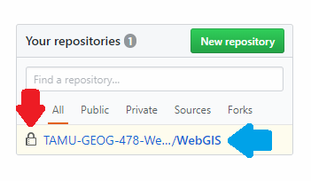
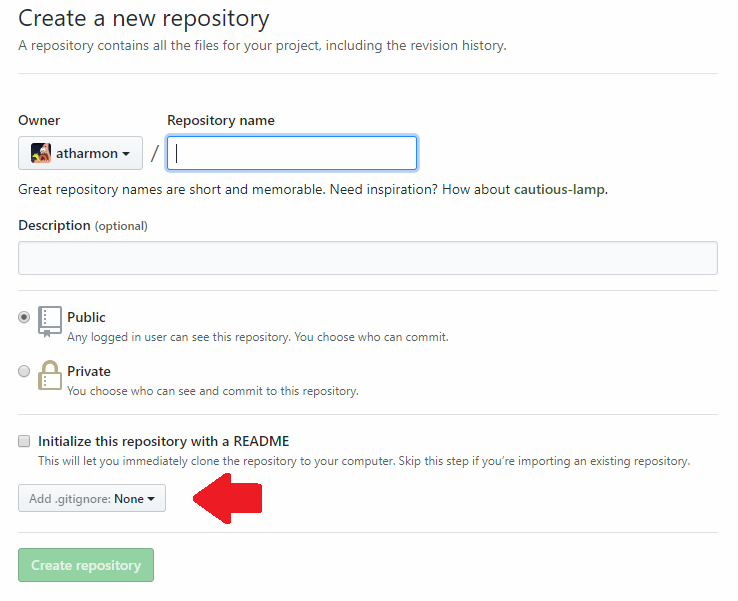
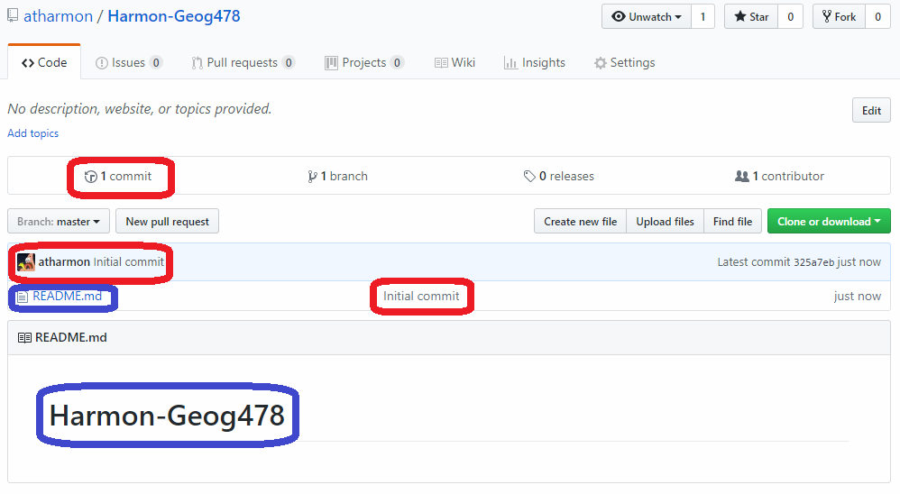
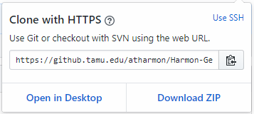
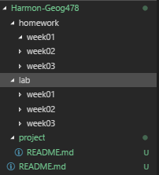
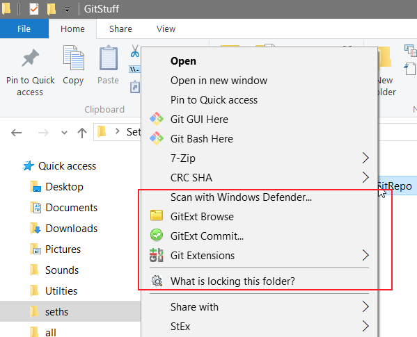

# TAMU WEBGIS: Lab 1
>
>**Topic:** GitHub Setup
> 
# Due Dates and Submission Instructions
> **Online Program**: [Online Program Dues Dates & Submission Instructions](https://github.tamu.edu/TAMU-GEOG-678-WebGIS/Online/blob/master/submissions/01.md)
>
> **Residential Program**: [Residential Program Dues Dates & Submission Instructions](https://github.tamu.edu/TAMU-GEOG-678-WebGIS/Residential/blob/master/submissions/01.md)

# **Tasks:**
1. Create TAMU GitHub account
2. Create a repo for this class 
3. Create folders + readme's for each weeks labs /labs/XX
4. Create a TAMU Slack account and submit your Slack username
5. **Optional** Clone the repo for this course on your laptop, PC or VM Desktop

## Create TAMU GitHub account
TAMU hosts a cloud-based Git repository like GitHub or GitLabs free for use by students, faculty, and staff. The TAMU GitHub is great as it lets its users have access to what would otherwise be paid features on the actual GitHub, such as individual private repositories, organizations, organization seats, etc. To create a TAMU GitHub account, go to [github.tamu.edu](https://github.tamu.edu/) and use your NetID to gain access. Before you go hog wild please take five minutes to give the [FAQ](https://github.tamu.edu/pages/tamugithub/changelog/) a quick read. Be sure to email your TA your username once you've created your GitHub account so they can add you to the class's organization. 
>
## Create a repo for this class
When you have your account created and go to the TAMU GitHub main webpage, you should see a box on the right side like this:
>

>
This is where all your repositories will be listed along with any forks of other repositories. You can also create a new repository in this box as well. The red arrow pointing to the lock indicates that this particular repository is private: it is only visible by people who have been invited to collaborate on it. The blue arrow shows the repository's name, in this case **WebGIS**. The longer part between the two arrows is the organization name or TAMU-GEOG-678 in this example. Organizations are like people in that they too can have public or private repositories, but are comprised of a whole group of people. An example of this could be the TAMU-GEOG-678 organization with members Stacey Lyle, Dan Goldberg, Aaron Harmon, Xiao Li, and Zhengcong Yin. We're all team members of TAMU-GEOG-678. This can be broken down further by having teams inside of an organization. This all makes much more sense in a business setting where you would have teams like marketing, developers, testers, management, etc. These teams would have access to team specific repositories owned by the organization. 
>

>
Now then, click the **New repository** button. This goes to the **Create a new repository** page. You'll see the typical info needed. In this instance you'll see that atharmon is the owner of this repository, but if you're part of an organization or many, you'll be presented with a drop down of these. This is how you would create a new repository under an organization. The new repository should have a short-yet-descriptive name. Don't make it long winded like "Billy Joe's GEOG678 Class Work". That's too many words and waaaay to many spaces. Don't use spaces at all for names in computing, be it your repository's name or on your computer. Just don't do it unless you like headaches. Descriptions are mainly for describing what your project is about if your name happens to make no sense whatsoever like this little fella [here](https://github.com/mapbox/tippecanoe). Below that you have your security settings public or private. Public makes your repository visible to **EVERYONE** on TAMU's GitHub. The option **Initialize this repository with a README** is *kinda* useful. This will create a file inside your repository called README.md, .md standing for Markdown. Markdown is how all these fancy lectures and labs are written. If you're familiar with LaTeX it's a little bit like that. For us though think of the README.md as a homepage for our repository. Inside the README would go all the detailed information regarding the entire repository. The red arrow is for adding a .gitignore file, we'll touch on that later. For now leave it on **None**.
>
Here you'll create a new repository and give it a meaningful name such as **Harmon-Geog478**; make sure to mark it public and check the box **Initialize this repository with a README**. Press create and you should be presented with this page here:
>

>
This is the first thing you'll see whenever you click on a repository. This page will list basic information such as owner, description of the repository, and general popularity (the watch, star, and fork in the top right corner). If you note the red circles in the image above you'll see all are related by commit. Whenever you commit and leave a message it can be read here. When you create the repository on GitHub it will make the files, stage them, then commit on your behalf with the commit message "Initial commit". The bottom red circle in the middle is refering to the most recent commit that affected README.md file; since it was created in that commit it reads "initial commit". The top blue circle shows the files that are currently inside the repository. Since we just created this and only have a single file README.md, that is what is shown. When you have many directories and files they'll all be listed here as well. The bottom blue circle is showing the contents of the newly created README.md. Whenever you initialize a new repository with a README, it will just throw the repo's name into it as shown. 
>
## Create folders + readme's 
To start adding files we'll need to **clone** the repository you created to your local computer. As of right now the repository only exists wherever TAMU GitHub saves stuff. On the main page for your repository you'll see a green button labeled **Clone or download**, click it. You should now see a popup like this: 
>

>
You *could* download your repository using the **Download ZIP** but I will always advise against it. When you download the zip you're not downloading a git repository, you're downloading the repository's files which is **NOT** what we want. Back to cloning. Click the little clipboard button to copy your repository's unique URL (it should look like https://github.tamu.edu/atharmon/Harmon-Geog478.git, note the .git part). Now at this point I'm assuming you have Git installed on your computer. Create a directory path like so `C:\Users\myName\DevSource`. Open up a terminal / command prompt and navigate to `C:\Users\myName\DevSource` with `cd C:\Users\myName\DevSource`. Your command prompt is now within the DevSource directory. To clone from GitHub or any other provider, use this command with your own repository URL you copied earlier:
> `git clone https://github.tamu.edu/studentusername/nameofrepo.git`
>
Git will go and clone your repository from TAMU GitHub. Once it's done downloading, there should be a directory inside of `C:\Users\myName\DevSource` with the name of your repo; for our example that name would be **Harmon-Geog478**. High five you've just cloned a Git repository. Now then, open up Visual Studio Code (you can download it [here](https://code.visualstudio.com/download) if you don't have it already) and use the `File > Open Folder` option to open up your local repository directory. You should see on the left hand side a control pane: this is where the currently opened directory is and any files inside. The stethoscope looking thing is where you can easily do Git commands without typing them (i.e. pressing buttons). Now then, open up your README.me. Edit the file to be your "homepage" by putting:
> 1. Your name
> 2. A table with links to your labs and homework
>
You can use this [link](https://github.com/adam-p/markdown-here/wiki/Markdown-Cheatsheet) to help you write better looking Markdown files. Now that you have all that you can commit your changes and push them to your repository. Make sure your terminal / command prompt is currently in your repository directory and use this command to stage and commit your changes:
>
`git add *`
>
`git commit -m 'Edited the main README.md'`
>
Now you have snapshot'd your changes and Git has made note of it. Now you can push your commit(s) to your TAMU GitHub repo. Wherever you push your commits is known in the Git world as a `remote`. Go ahead and `git push origin master` to push your changes to the server. Your repository *may* not use the names `origin master` but 99% of the time it defaults to `origin master`. Now to finish this part of the lab go ahead and add folders to your repository with the structure found inside the main class README.md. You should a similar structure in your local repository:
>

> 
Make sure to add a README.md to each weekXX folder inside the labs and homework directories. This can be a simple README.md with your name written on the top for now. Do not forget to stage, commit, and push these folders. When you're all set and done make sure to submit your repo's TAMU GitHub URL into the blackboard lab assignment link.

## EXTRA
A useful tool to make using Git a little easier is called [Git Extensions](https://github.com/gitextensions/gitextensions). This will add some useful tools like a GUI (graphic user interface) based merge conflict tool and most importantly it will add a right-click context menu for Git commands. If you have a Git repository visible inside of File Explorer you can right click it to get a series of useful Git commands to perform on such repository. I personally use this to pull repositories quickley without having to type `git pull origin master` for each repository.
>

>
# **To Hand In:**
1. Submit your GitHub URL into the online Lab assignment link
2. Slack Username

## Videos
[Video 1 - Lab 1](https://youtu.be/RPf9n7gjRJ0)
