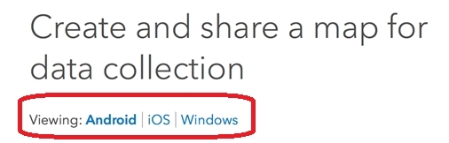

# TAMU WEBGIS: Lab 2
>
>**Topic:** ArcGIS Online
> 
# Due Dates and Submission Instructions
> **Online Program**: [Online Program Dues Dates & Submission Instructions](https://github.tamu.edu/TAMU-GEOG-678-WebGIS/Online/blob/master/submissions/02.md)
>
> **Residential Program**: [Residential Program Dues Dates & Submission Instructions](https://github.tamu.edu/TAMU-GEOG-678-WebGIS/Residential/blob/master/submissions/02.md)

# **Tasks:**
1. Finish the ArcGIS Online web map tutorial
2. Complete the exercise "Create and share a map for data collection"

# What is ArcGIS Online?
**ArcGIS Online** is an online, collaborative web GIS that allows you to use, create, and share maps, scenes, apps, layers, analytics, and data. You get access to **Living Atlas of the World**, apps, and ESRI's secure cloud, where you can add items and publish web layers.

# What is Collector for ArcGIS?
Collector for ArcGIS allows you to do many things including collecting and updating data in the field, whether you're online or offline. Collector works on Windows, Android, and iOS and supports external receivers for improved spatial accuracy.

# Task 1: ArcGIS Online Web Mapping
Finish the online tutorial [here](https://learn.arcgis.com/en/projects/get-started-with-map-viewer/). This tutorial contains five lessons which help you learn how to make maps in ArcGIS Online. You'll finally learn how to package your web map as a professional-looking app. After you've completed this tutorial, you should be able to:
- Add layers to a map
- Add data stored in a spreadsheet or other data file to a map
- Change map symbols
- Configure pop-ups
- Share the map as a web app
>

>
Make sure you open your app link to make certain it works correctly. You should do this in a private / incognito window or tab to eliminate the possibility of the browser loading from cache. 
1. Login to your ArcGIS Online account
2. Click **Content** from the menu bar
>
 
>
3. Find the web app you created, click **View Application** to open the app page
>

>
4. **TASK 1: 
>

>

# Task 2: Collector for ArcGIS
Finish the exercise **Create and share a map for data collection** found [here](https://www.esri.com/arcgis-blog/products/collector/field-mobility/make-your-first-collector-map/). Please make sure to choose the appropriate operating system for your mobile device before you start the exercise.
>

>
In this exercise you will create a damage assessment map and collect data. You'll build a map by starting with a basemap, add the **Damage Assessment** layer using the ArcGIS Online shared layer, configure the data collection form, and finally customize the application settings. 
>

>
**Task 2:** Access the web map you published. Add a new feature into your web map. Take a screenshot of your mobile device screen displaying the feature you added.

*(When you login the Collector via phone, please select ArcGIS Enterprise login.)*  

# **To Hand In:**
1. Submit the link of your web mapping application to eCampus 
Please name your web app as "MY first Web App - Your name (e.g., My first Web App - Xiao Li)
2. Take a screenshot of your phone of the web map you published.Submit the screenshot to eCampous

# **Grading Rubric**
Web Mapping App 
- Color choice (20 pt)
- Successfully configure pop-ups to show images (40 pt)
- Successfully publish your web app (10 pt)

Collector for ArcGIS 
- A screenshot of your phone showing the web map can be accessed using your mobile devices.(30 pt)

<!--
## Videos
[Video 1 - Lab 2](https://youtu.be/YNnatJyUuTs)
-->
