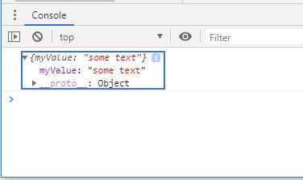
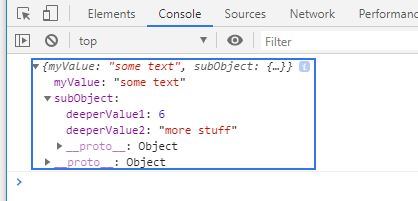
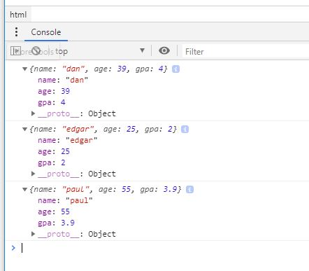
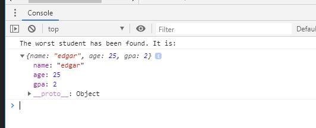
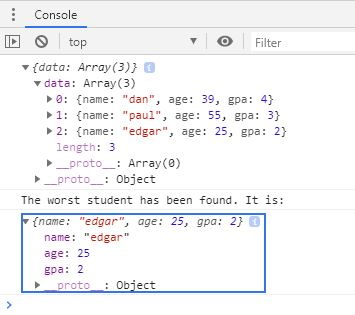
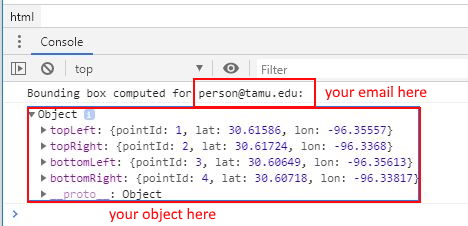

# TAMU WEBGIS: Lab 4
>
>**Topic:** Javascript and JSON programming

>***100 pts***
> 

# Due Dates and Submission Instructions
> **Online Program**: [Online Program Dues Dates & Submission Instructions](https://github.tamu.edu/TAMU-GEOG-678-WebGIS/Online/blob/master/submissions/04.md)
>
> **Residential Program**: [Residential Program Dues Dates & Submission Instructions](https://github.tamu.edu/TAMU-GEOG-678-WebGIS/Residential/blob/master/submissions/04.md)

# Outcomes
This Lab will build on the Learning Module Outcomes
- Build interactive web pages (javascript button clicks)
- Create and utilize JSON objects
- Make arrays
- Apply basic javascript control structure (loops, if/else)

# What is JSON?
JSON (Javascript Object Notation) is the base object structure which powers almost all of javascript.
- Everything in javascript is an object
- If you need an object, you make it
- If someone else (or a server spitting out data) makes or give you objects, you can use them.
- You can access all attributes and methods of a JSON object with dot and array notation
- Most of the time, you will be sending JSON objects to a server to process, and it will be sending you back JSON objects in response
- GeoJSON is a special variant of JSON (i.e., a special javascript object) which encodes geographic information into a Javascript object
- ArcGIS and most other geo-related servers and API's (MapBox, Google Maps, etc.) can understand GeoJSON, and it's the preferred way to send and receive geographic data

## Assignment Components
1. HTML Files:  index.html - The HTML page you will create in order to have a button displayed which does things
2. Javascript Files: script.js - The Javascript file where you will do your actual programming

## HTML Page Components
```html

<!DOCTYPE html> 
<!-- First line of code in all of your HTML documents. Declaration of version of HTML -->

<html> 
<!-- Container for the document-->

    <!-- Pull in the code within an external javascript file (located in the same directory) -->
    <script src='script.js'></script>

    <!-- Setting a creative title for the page -->
    <head>
      <title> Lab 4 </title>
    </head>

    <!-- The body of our document which contains things to be rendered by the browser-->
    <body> 

        <!-- Make a button -->
        <input type='button' value='Click Me!'></input>
    </body>
</html>
```
- The *script* element is where we write our javascript
    - In  this case, we are writing our javascript in a separate file in the same directory, script.js
    - So, we add the *src* attribute to specify the external javascript file that we would like to import into this HTML document

- The *input* element specifies that you would like to gather some kind of user input
    - Setting the input element's *type* attribute specifies that the input should be a button (other options include radio buttons, checkboxes, text boxes, etc.)
    - Setting the input element's*value* attribute specifies what should be displayed as text on the button


## Javascript Page Components
```JavaScript
//Create a function named Run within our script.js page. 
//Currently it accepts no parameters and does nothing. 
//It is very exciting.
function Run()
{

}
```
- Inside of our javascript file (script.js), we create a function named run
- We also see some comments, which are code that is not executed, but is there instead to help a user understand what the code is doing
    - Comments are anything which starts with two slashes \\\\
    - You will be a hero if you comment your code


## Call the Javascript function when a user clicks the button
```html
 <input type='button' value='Click Me!' onclick='Alert("Please stop. That tickles.");'></input>
```
- By setting the *onclick* attribute of our button, we can make the browser execute some javascript code
    - In this case, we are running javascript code which pops up an alert box, but typically you would do something more interesting/important. 

 ```javascript
    Alert("Please stop. That tickles.");
```   

- To call the  Run() method located in our Javascript file, we call that function instead of our stupid alert box.

```html
 <input type='button' value='Click Me!' onclick='Run();'></input>
```

## Lets make an object

In javascript, you can make an object at any time simply by using javascript object notation (JSON)
- All JSON objects are wrapped inside of curly brackets { ... }
- JSON uses *attribute: value* syntax to create object properties and assign them values

```JavaScript
function Run()
{
    // Make a super-simple JSON object
    var myObject = 
    {
        myValue: 'some text'
    };

    // print it out to the console
    console.log(myObject);
}
```

- Here, we are making a variable named myObject and setting it equal to a new JSON object.
    - The JSON object have one property, named *myValue* which is assigned a text (string) value.
- When we log the variable myObject to the console (i.e., print it out), we see that we have an object with a property inside which has our value.

>

>
*Object Logging to the Console*

## Lets make a more complicated object
JSON objects can contain other JSON objects, simply by setting the value of a property to be a full JSON object. It should start and end with curly brackets and contain attribute: value pairs.

```JavaScript
function Run1()
{
    // make a JSON object with a sub-object
    var myObject = 
    {
        myValue: 'some text',
        subObject: 
        {
            deeperValue1: 6,
            deeperValue2: "more stuff"
        }
    };

    // log it to the console
    console.log(myObject);
}
```
- Here we have created more properties on our myOject JSON object.
- To add properties past the first one, you separate them with commas.
- We add a second property *subObject*, which is itself a JSON object with two properties
    - *deeperValue1* with an integer value of 6
    - *deeperValue2* with a string value of "more stuff"

>

>
*Logging a more complex object to the console*

## Lets code like a normal person
Typically, you would not be coding in a way where you hard-code object properties like shown above. Doing it the previous way means every time you want to make a new object, you have to cut/paste code, which means you have to maintain several versions of the same code. This is terrible, and you don't want to do it.

Instead, we can make objects by creating a single function which builds and returns functions based on parameters which we send in.

```JavaScript
function Run2()
{
    // create three different objects by calling the BuildObject function with different parameters
    var person1 = BuildObject('dan', 39, 4.0);
    var person2 = BuildObject('edgar', 25, 2.0);
    var person3 = BuildObject('paul', 55, 3.9);

    // print them out
    console.log(person1);
    console.log(person2);
    console.log(person3);
}

// This function takes three parameters, makes a JSON object having those values, and returns it
function BuildObject(value1, value2, value3)
{
    // build the object using the values passed in
    var returnObject = 
    {
        name: value1,
        age: value2,
        gpa: value3
    }

    // return the object that was just build
    return returnObject;
}
```
- Here, we create another javascript function in our javascript file named *BuildObject* to handle the creation of our objects, rather than doing them one by one via cut/paste.
    - The function takes three parameters: *value1*, *value2*, and *value3*. 
        - These names specific names are garbage, and could be anything you want them to be which makes more sense. Whatever you name them in the function definition, you just have to make sure to use them wit the right name in your code.
    - Within the function, we create a variable named *returnObject* which is a JSON object.
        - We add three properties to the object: *name*, *age*, and *gpa*.
        - The values for each of these properties are set to the three parameters which we pass into the function.
    - At the end of the function, we use the *return* keyword to pass the object that we created inside the function back to whoever called the function.

- To make use of our new *BuildObject* function, we update our *Run()* function to call it.
    - We create three new variables *person1*, *person2*, and *person3* and set their values to be objects returned from the *BuildObject* function.
    - Each of these variables is set by passing in different parameters values to the *BuildObject* function.

- Each of these objects is logged to the console, and each of them have the properties which we passed in.
>

>
*Objects created by calling a function*

## Lets finally do something
Now that we can create objects, we should do something with them. Let's make another function which loops through them, and computes and prints out the person with the lowest GPA.

```JavaScript
function Run3()
{
    // make three people
    var person1 = BuildObject('dan', 39, 4.0);
    var person2 = BuildObject('edgar', 25, 2.0);
    var person3 = BuildObject('paul', 55, 3.9);

    // put the three people into an array
    var students = [person1, person2, person3];

    // send the array into our function which computes the worst student.
    // assign the result of the function to a variable.
    var worstStudent = FindWorstStudent(students);

    // print out the worst student that we found.
    console.log("The worst student has been found. It is: ");
    console.log(worstStudent);
}
// This function takes an array of objects and returns the one with the lowest GPA
function FindWorstStudent(listOfStudents)
{
    // this variable keeps track of the current worst student. 
    var worstStudent;

    // loop through each of the students in the array
    listOfStudents.forEach(
    
        // The variable element gets set to be each item in the array,
        // in a loop through all items in the array.
        // For each record in the array, do this stuff.
        element => 
        {
            // When we are on the first item in the array, worstStudent will be null
            // since it has not been set yet. Set it to be the first item in the list. 
            // When we haven't seen any other students, the first one is the current worst one.
            if (worstStudent == null)
            {
                worstStudent = element;
            }

            // when worstStudent is not null, it means that we are on a record after the first one, so compare.
            // if the GPA of the current one is lower than the GPA of the current worst one, 
            // set the worst one to be this one
            else
            {
                if (element.gpa < worstStudent.gpa)
                {
                    worstStudent = element;
                }
            }
        }
    );

    return worstStudent;
}
```

- Using our function to create objects based on parameters we pass in (*BuildObject*), we can make a bunch and then do some computations.
- Here, we create three JSON objects using our BuildObject function and add them all to an array.
- We pass that array into a new *FindWorstStudent* function which loops through all of the items in the array and computes the one with the lowest GPA, and returns it.
- We do our looping through the array using the Javascript built-in *forEach()* function.
    - The forEach loops through all items in the array and assigns the temporary variable *element* each time, which we use to determine if a specific array item has the lowest GPA.
    - Everything after the ``` => ``` (arrow) gets called for each item in the list. This is where we do our computation.
    - We keep track of the item with the lowest GPA that has been seen so far using the variable *worstStudent*, which we update each time that we see an item with a lower GPA.
- After we loop through all items and have set the one with the lowest GPA to be *worstStudent*, we return *worstStudent* and print it out to the console.

>

>
*The object (student) with the worst GPA*

## Lets stop pretending 
In the real world, it's not likely that you will be processing a lot of objects that you make yourself (for the most part). Instead, you will be getting objects from some kind of data source, like an ArcGIS server, or some other data file. You will be making objects (for sure), but for the majority of your programming, you will be battling to make your code consume objects from other sources.

To make use of JSON objects from another location (meaning, not ones that you create yourself), you just have to load them like any other javascript file.

```html
<script src='data.js'></script>
```
- We tell our browser to pull a JSON object from a file (which is different than a URL source), by adding the file to our HTML document via a script tag and setting the source attribute be the name of the file which contains the JSON. The file name can be anything, and it can have any extension. However, since it's Javascript (in this case), it makes the most sense to name it something.js.

Our json file data.js (in the same directory) looks like this.
```Javascript
var theJSON =  
{
    "data":
    [
        {
            "name": "dan",
            "age": 39,
            "gpa": 4.0
        },
        {
            "name": "paul",
            "age": 55,
            "gpa": 3.0
        },
        {
            "name": "edgar",
            "age": 25,
            "gpa": 2.0
        }
    ]
}
```
- We create a variable named *theJSON* and set it to be a JSON object.
- The JSON object starts and ends with curly brackets { }
- At the root level, the JSON object has one property named *data*
- The value of the property *data* is an Array of objects. It starts and ends with square brackets [ ]
- Each item in the Array is a full JSON object
    - It starts and ends with curly brackets
    - Each property of an item in the Array is written in JSON *attributeName : attributeValue* format
    - All attribute names are wrapped in double quotes (attribute names in JSON have to be strings)
    - The attribute values can be any data type, including sub objects. In this case they are strings, integers, and floats.

```JavaScript
function Run4()
{
    // theJSON is a variable already created since it is loaded via a script tag in the HTML page.
    console.log(theJSON);

    // get the array of people from the JSON object's data property which contains the array
    var students = theJSON.data;

    // get the worst student
    var worstStudent = FindWorstStudent(students);

    // print it out
    console.log("The worst student has been found. It is: ");
    console.log(worstStudent);
}
```
>

>
*The object (student) with the worst GPA from a JSON data file*

# Tasks: 

### Task 1: Create and link the HTML and Javascript pages for this assignment - 20 points
1. Create your index.html page
2. Create your script.js page
3. Add a script tag to include your Javascript page within your HTML page.
3. Add a script tag to include the data for this assignment [data.js](../data/labs/04/data.js).

### Task 2: Create an HTML button which calls your javascript function Run() when it is clicked - 5 points
1. Inside of your HTML document:
    1. Create a button input
    2. Make the onclick action of the button call a Run() javascript function

### Task 3: Create the Run function inside of your Javascript file - 5 points
1. Inside of your Javascript file, create a new function named Run()

### Task 4: Create javascript functions to calculate the bounding box of the data file - 20 points
1. Create one or more functions which selects the points from the data file which are the top left, top right, bottom left, and bottom right corners of the data set.
    1. Top Reft = Max Lat and Min Lon
    2. Top Right = Max Lat and Max Lon
    3. Bottom Left = Min Lat and Min Lon
    4. Bottom Right = Min Lat and Max Lon


### Task 5: Make your Run function call your function(s) that find the corners  - 20 points
```Javascript
// get the corners by creating functions which select an item from the data which has the correct values
var topLeftPoint = findTopLeft(data);
var topRightPoint = findTopRight(data);
var bottomLeftPoint = findBottomLeft(data);
var bottomRightPoint = findBottomRight(data);
```

### Task 6: Create an output object from your corners - 20 points
1. In your Run function, create a new object and set its properties to include the corners which you calculated.
```Javascript
// make an output object containing the corner points
var boundingBox = 
{
    topLeft: topLeftPoint,
    topRight: topRightPoint,
    bottomLeft: bottomLeftPoint,
    bottomRight: bottomRightPoint
}
```

### Task 7: Print out your result, along with your email - 5 points
```Javascript
console.log("Bounding box computed for person@tamu.edu: ");
console.log(boundingBox);
```

### Task 7: Take a screenshot of the console showing your email and your bounding box - 2.5 points
1. It should look like the following:
>

>
*An example solution*

### Task 8: Upload your code to your github account - 2.5 points
1. Upload your .html and .js files to your github repository labs\04\ folder


# To Hand In:
## Github
1. Upload your .html and .js files to your github repository labs\04\ folder

## eCampus
1. Create and submit to eCampus a screenshot of your console output showing your email address and your output object.
2. Submit to eCampus the link of your Github lab\04\folder to eCampus.


# **Grading Rubric**
1. Correctly working code - 95%
2. Code uploaded to GitHub - 2.5%
3. Screenshot of correctly working code with your email address - 2.5%

<!--## Videos
[Video 1 - Lab 3](https://youtu.be/pwneCDfAlDI) Reference video for Lab. No Audio.-->
