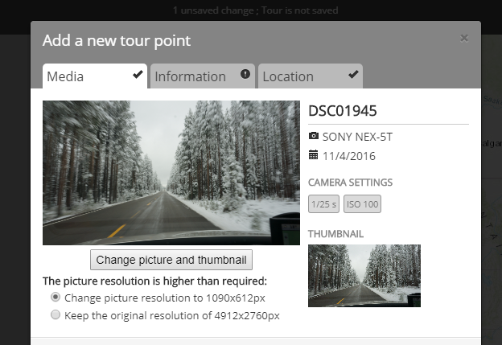
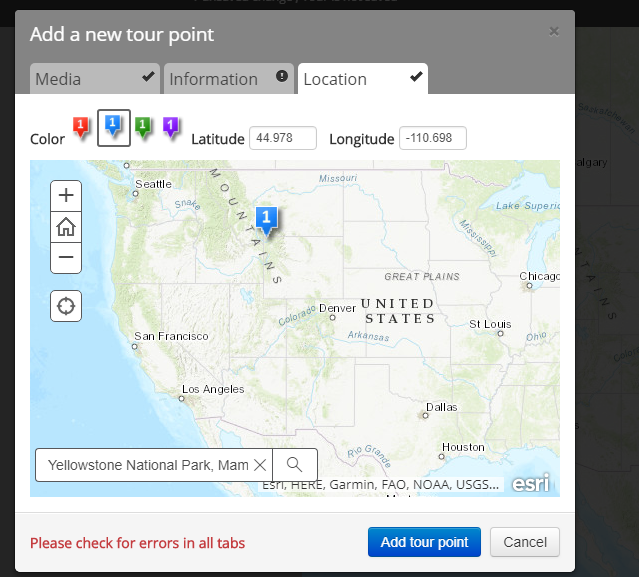
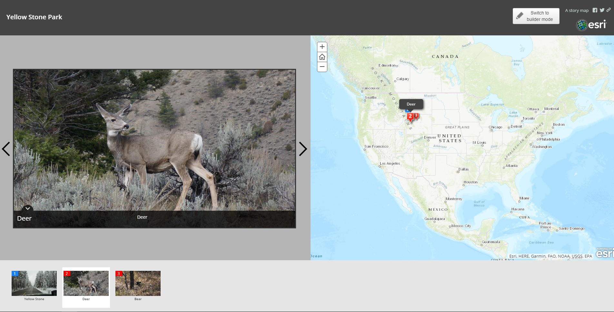
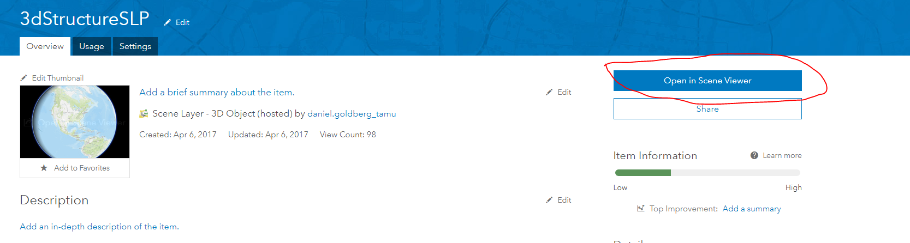
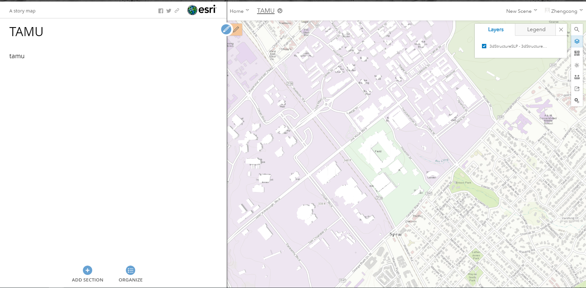

# TAMU WEBGIS: Lab 8
>
>**Topic:** Tell the story of your data using ArcGIS Story map
> 

# Due Dates and Submission Instructions
> **Online Program**: [Online Program Dues Dates & Submission Instructions](https://github.tamu.edu/TAMU-GEOG-678-WebGIS/Online/blob/master/submissions/08.md)
>
> **Residential Program**: [Residential Program Dues Dates & Submission Instructions](https://github.tamu.edu/TAMU-GEOG-678-WebGIS/Residential/blob/master/submissions/08.md)

# What is ArcGIS Storymap?

Esri Story Maps are web applications that let authors combine beautiful maps with narrative text, striking images, and multimedia, including video. They make it easy to harness the power of maps and geography to tell your story. The applications are designed to be attractive and usable by anyone, which makes them great for education and outreach, either to the general public or to a specific audience. It is a simple yet powerful way to inform, engage, and inspire people with any story you want to tell that involves maps, places, locations, or geography.
 
# Task:
### Define a theme of your storymap and prepare the data  
Before develop your storymap, let's do some brainstorming about the idea of the story. Data used in the storymap usually has something to do with locations. A good start point is to use some traveling photos. At the end of this lab, you could share this app to your family or someone you love. 

### Think about the layout of your page  
Esri already created some template for the page layout. In this exercise, you may only choose one from the list.

Available templates - https://storymaps.arcgis.com/en/app-list/

### Upload your data
Find out your favorite photos and upload to ArcGIS online via the interface.
>

>

Link the location to each photo.
>

>

Make sure fill the information for each tab.

### Beautify your page
You may add multiple photos if needed. When finish uploading all the photos, don't forget edit the title of your storymap. 
>

>

Here are some principles for design a good storymap - https://storymaps.arcgis.com/en/five-principles/

For the submission of this exercise, you may just use some simple photos and share with the organization. But later, you could create a new one that share with your family. 

# Storymap with 3D map
Our world is 3D. So does your map. Esri has the 3D map rendering framework called **Scene Viewer**.
Please go through this tutorial first:  https://blogs.esri.com/esri/arcgis/2018/01/02/using-web-scenes-in-story-maps/

To embed the 3D layer with your story map, you need to link your storymap to the Scene Viewer. Three different scenes have been provided to you. When you click the following links, make sure you click **"Open in Scene Viewer"** button. 
>

>
Then copy and paste the URL. After successfully adding 3D map to your story map, you should get an app looks like this:
>

>

Then the next step is to edit the left side of this app. Tell a story about our university. 

# Task 1: Build your 2D story map 50pt
1. Decide the story you want to tell. 
2. Find out the data you needed.
3. Follow the instruction and the online tutorial to create your storymap.

# Task 2: Build your 3D web scene story map 50pt
1. Decide on what story you would like to tell about the TAMU campus
2. Use any (GIS) data layers that you need to ArcGIS online (at least one GIS layer)
3. Create a story map about your topic of TAMU campus which includes at least one 3D data layer as part of the story

# **To Hand In:**
1. Open the **storymaps** you created in a browser and take a screenshot for each of sites and upload your screenshots & links to eCampus **(two screenshots, two links)**

# **Available TAMU Data Sources**
1. TAMU 3D building layer - http://tamu.maps.arcgis.com/home/item.html?id=6af9596e6a6542b8bd71df845763698e#overview
2. TAMU 3D lidar layer - http://tamu.maps.arcgis.com/home/item.html?id=b34178285ad44b9788051c9e7375a04d
3. TAMU 3D terrain layer - http://tamu.maps.arcgis.com/home/item.html?id=36ab17befba54ff4a5d98a852c219679

## Recordings
[2020-03-22 - Lab](https://tamu.zoom.us/rec/share/x_Fbdp7yy2JIYrfw9UbZdKINHo3BT6a81SkbqaIMnk3NIP4-aXYQ79-m_gnlsEsj)
<!--
## Videos
[Video 1 - Lab 6](https://youtu.be/s0GQhGzlJBU)-->
