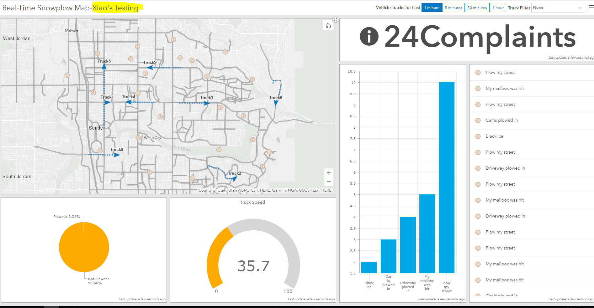

# TAMU WEBGIS: Lab 9
>
>**Topic:** Interactive Charts (Operations Dashboard for ArcGIS + D3 + HighCharts)
>

# Due Dates and Submission Instructions
> **Online Program**: [Online Program Dues Dates & Submission Instructions](https://github.tamu.edu/TAMU-GEOG-678-WebGIS/Online/blob/master/submissions/09.md)
>
> **Residential Program**: [Residential Program Dues Dates & Submission Instructions](https://github.tamu.edu/TAMU-GEOG-678-WebGIS/Residential/blob/master/submissions/09.md)


# What is Operations Dashboard for ArcGIS?
> ### Text and examples from https://www.esri.com/en-us/arcgis/products/operations-dashboard/overview
Operations Dashboard for ArcGIS is a configurable web app that provides location-aware data visualization and analytics for a real-time operational view of people, services, assets, and events. From a dynamic dashboard, view the activities and key performance indicators most vital to meeting your organization's objectives.
>
# How it works
1. Create a dashboard
2. Add elements
3. Set layout
4. Build interactivity
5. Save, test, and share
>

> ##### [Snowplow Monitoring_Example](https://tamu.maps.arcgis.com/apps/opsdashboard/index.html#/36fd31e2b9114536a10cef828ed2a206?edit=true)

# What is D3?
D3 is a well-known **Javascript visualization library** used by people everywhere regardless of their industry. Created by Mike Bostock while he was a PhD student at Stanford, D3 is an extensible, greatly configurable library used by data visualization people. According to D3's official website, "D3 allows you to bind arbitrary data to a Document Object Model (DOM), and then apply data-driven transformations to the document." We can create many neat visualizations by utilizing D3 as shown by the screen shots below.
- https://github.com/d3/d3/wiki/Gallery

# What is HighCharts?
Highcharts is a **Javascript, visualization library** used by many different groups and companies. We can use Highcharts for a variety of fancy visualizations that are generated easily and effortlessly with little input from us. 
>
- https://www.highcharts.com/demo

# Tasks:
## Task 1 : D3.js
### Preparing your page <br  />
In this exercise, we are going to create a simple bar chart using D3.js
- Create a new html file with basic components
```html
<!DOCTYPE html>
<html>
  <head>
    <title>add a title</title>
  </head>
  <body></body>
</html>
```

- Include **D3 JavaScript file** in the head section of your document:
```html
 <script src="https://d3js.org/d3.v4.min.js"></script>
```
- Create a **div** element in the body section with a certain id where you want your chart to be:
```html
 <div id="chart"></div>
```
- Create an **internal CSS** in the head section of your document to modify the settings of your chart:
```html
#chart div{
            font: 10px sans-serif;
            background-color: steelblue;
            text-align: right;
            padding: 3px;
            margin: 1px;
            color: white;
        }
```
- Now below your **div** we start **a new Javascript section** and put in the following:
```javascript
 var data = [30, 86, 168, 281, 303, 365];

            d3.select("#chart")
            .selectAll("div")
            .data(data)
                .enter()
                .append("div")
                .style("width", function(d) { return d + "px"; })
                .text(function(d) { return d; });

```

The variable **data** acts as our D3 data. Below the **data** variable you have your first taste of D3-enese. We call the **d3** object and use the **select** method to go into our **div** and grab the element with the class name **chart**. 
>
After that first line is done executing you can imagine having a reference to your **chart** element, then ON the **chart** element, we use another D3 method called **selectAll**. We provide the type of element we wish to select inside our **chart**, which in the case, is a div with no other children. So what are we selecting? Nothing yet. D3 is smart enough to know we have data we wish to visualize and prepares for what's known as a **data join**. Long story short what this does is create a **div** inside our main div with class **chart** to then use in the following line.
>
With **selectAll** done we then have a reference to each individual div, or in this case an individual bar in our chart. This is where the **data join** occurs. We're binding the data found inside our **data** array variable to what will be newly created divs inside **chart**. Again since those divs which will act as the bars in our bar chart do not exist yet (there are still no children inside of **chart**), we use the **enter()** and **append()** functions to create a new DOM element for each value present inside our data array **data**. If we left it at that and didn't have the two lines style and text, we'd have the **chart** div with 6 children: all children divs of **chart**.
>
Now that we have a div created for each data point, we use the value inside of data to define the style of the div: in this case we're setting the width of the div to be equal to the value of the data point bound to this div. For example, the first div is bound to the value 30. This **style()** method will take the value 30 and set the width of the div element equal to 30. The second value is 86, when **style()** is called it will make width of the second div inside of **chart** equal to 86 and so on. 
>
The last function will set the text value of each div with the value bound to that div. This would look something like this:
>
```html
<div style="width: 86;">86</div>
```

## Task 2 : HighCharts
### Preparing your page <br  />
In this exercise, we are going to create a simple bar chart using D3.js
- Create a new html file with basic components
```html
<!DOCTYPE html>
<html>
  <head>
    <title>add a title</title>
  </head>
  <body></body>
</html>
```

- Add the following lines in the head section of your document to import the **HighCharts library** into our page :
```html
 <script src="https://code.highcharts.com/highcharts.js"></script>
 <script src="https://code.highcharts.com/modules/series-label.js"></script>
  <script src="https://code.highcharts.com/modules/exporting.js"></script>
```
- Create a **div** element in the body section with a certain id to hold your chart:
```html
 <div id="container"></div>
```
- Create an **internal CSS** in the head section of your document to modify the settings of your chart:
```html
<style>
        #container {
            min-width: 310px;
            max-width: 800px;
            height: 400px;
            margin: 0 auto
        }
</style>
```
- Now below your **div**, w start by calling the **chart()** method of the Highcharts object. We provide the **id** of our container div and set a bunch of different options and define the data we'll be plotting.
```javascript
Highcharts.chart('container', {

    title: { text: 'Solar Employment Growth by Sector, 2010-2016' },
    subtitle: { text: 'Source: thesolarfoundation.com' },
    yAxis: { title: { text: 'Number of Employees' } },
    legend: { layout: 'vertical', align: 'right', verticalAlign: 'middle' },
    plotOptions: { series: { label: { connectorAllowed: false }, pointStart: 2010 } },

    series: [{
        name: 'Installation',
        data: [43934, 52503, 57177, 69658, 97031, 119931, 137133, 154175]
    }, {
        name: 'Manufacturing',
        data: [24916, 24064, 29742, 29851, 32490, 30282, 38121, 40434]
    }, {
        name: 'Sales & Distribution',
        data: [11744, 17722, 16005, 19771, 20185, 24377, 32147, 39387]
    }, {
        name: 'Project Development',
        data: [null, null, 7988, 12169, 15112, 22452, 34400, 34227]
    }, {
        name: 'Other',
        data: [12908, 5948, 8105, 11248, 8989, 11816, 18274, 18111]
    }],

    responsive: {
        rules: [{
            condition: {
                maxWidth: 500
            },
            chartOptions: {
                legend: {
                    layout: 'horizontal',
                    align: 'center',
                    verticalAlign: 'bottom'
                }
            }
        }]
    }

}); 

```


# **Final Tasks:**
**1. Finish the Online Esri Dashboard Tutorial - Using Your ArcGIS Online Organizational Account**
- [Tutorial: How to Create a Simple Real-Time Dashboard](https://community.esri.com/community/gis/applications/operations-dashboard-for-arcgis/blog/2018/05/10/how-to-create-a-simple-real-time-dashboard)
>

>
>
>
**2. Visualize the Following Data Using **D3.js** and **Highcharts****
- Title: College Station Weekly Temperature Forecast


||Sat|Sun|Mon|Tue|Wed|Thu|Fri|Sat|
|:---:|:---:|:---:|:---:|:---:|:---:|:---:|:---:|:---:|
|Highest (°F)|82|81|81|70|77|78|79|80|
|Lowest (°F)|67|59|50|47|51|60|66|66| 
- find appropriate demos from **D3** and **Highcharts** to visualize the Temperature Forecast data
- the sample results below used Line Chart, you can use different types of chart to better visualize your data

>
>
>

# **To Hand In:**

**Github**: Two html files.

Please upload your html files to github.

**eCampus**: Three screenshots and two links:

Screenshot 1&2: Please take screenshots(one for **D3** and one for **Highcharts**). Upload your screenshots to eCampus.

Screenshot 3: Please open the **dashboard** you created in a browser and take a screenshot of it.

Link 1: Operation Dashboard

Link 2: Github repo. 

# **Grading Rubric:**
- Dashboard 40pt
- Highcharts Chart 40pt
- D3 Chart 20pt


<!--
## Videos
[Video 1 - Lab 7](https://youtu.be/iiG8mH0ezHc)
-->
