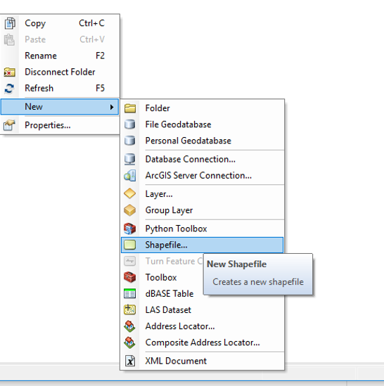
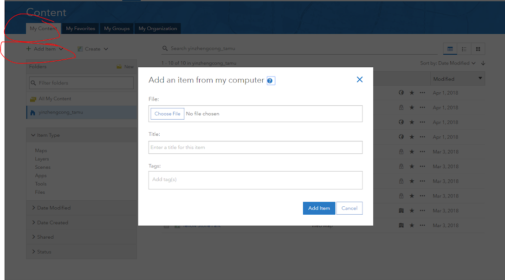
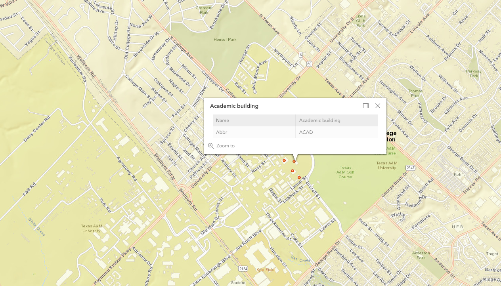

# TAMU WEBGIS: Lab 10
>
>**Topic:** Feature Layer Web Editing - 
>

# Due Dates and Submission Instructions
> **Online Program**: [Online Program Dues Dates & Submission Instructions](https://github.tamu.edu/TAMU-GEOG-678-WebGIS/Online/blob/master/submissions/10.md)
>
> **Residential Program**: [Residential Program Dues Dates & Submission Instructions](https://github.tamu.edu/TAMU-GEOG-678-WebGIS/Residential/blob/master/submissions/10.md)

# Lab Outline
1. Create an editable feature layer in ArcMap
2. Publish editable feature layer to ArcGIS Online
3. Create Esri ArcGIS JS web map that includes the layer you published
4. [Custom popup actions per feature](https://developers.arcgis.com/javascript/latest/sample-code/popup-custom-action/index.html)

# Tasks:

### Create an editable feature layer in ArcMap <br  />
**Step 1:  Creating your Shapefile**
- Open ArcCatalog
- Navigate to your project folder
- From the menu, click File>New>Shapefile
- Give your shapefile a name and select a geometry based on what type of features you are trying to draw
- Use the Edit button to select the coordinate system that you are using in your ArcMap project

**Step 2: Editing your Shapefile**
- Add your shapefile to your ArcMap project
- Open the Attribute Table of your shapefile
- Using the Attribute Table Options button, use the Add Field button to add fields you want to keep track of.  For example, if plotting metro stations, you may want to add a field for the name or number of the stop.
- Turn on the Editor toolbar by going to Customize>Toolbars>Editor
- Click on the Editor button and push Start Editing
- Make sure your shapefile is selected in the Create Features window on the right
- The bottom of this window shows the different construction methods available for your shapefile.  Click on one to start drawing.  You’ll notice that your cursor turns into a cross.
- To edit the attribute table for the feature you just created push the Attributes icon on the Editor toolbar.
- All the editable fields for the feature you just created will appear.  This way you can label your features as you create them
- When you’re done creating features click on the Editor button on the Editor toolbar and select Save Edits, and then Stop Editing



### Publish editable feature layer to ArcGIS Online <br  />

The steps below outline how to publish features from ArcGIS Online using a shapefile or GeoJSON file. The features are published in the WGS 1984 Web Mercator (Auxiliary Sphere) coordinate system.

1. Verify that you are signed in and that you have privileges to create content and publish hosted feature layers.
2. Open Content > My Content, click Add Item, and click From my computer.
3. Click Choose File or Browse (the button name varies by web browser) and find the file on your computer.
4. Select the file and click Open. (**Shapefiles must be compressed as a .zip file** containing at least the .shp, .shx, and .dbf files.)
5. Type a title
6. Type tag terms separated by commas
7. Check the **Publish this file as a hosted layer** check box
8. Click **Add Item**



###  Create Esri ArcGIS JS web map that includes the layer you published

- Create a new html file with basic components
```html
<!DOCTYPE html>
<html>
  <head>
    <title>add a title</title>
  </head>
  <body></body>
</html>
```

- Add the following lines in the head section of your document to import the **ArcGIS library** and **External Stylesheet** into our page :
```html
  <link rel="stylesheet" href="https://js.arcgis.com/4.6/esri/css/main.css">
  <script src="https://js.arcgis.com/4.6/"></script>
```
- Create a **div** element in the body section with a certain id to hold your chart:
```javascript
 <div id="viewDiv"></div>
```
- Create an **internal CSS** in the head section of your document to modify the settings of your chart:
```html
<style>
    body {
      font-family: sans-serif;
      padding: 0;
      margin: 0;
      height: 100%;
      width: 100%;
      overflow: hidden;
    }

    #viewDiv {
      position: absolute;
      right: 0;
      left: 0;
      top: 0;
      bottom: 0;
    }
  </style>
```
- Now below your **div**, we try to add a basic feature layer to a map. At a minimum, the FeatureLayer must point to a valid feature service hosted on ArcGIS Server or ArcGIS Online or be constructed with a Feature Collection object. 
```javascript
   require([
      "esri/Map",
      "esri/views/MapView",
      "esri/layers/FeatureLayer",
      "dojo/domReady!"
    ], function(
      Map, MapView, FeatureLayer
    ) {

      var map = new Map({
        basemap: "streets"
      });

      var view = new MapView({
        container: "viewDiv",
        map: map,
        center: [-96.339469, 30.617492],
        zoom: 13
      });

      /********************
       * Add feature layer
       ********************/
      // sampling of breweries
      var featureLayer = new FeatureLayer({
        url: "https://services1.arcgis.com/qr14biwnHA6Vis6l/arcgis/rest/services/testing1111/FeatureServer",
        
      });

      map.add(featureLayer);
      
    });
```
### [Custom popup actions per feature](https://developers.arcgis.com/javascript/latest/sample-code/popup-custom-action/index.html)
- This code snippet demonstrates how to format custom actions specifically per selected feature. It uses a Popup and a PopupTemplate,  the actions in this sample are specifically set within the featurelayer's popupTemplate.
```javascript
 var popupTemplate= {
          title: "{Name}",
          actions: [{
            id: "find"
          }],
          content: [{
            type: "fields",
            fieldInfos: [{
              fieldName: "Name"
            }, {
              fieldName: "Abbr"
            }]
          }]
        }
```
- The last code snippet will enable and generate the popup for each feature:

```javascript
     featureLayer.popupTemplate = popupTemplate;
```



# **Tasks:**
**1. Create an editable feature layer (points, lines, or polygons) of things on campus in ArcMap**

Examples could include:
- Major fields on campus - Polygon - Attributes: Name
- Building footprints on campus - Polygon - Attributes: Name, Abbrv
- Parking lots on campus - Polygon - Attributes: Number
- Sandtraps on the golf course - Polygon - Attributes: Hole Number, Trap Number
- Landmarks on campus - Point - Attributes: Name
- Sidewalks on campus - Line - Attributes: Name
- Etc.

**2. Publish editable feature layer to ArcGIS Online**

**3. Create Esri ArcGIS JS web map that includes the feature layer you published**

**4. Custom popup actions per feature**

# **To Hand In:**
1. Create a lab\10\ folder in your Github repository and link it to your main README.md
2. Open the **web map** you created in a browser. Take a screenshot of your map displaying your features and popup window.  Upload your html file to **Github** lab\10\ folder 
3. Submit the link of your Github and the screenshot of your webmap to **Ecampus** 

#**Grading Rubric**
1. Successfully have shapefile created and published 30pt
2. Successfully access and display your published shapefile using HTML 40pt
3. Create popups for features displaying their attributes 30pt
<!--
## Videos
[Video 1 - Lab 8](https://youtu.be/t97DGOFnybo)-->
