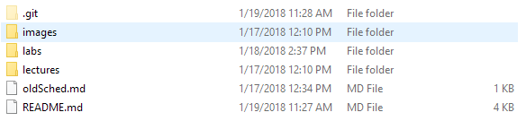
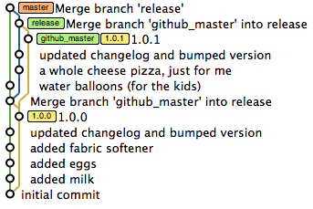
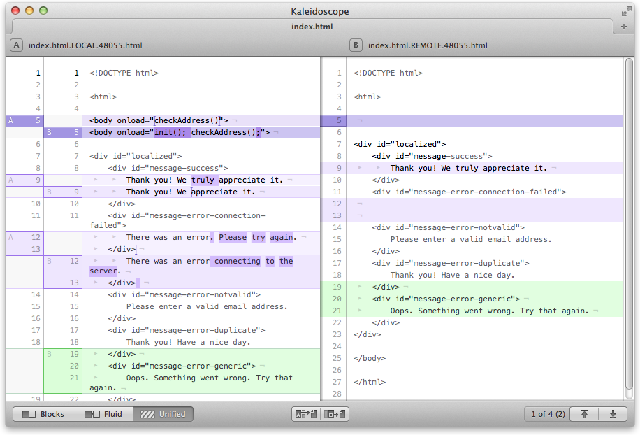

# TAMU WEBGIS
>

>
# What is Git?
As you begin your journey into web and web GIS programming you will undoubtedly see Git being mentioned on various sites and within text editors and industry figures and practically anyone who programs for a living. Well what is Git? It's a lifesaver that's what. I could end this right now knowing I've already parted to you the wisdom of Git you need to know. But you're stuck here for 50 minues. Git is a program known as a version control system or VCS. VCSs are programs that monitor changes made to directories and the files within them. There are many kinds of VCSs out there like BitKeeper, SVN, or Mercurial. So what sets Git apart from the rest? I would say ease of use, project integration, and community are the big components of Git's success. Most projects anymore use Git. Leaflet? Git. Mapbox? Git. React? Git. If you want people to contribute code, discuss issues and coming features, Git is where it's at. 

## History
 Git is a version control system created by Linus Torvalds, the creator of Linux. That alone should give quite the creedence to Git being awesome. Linus wanted to create a free and open-source VCS system that emphasized speed, data integrity, and non-linear workflows. Git was actually created for the development of Linux, an operating system made by thousands of people collaborating together around the globe, unlike Windows or MacOS which is created by industry bigwigs. How do you manage millions of lines of code written by so many loosely coupled people? Git of course. 

## What sets Git apart?
Git was revolutionary in that it was created by someone so well known in computing and being open-source and free always helps. 

# What is Github?
Github.com is a large, cloud Git repository where millions of people share their projects and collaborate with others daily. Most projects you can see on Github are public repositories where anyone can freely download code from others. You can also pay Github to host a private repository for yourself or an organization if you do not want your source code to be visible to anyone online.

# How does Git work?
Git can be quite complicated if you try to do more than the minimum required to be useful, for instance cherry picking commits, blaming, and consolidating several branches. Stick with the features below and you'll be up and using Git in no time.
>
## Init
Initializing a new Git repository is used through the `git init` command. This creates a hidden folder inside your repository (directory) labeled **.git**. Inside of **.git** are all the files Git uses to maintain your repository's history, commits, branches, remotes, etc. If you download a repository from Github or GitLab without cloning, the **.git** directory will usually be missing. What this means is that you've cloned the content but not the actual Git files. Without these files you won't have access to the commits and branches usually associated with these files. Note that you will *NEVER* edit anything in the **.git** directory directly. These files are created and edited by using Git; let Git do its job. 
>

>
## Cloning
Cloning is a useful way of downloading a Git repository from a cloud Git repository such as Github or GitLab. Given the project unique URL, cloning will go and download the repository for you with a simple command `git clone https://github.com/username/project.git`. The difference between cloning a repository and just downloading the project like you would through your browser is that cloning maintains Git integrity as the **.git** directory is present with all pass commit history and files. The main thing to keep in mind is that plainly downloading the files and then initializing a Git repository only starts keeping track of change history at that very moment
>
## Commiting
One of the main actions you will use Git for are creating commits. Think of commits as tiny snapshots in time. Everytime you make a change to a file inside a Git initialized repository Git will mark the status of said file as changed. If you type `git status` inside a Git repository with changes it will list the changes you've made. Before you can commit these changes though you must stage the changes. Staging is merely selecting which changes you've made that you would like to include in your commit. If you create a file but don't want to commit this file you can purposely omit staging this file, thereby keeping it from ever being saved in a snapshot. When you commit you will also be given the opportunity to mark your commit with a message. These messages should be a brief, meaningful description of the changes you staged for this commit such as 'Removed useless code; added new search algorithm'. These msesages help you keep track of your code changes if you ever need to look back at your changes. If a team member working with your repository pushes a commit that breaks something further down the line, you can check the commit history to find where the change was made (hopefully they made useful commit messages). An important fact to keep in mind is that commiting a change only saves the changes to your *LOCAL* repository; we will learn how to upload these changes to a cloud repository next.
>
## Pushing
 Pushing is the act of gathering up your local commits and uploading these commits to a defined cloud repository host such as a Github project. Using `git push origin master` will take your local commits and upload them (the `git push`) to a cloud repository name (Github defaults to naming the default cloud name as `origin` but it can be whatever you want to call it). You can even define multiple cloud repositories so you could have an `origin` or a `tamu` if you wanted to push your code to either the actual Github or the Github hosted by TAMU. Or if you really want to be confused you could always name your cloud repos `A` or `B`. The `master` portion of the command is the cloud repo branch you want to push your code too. We haven't touched on branches yet but by default whenever you initalize a local Git repository it will create a working branch called `master`. Branches are one of the key parts of Git development, its a way of seperating out code changes from the main (master) branch. Say you're making a website but want to make a change that could potentially be dangerous or irreversible. You could make this change inside the default `master` branch but that would be dumb. A smarter approach is creating another branch which will take the code inside the repository at this very moment and duplicate it. It will not actually duplicate the directory on your computer, but Git will separate the two branches through magic inside the **.git** directory. So you make your change that drastically changes the directory inside the new branch. If you then checkout the `master` branch you'll see that that dangerous change you made is not present. It's normal practice to do all your development inside a `dev` branch, test the code until its perfect, then uploading the commits inside `dev` to a `stable` branch. It is good practice to push all your commits at the end of the day whenever collaborating on a project with others. 
 >
 >
 
 ##### View of a Git repository with multiple branches
 >
 ## Fetching
 The Git command `git fetch` is used to grab changes from a cloud repository like Github. If you're using code from Github and would like to see the latest changes people have pushed to Github, you can use the `fetch` command to pull all the commit history for that project made since the last time you fetched. This is useful if you want to see the newest changes without merging these changes into your current repository.
 >
 ## Merging
 Merging is the process of taking changes fetched from the cloud repository and *merging* these changes into your local repository. One thing to keep in mind is that merging is the root of most problems when it comes to Git. If someone commits a change that affects a file you have commited to you'll end up with a merge conflict. Merge conflicts are when the same file has two different commits. To resolve merge conflicts you have to use special programs that show the code from commit A, code from commit B, and the original. It will then go to each line that was changed and you must choose between all three sources which change you want to keep in the file. It can be intimidating at first but once you've done it before merge conflicts aren't so bad. You will rarely use the plain `merge` command by itself.
 >
 >
 
 ##### A managable merge conflict; they get MUCH worse
>
 ## Pulling
 Pulling is a shorthand command for performing both a fetch and a merge. This will grab the latest code from your defined cloud repository and automatically merge these commits with your local repository. Merge conflicts can occur here just like with any merge. It is good practice to perform a `git pull` whenever you start coding for the day or session to avoid getting a merge conflict.

# Why use Git?
There are many reasons to use Git but at the end of the day the best reason is peace of mind. How often have you had an important file on your computer get deleted somehow or gets corrupted? Or that big midterm project you just finished didn't get saved before your computer crashed? Using Git frequently can help you avoid having to worry about these disasters. As long as you're commiting and pushing your changes to a cloud repository like Github you'll have nothing to fear. Collaborating with others is another great reason to use Git. Have you ever needed to collaborate with someone and shared files on Dropbox or Drive? Did you ever think 'Man this is a hassle'? It's because it is a giant hassle. Git streamlines the whole process for you.

<!--## Questions-->

<!--## [Set 1](../reviewquestions/02.md)-->

## Videos
[Video 02](https://youtu.be/wK_yVKVtwbo) - No Audio

