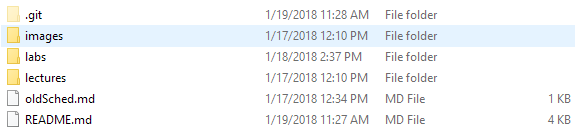

# TAMU WEBGIS
>

# What is Git?
Git is a version control system or VCS for short. What's a version control system you might ask? Think of Git as a program that monitor changes to a directory and all its child directories and files. The user can tell Git to create a commit (Git lingo for a snapshot) of a directory and Git saves all the additions, deletions, and changes made. The user can even move through time by selecting a commit and reverting back in time to what the code looked like at that moment. Commits are one of the most important features of Git and probably one of the most used. You can commit constantly but if your computer fails so too does your Git repo. To prevent loss of progress you can use Git to push your commits to a remote repo like Github or Gitlab. Github repos are just Git directories of code that someone wanted to share or preserve. If you push your local repo commits to a service like Github you could permanently delete your local repo and, with a simple one-line command, bring it all back along with any commit history. This buys peace of mind that if anything were to happen to your computer your work will always be there. On top of preservation it makes working accross machines and with others a lot easier than email or Drive.

Whenever you initialize a directory as a new git repository, you will notice that Git creates a directory inside called **.git**. Unless you have your file browser setup to view hidden files and directories you may not even notice this being added. Inside **.git** is all of the files Git uses to maintain and track your repository. You will never really need to go into this Be sure to not mess around with these files as you can seriously screw up everything Git does for you.
>

>

## The importance of Git
The following is a cautionary tale. Something like this will probably happen to a few of you at some time during your degree. Say you have a directory named **iLuvGIS** with a structure like so:
>
### **iLuvGIS**
- **Shps**
- **GDBs**
- **scratch**
- *helloworld.mxd*
- *class_project.mxd*
- *README.txt*
##### Note: in this example bolded items are directories which contain directories and files; italicized items are just files
>
We have also initialized our directory **iLuvGIS** as a git repository (repo for short). Git now monitors our directory for any changes we may make. If we add some reference text to our *README.txt* file and hit **SAVE**, Git will take notice of this change. If we add a directory named **Metadata** to **iLuvGIS** Git will know. And after we've editted the *README.txt* and added **Metadata** we delete the *helloworld.mxd*. Git takes notice. Since these are all changes we purposely made we will tell Git to create a snapshot of **iLuvGIS** at this moment; this snapshot is called a commit. Before we can commit we have to stage our changes: staging is the process of telling Git which changes you would like to include in a commit. You can cherry pick one edit for this commit or you can include all of them. You can commit after making ANY change and with every commit you can (and you **SHOULD**) provide a brief, meaningful message describing the changes that occured. This message is useful as it lets you look back on the changes you made in a way meaningful to you. 

 Now within **iLuvGIS** lets say we are making some changes to our *class_project.mxd* file inside of ArcMap for our big semester project. Since we're using ArcMap it would be wise to save our project often just in case it crashes. 

Everything is going real swell and we're making sure to save frequently (it's ArcMap, you should always make this precaution). Then when we're in the final stretch and almost done when *POW!*. ArcMap crashes and our whole **iLuvGIS** directory is gone. And just to make this scenario couldn't get even worse someone spilt Dr. Pepper on the computer causing it to burst into flames. @#%#&!!! We'll surely fail now!

- # What is Git?
- ## History
- ## What sets it apart
- ## Premise
- # Why use Git?
- ## Cautionary tale
- # What is Github?
