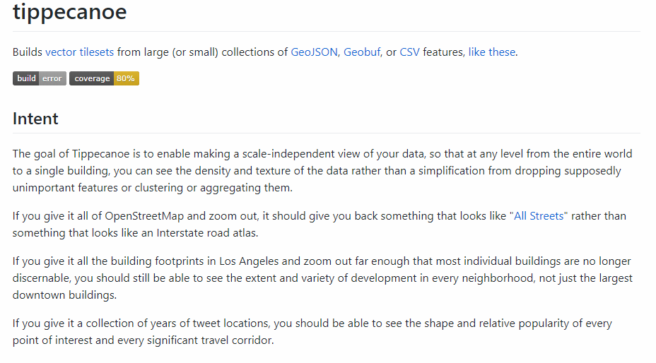

# TAMU WEBGIS
>

# More Git
Git is fundamental in this class, this is why we'll be focusing so much on it. 

# Git Extensions / other Git tools
## Git Extensions
In this class you'll often hear and / or see Dan use some fancy tool called Git Extensions. What is it? It's a useful GUI frontend for managing Git repositories. Well what does that mean? All it does is add a graphical user interface (a window with buttons) to Git; this lets you manage a Git repository without remembering specific written CLI commands like `git remote add https://github.tamu.edu/myuser/myrepo.git`. You could do this with a fancy little popup box that lets you add remotes and countless other Git commands. Cool huh?

## Installing Git Extensions
Installing Git Extensions has been a pain in the past so to expedite this we'll go over setting it up here. Obviously the first thing you need to do is download Git Extensions from this site [here](https://github.com/gitextensions/gitextensions). Make sure to download the **Latest Release** under the Download header as this is the stable version (less likely to crash and have issues). Once you have that downloaded click on the installer. You should eventually end up with a screen that looks like this:
>

>
Make sure that the **Windows Explorer integration** is marked for installation; this is one of the most useful featurse of Git Extensions. On the next window select PuTTY if you're using Windows and OpenSSH if you're using a Unix based operating system (Linux, MacOS). Then keep hitting next until it finishes installing. You now have Git Extensions installed! 

## Configuring Git Extensions
After you have successfully installed Git Extensions, it is now time to configure it. This is where most people go wrong in the setup process. Git Extensions doens't function correctly without being configured, that is why I'm going to show you what to do! Start up Git Extensions (useful Windows tip: use the Windows key to bring up the start menu, then type in any program you want to open it quicker) and you'll be presented with a "Choose your language" popup. Choose your language. After that you'll be presented with the settings / configuration checklist.
>

> #### Settings / configuration checklist
If for any reason the settings checklist / configuration isn't show, just go to `Tools > Settings` in the main menu to bring it up. All the portions that are highlighted green are good, that means when Git Extensions was installed that it was able to configure that for us. Clicking on any item, green or red, will open up a window with all the info regarding that such as your user name and email. Most people will probably have an issue with the KDiff3 setting. Click on it and you'll probably get a window like this:
>

>
Like the window explains this is because we do not have kdiff3 installed or set up probably. You can use any Git merge conflict resolving software but we'll be using kdiff3. You can download it [here](https://sourceforge.net/projects/kdiff3/files/kdiff3/0.9.97/). Go ahead and install it with the default settings. Make note of the path that you install kdiff3 to. If you don't happen to know the path is the location of a directory or file such as `C:\DevSource\kdiff3`. With kdiff3 installed we can set our merge tool to the kdiff3.exe; this is where you made not of the kdiff3 path comes into play. If you have any other red items you may need to install other software such as PuTTY. You can fix other items usually in the same manner that you would fix kdiff3. Once all items are green you should be good to go. 

## Git Extensions main window
As mentioned earlier, Git Extensions acts a GUI for Git. The first time you launch Git Extensions with the settings complete you will see this window.
>

>
From here you can quickly clone or even create a new repository. In addition to manually inputing the remote URL for your repository, you can also link your GitHub account with Git Extensions. This gives you a menu that is always populated with your repositories

## Git Extensions right-click context
The most handy feature for lazy programmers is the right click context menu provided by Git Extensions. You can now right click any Git initialized repository inside of File Explorer to provide Git context menu seen below.
>

>
As you can see here you can quickly push, pull, view history, and checkout revisions all with this tool. You may not think this is important as a Git beginner, but as you accumulate more and more Git repos that need to be synced with the remote, this will be a life saver. With this menu you don't need to keep a Git bash window open at all times or rely upon your memory to stage, commit, push, etc. 

## Using Git inside VSCode
Using Git Extensions is fine and dandy, but what if you don't even want to bother with that? What if you wanted to do everything inside your newly discovered, favorite text editor Visual Studio Code? Of course you can do that! Along the side pane of VSCode you'll see several icons: the file explorer, search, debug, extensions... And then there's the **Source Control** option that looks like a stethoscope. This is where you can do all your Git right inside of VSCode. 
>

>#### Source Control inside of VSCode
>
From this you can pick and choose which changes to stage and commit using the **+** sign next to a change or remove a change if you want with the swirly, refresh sign. The ellipsis brings down a menu with a plethora of different Git commands for your disposal as well. Once you get the hang of it using Visual Studio Code's built in **Version Control** functionality makes proper Git usage a breeze.

<!-- ## Other Git tools
Git may appear daunting at first, but don't let that *git* you down. There are an insane amount of tools for using Git out there aimed at people who have just started using Git to those who have been using it for years.  -->

# GitHub
GitHub is the main remote repository we will use in this class as well as arguably the most popular cloud hosted Git repository around. If you wish to keep programming in the future you will soon realize how much of an asset GitHub and any projects hosted on there can be. There are seriously millions of projects on there varying from someone playing around with Git to community projects maintained by hobbiests to full blown products from huge corporations. 
- Explain the readmes
## Project README
Every project needs a nice big landing page on GitHub if you want to draw the attention of people to your project. You can achieve this through README.md. GitHub looks for a file in any root directory named README.md, the .md meaning MarkDown. MarkDown is a fancy way of structuring text and layouts; what you see right now is made with MarkDown. 
>

> #### Typical README.md from GitHub
>
The README details a lot of important details regarding a project such as what the project does, how to install it, common usage, and more. Always make sure to give the README a quick read when visiting a project. 

- Explain the commit portion
## Commits on GitHub
Git stores away all commits so that you can view code changes and revert back any project breaking changes. To view these commits inside of GitHub click on **commits** above the branch selector on the main page of the project.
>

> #### The commits button
Select this and you'll be presented with a list of recent commits to the branch. If you select a specific commit you can see **EVERY** change made in this commit. 

- Explain the + and -'s
- Issues 
- Pull requests
- Wiki