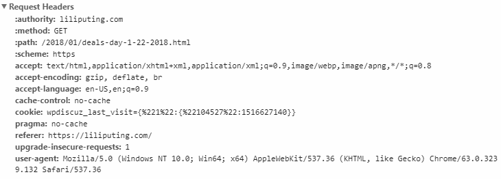

# TAMU WEBGIS
>

<!-- INTRO TO THE INTERNET AND ONLINE MAPPING -->
# What is this "Internet"?
Starting back in the 1960s, the internet has found itself embedded in all aspects of modern life. But what exactly is the internet? The internet is a decentralized network of connected computers and devices that is global in scope. These computers and devices utilize a protocol suite called TCP/IP (also known as the internet protocol) to create the link amongst eachother known as the internet.  This internet protocol provides end-to-end data communicatinon specifying how data should be packetized, addressed, transmitted, routed, and received. The internet depends on a series of different structures and protocols to keep the gears moving. Below you will find some internet and networking jargon explained.

## HTTP
<!-- - Stands for Hypertext Transfer Protocol
- Created in 1989 by Tim Berners-Lee (MR. World Wide Web) at CERN
- Function as a request - response protocol
- User agent
- URL
- FTP -->
Created by Tim Berners-Lee in 1989, Hypertext Transfer Protocol or HTTP is an application layer protocol for transmitting hypermedia documents like HTML. Originially conceptualized as communication between web browsers and web servers, but can be used for other purposes. HTTP is stateless, meaning that the server does not keep any data(state) between two requests. Pretty much all web traffic anymore employs HTTP. Every request you make online contains something called a header. This header defines a lot about the request you are making such as your language, any cookies you have, and your current device. Your internet browser sends a **user agent string** that identifies your device to the website. This website then can provide a mobile experience for you if you happen to be on your phone. A typical user agent string looks like this:
>
`Mozilla/5.0 (Windows NT 10.0; Win64; x64) AppleWebKit/537.36 (KHTML, like Gecko) Chrome/63.0.3239.132 Safari/537.36`
>

>
>#### A typical HTTP header

## Ports
Ports are endpoints of communication for operating systems represented by a 16-bit integer maxing out at 65535. These endpoints denote specific protocol types or processes such as HTTP or FTP; ports distinguish the service requested by the remote computer. These processes "listen" on these ports for requests such as fetching emails or transfering files from one computer to another. Ports 1 through 1024 are known as **well-known port numbers** and are generally reserved. Many protocols utilize a **well-known port number**; examples of this include port 80 being reserved for HTTP, port 443 being reserved for HTTPS, and port 21 for FTP. You'll often hear about a blocked port, this is a firewall working to prevent someone or some program from taking advantage of this open portal to your system.

## DNS
Since all internet connected devices out there have a unique identifiying number (an IP address), have you ever wondered why typing in google.com gives you a site without having to put in its IP? This is all due to a specialized server that your devices point to called a **Domain Name System**. Though they have many tasks, these servers main job is to take a place URL like youtube.com or google.com and return the IP for the site. Imagine how terrible life would be if you had to remember a series of 12 digits to get to any site you want. What if you want to go to Youtube to learn more about the internet but there are no DNSs? Good luck remembering 77.153.128.46. DNSs can also act as a first line protection to keep known spam addresses from sending email to you.

## The Query String
<!-- - Part of the URL containing data that does not fit conventiently into a hierarchical path structure
- https://www.google.com.br/search?q=whats+a+query+string&gws_rd=cr&dcr=0&ei=GOhkWp6NNcSZwQSv1YLoCg contain
- ? acts as a seperator -->
The query string is a URL that defines parameters used by the server backend to perform some task. You can easily identify the query string in a URL by looking for the question mark right after the domain of the site. These parameters are in the format `key=value` and parameters are separated by ampersand. Given a URL like this: 
`https://www.google.com.br/search?q=whats+a+query+string&gws_rd=cr&dcr=0&ei=GOhkWp6NNcSZwQSv1YLoCg`
One can figure out what was searched just by looking at the query string alone. Starting after the question mark you can see `q=whats+a+query+string` is the parameter passed to Google to search. 

## Web crawlers
<!-- - Internet bot that browses the web, usually to web index -->
Web crawlers, sometimes called spiders, are internet bots that browse the web for the purpose of indexing. These indexes link key words or tokens back to a particular domain. Search engines then use indexes to help provide domains and links to the user from their query.

## SSL
<!-- - "SSL certificates create a foundation of trust by establishing a secure connection"
- Secure sockets layer -->
SSL (Secure Sockets Layer) is the standard security technology for establishing an encrypted link between a web server and a browser. This link ensures that all data passed between the web server and browsers remain private and integral. SSL is an industry standard and is used by millions of websites in the protection of their online transactions with their customers.

## Password management
Password managers are programs or services that work by creating and storing encrypted passwords for the user. Usually you will set a single main password that you create, then the programs will create passwords for various sites and programs for you that are very strong. Strong passwords usually contain random alphanumeric characters and symbols to reduce the chance of someone guessing or brute forcing your password. 

[Lastpass](https://www.lastpass.com/how-lastpass-works) is a great example of this type of software. 

## Videos
[Video 05.1 - 2018-01-17](https://youtu.be/a-23nGoKDzw)
[Video 05.2 - 2018-01-22](https://youtu.be/et0XR0Ohy_0)
[Video 05.3 - 2018-01-24](https://youtu.be/n2RvXGZFqaQ)
