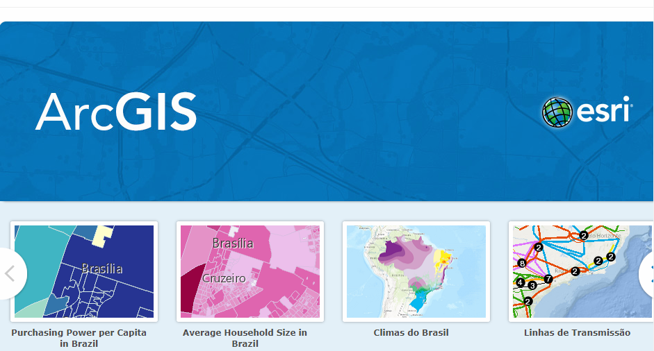
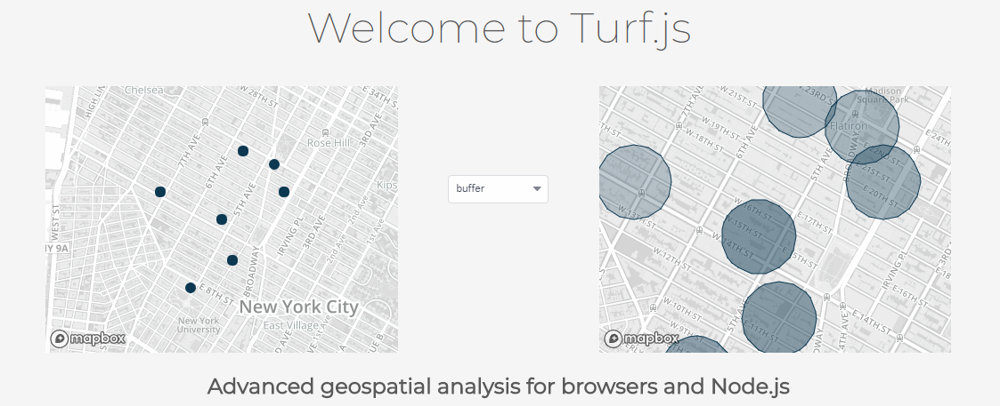

# TAMU WEBGIS
>

# Learning Objectives
>
- Describe the purpose of online mapping
- Enumerate the types of online maps
- Enumerate the types of online map layers
- Describe the purpose, types, limitations, and constraints o finteractive elements
# Online Mapping
Building and using web maps is different from working with a desktop GIS for a variety of reasons:
- In a web map, any information you see has to be sent “across the wire” from the server to your browser, introducing latency.
- In a web map, you may be pulling in information from several different servers. Your map performance is therefore limited by the availability and speed of all the servers you're using.
- In a web map, performance may be affected by other people using the server at the same time.
- In a web map, you are limited to the display technologies supported by the client application, which may be a basic web browser.
These considerations can sometimes take people by surprise. For example, if you've only used ArcMap or QGIS in the past, you may not be accustomed to thinking about broadband speeds or sharing the machine with other people.

By far, the biggest challenge for new web mappers is understanding the amount of data that is displayed in their maps and how to get all that information drawn on the screen of a web user in sub-second speeds. Many people who have worked with desktop GIS packages are accustomed to adding dozens (or even hundreds) of layers to the map and switching them on and off as needed. Your powerful desktop machine may be able to handle the drawing of this kind of map; however, performance will be unacceptably slow if you try to move the map directly to the web. The server requires precious time to iterate through all those layers, retrieve the data, draw it, and send the image back to the client.

To address this problem, most web maps break apart the layers into groups that are handled very differently. Layers whose sole purpose are to provide geographic context are grouped together and brought into the map as a single tiled basemap. In contrast, thematic layers (the layers that are the focus of the map) are brought in as one or more separate web services and placed on top of the basemap. You might additionally decide to include a set of interactive elements such as popups, charts, analysis tools, and so forth.

Let's take a closer look at these three things--basemaps, thematic layers, and interactive elements--to understand how each is created and displayed.

## Basemaps
A basemap provides geographic context for your map. In other words, it is usually not the main reason people look at your map, but your map would be difficult to interpret without it. The most common base maps you've used online are vector road maps and remotely sensed imagery.

Although a basemap may consist of many sublayers (such as roads, lakes, buildings, and so forth), these are often fused together into a rasterized set of tiled images and treated as a single layer in your web map. These tiled maps consist of often thousands or millions of predrawn images that are saved on the server and passed out to web browsers as people pan around the map.

In the past couple of years, it has become fashionable in some applications for the server to send the basemap as chunks of vector coordinates, sometimes known as "vector tiles." Displaying the basemap as vectors instead of a rasterized map allows for more flexibility in visualization, such as being able to rotate the map while the labels stay right-side-up. You can see a vector basemap in action if you look at the Google Maps app on a smartphone.

Sometimes two tiled layers will work together to form a basemap. For example, you may have a tiled layer with aerial imagery and a second tiled layer with a vector road overlay that has been designed to go on top of the imagery. (In Google Maps, this appears when you check the Labels item). Keeping these two tilesets separate takes less disk space and makes it easier to update the imagery.

>

>#### OpenStreetMaps

## Thematic layers
Thematic layers (also known as business or operational layers) go on top of the basemap. They're the reason people are coming to visit your map. If placed on the basemap, they might not be of interest to everybody, but when placed on your focused web map, they are the main layer of interest. If your map is titled “Farmers markets in Philadelphia,” then farmers markets are your thematic layer. If your map is titled “Migration patterns of North American birds,” then the migration patterns are your thematic layer.

Like basemaps, thematic layers are sometimes displayed with tiles; however, this may not always be possible due to the rapidly changing nature of some data. For example, if you need to display the real time positions of police vans, you cannot rely on predrawn tiles and must use some other way to draw the data. There are various web services such as Web Map Service (WMS , it will be covered in a lecture on Web Services) that are designed to draw maps on the fly in this way. You can use these for your thematic layers.

Your map may include several thematic layers that you allow users to toggle on and off. To accomplish this, you can use a single web service with multiple sublayers, or multiple web services that each contain a single layer. However, to keep your app usable and relatively fast-performing, you should avoid including many thematic layers in your web map.

>

> #### Example of many thematic layers

## 3D Maps
[Mapbox 3D](https://docs.mapbox.com/mapbox-gl-js/example/3d-buildings/)
[Mapbox 3D - Indoor](https://docs.mapbox.com/mapbox-gl-js/example/3d-extrusion-floorplan/)

## Contextual/Story Maps
[Story Maps](https://storymaps-classic.arcgis.com/en/gallery/#s=0)

## Interactive elements
Web maps are often equipped with interactive elements that can help you learn more about the layers in the map. These can be informational popups that appear when you click a feature, charts and graphs that are drawn in a separate part of the page, slider bars that adjust the time slice of data displayed in the map, and so forth. Some web maps allow you to edit GIS data in real time, or submit a geoprocessing job to the server and see the response drawn on the screen. Others allow you to type a series of stops and view driving directions between each.

These elements make the map come alive. The key to making an effective web map is to include the interactive elements that are most useful to your audience, without overwhelming them with options or making the tasks too complicated. Even a little bit of housekeeping, such as including user-friendly field aliases in your popups, can go a long way toward making your map approachable and useful.

Interactive elements are the part of your web map that require the most custom programming. The amount of interactivity you have the freedom to add may be strongly correlated with the amount of JavaScript programming that you know how to do. Open web mapping APIs such as OpenLayers and Leaflet provide convenient methods for doing some of the most common things, such as opening a popup.

> Great example of interactive elements: http://bl.ocks.org/NPashaP/a74faf20b492ad377312

##### [Credits to Bo Zhao and Oregon State](https://github.com/jakobzhao/geog371/tree/master/lectures/lec04)

# Types of online maps
Online maps are much more than your typical Google Maps. Online maps can be used to do research or distribute your data around the globe for others to benefit from such as ArcGIS Online. The beauty comes from others taking something you've created and creating something of their own with it; that's the whole basis of online mapping. 
## Browser
>

> #### Google Maps
>
>
 
> #### ArcGIS Online
>
>

> #### Turf.js

 ## Mobile apps
 >
 
 > #### MapboxGL SDK
 
<!-- ## ArcGIS Online -->

 <!-- ## 
- Types of online map services -->

<!--## Questions-->

<!-- ## [Set 1](../reviewquestions/06.md)-->

## Videos
[Video 06 - 2018-01-26](https://youtu.be/w-VvT1BeRYY)
