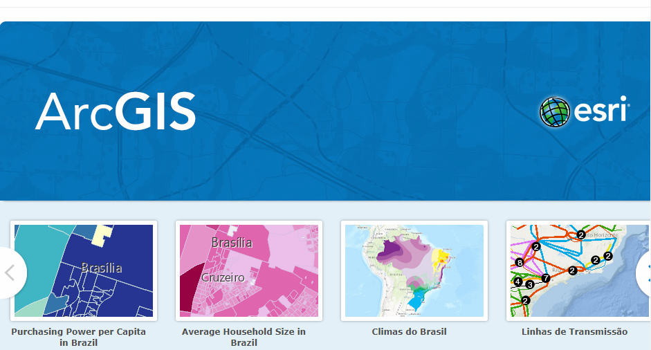
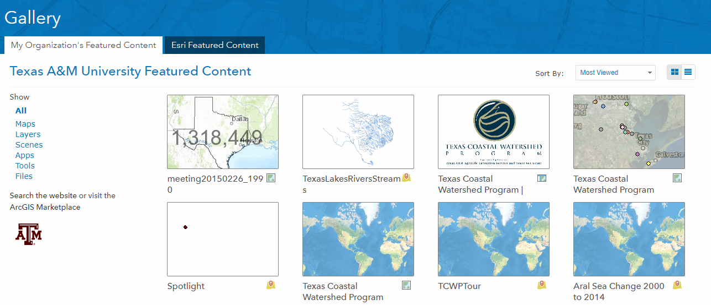
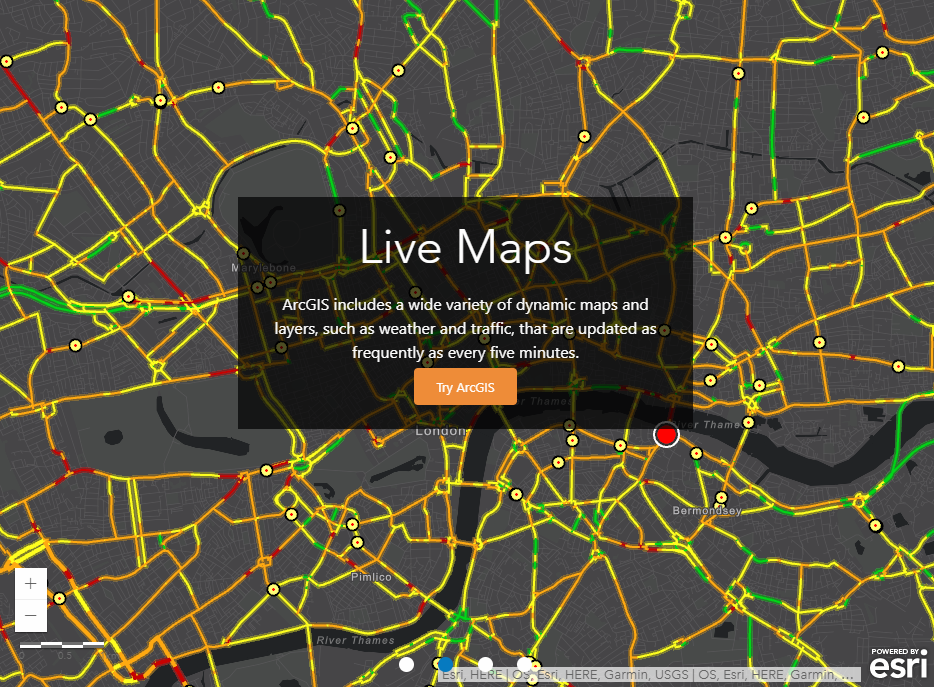
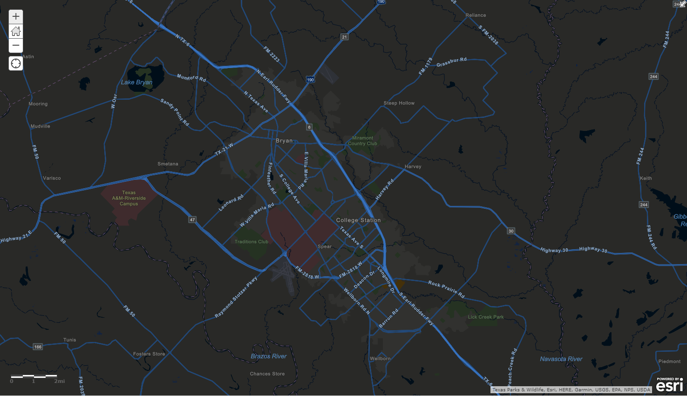
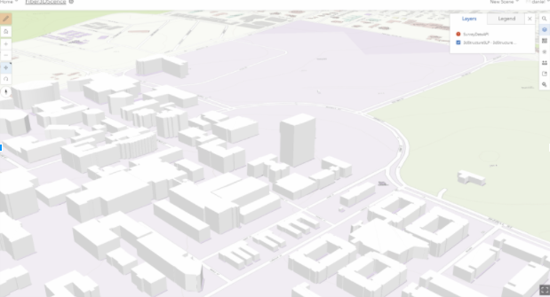
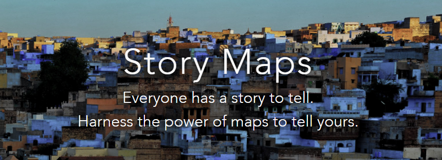
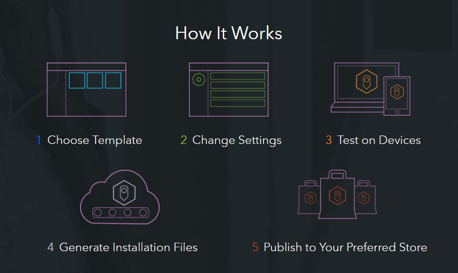

# TAMU WEBGIS
>

# ArcGIS Online
ArcGIS online is an example of a cloud-based WebGIS system. ArcGIS Online provides user data storage, map authoring tools, data and map distribution and sharing capabilities, and a series of interesting components that allow users to collect data in the field (ArcCollector) and distribute it to the world (Story Maps, Web Apps). 
>
ArcGIS Online is the central location that provides the web interface for uploading data, creating maps, applications, and services, and publishing these data and services that allow other people to connect and use them. There are a very large number of data sets and services that ArcGIS Online users worldwide have uploaded to ArcGIS Online and make available for free to other users looking to utilize their data.
>
While there are scary amount of moving parts that go into publishing to, using, and consuming maps and data from ArcGIS online, it is quickly becoming one of the most popular aspects of the Esri set of ArcGIS tools for several reason:
- ArcGIS Online does not require the use of desktop software to create and distribute maps. This means that there is no desktop software to upgrade, license, or maintain.
- ArcGIS Online provides much of the spatial analysis and cartographic tools available inside of ArcGIS Desktop tools. This means that most common GIS mapping and analysis can be done directly in a web browser.
- Esri staff handle ArcGIS Online software updates, data backups, and bugs fixes. This means that end-users do not need to worry about any of backend maintenance issues, nor do they have to worry about how or where their data are stored and that these data and services are available 365x24x7 - Esri handles it.
- The full suite of Esri tools - from desktop apps (ArcMap, ArcGIS Pro), to mobile apps (Survey 123, Collector), to server platforms (ArcGIS Enterprise, ArcGIS Portal) - natively integrates seamlessly into and through ArcGIS online. This means that the full spectrum of end-user needs - from basic map viewing to, to custom data collection processes, to unique application development can all be integrated together in a single platform which can be utilized online, on a desktop, or on smart devices.
>

>##### From: [arcgis.com](https://www.arcgis.com/home/index.html)

# Components

>##### From: [arcgis.com](https://gisinsider.files.wordpress.com/2013/05/arcgis_structure.jpg)
>
# Organizations
ArcGIS Online Organizations provides a way that end-users of ArcGIS Online can form groups to manage the users, data, services, and price of utilizing ArcGIS Online. Esri provies enterprises customers (those with site licenses), such as Texas A&M, with a custom section within the https://arcgis.com website specifically for the organization. 
>
The Texas A&M ArcGIS Online organization is located at http://tamu.maps.arcgis.com. All faculty, staff, and students at Texas A&M can become members of this ArcGIS Online Organization by emailing the one of campus administrators (daniel.goldberg@tamu.edu, klein@tamu.edu, or sladdusaw@library.tamu.edu) and requesting access. 
>
Once a user has an account with the TAMU ArcGIS Online organization, s/he can immediately begin uploading data and services to ArcGIS online to start creating and distributing web maps and apps. The organization as a whole is granted by Esri a set amount of space for storing data and a set amount of “credits” for processing data. It is up to the administrators to divide the space and credit allocations across the members of the organization. Some spatial processes require lots of credits, like geocoding, while others require very few, like simple buffering and intersections.
>
Each organizational user is provided with their own dedicated account, meaning that they can choose to upload data and NOT share it with the whole world. Or, they can choose to share it with specific people, specific groups of people (which individual users can create and manage membership for), or they can make their data public at the organization level (all members of the organization can see it) and/or publicly accessible (anyone on the internet can see it).
>

>##### From: [arcgis.com](https://tamu.maps.arcgis.com/home/gallery.html)
# Capabilities
ArcGIS Online allows users to create interactive maps, scenes, and apps you can share with others: 
## Find data
ArcGIS Online hosts thousands and thousands of data layers which are available for users of ArcGIS Online, Desktop, and Mobile to use as base maps and thematic layers within their maps and applications.These data include imagery, a series of basemaps, demographic and lifestyle data, boundaries and places, landscapes, oceans, Earth observations, community maps, transportation, and many more.
>

>##### From: [arcgis.com](https://www.arcgis.com/features/maps/index.html)
>
## Create maps
A map you create in ArcGIS Online is an interactive map that displays geographic information to tell stories and answer questions. These maps are available to a wide audience and include multiscale basemaps, operational layers targeted to a specific audience, and information pop-ups that allow users to drill into specific features they are interested in. They also support visualization, editing, analysis, and time. They are the basis of web apps and can be viewed on a wide variety of clients, including mobile devices, desktop applications, and web browsers. [Learn more](https://doc.arcgis.com/en/arcgis-online/create-maps/choose-basemap.htm).
>

>##### From: [arcgis.com](https://tamu.maps.arcgis.com/home/webmap/viewer.html?webmap=7e2b9be8a9c94e45b7f87857d8d168d6&zoom=true)
>

## Create scenes
Create dynamic highly-realistic scenes in Scene Viewer. Choose between a global or local scene to visualize geospatial content that includes cartographic elements, such as, a multiscale basemap, 2D and 3D layers, layer configurations, lighting, and camera views. Scenes allow you to creatively represent geographic information in an intuitive and interactive 3D environment for your audience. [Learn more](https://doc.arcgis.com/en/arcgis-online/create-maps/choose-global-local-scene.htm).
>

>##### From: [arcgis.com]()
>
## Perform analysis
- Summarize data - Aggregation,  Joins, Summarize nearby/within
- Find Locations - Select by attribute/location, Viewshed, Routing, Centroids
- Data enrichment - Apply data to location
- Analyze patterns - Density, Hotspots, Outliers, Interpolation
- Use proximity - Buffers, Drive-times, Nearest, Routing
- Manage data - Extract, Overlay, Dissolve
>
## Create apps
Apps combine maps, scenes, or groups with text, multimedia, and interactive functions to inform, educate, entertain, and inspire people about a wide variety of topics. You create apps by building and refining maps, scenes, or groups and incorporating them into configurable apps or builders. You can create, modify, edit, and publish apps without needing specialized development skills. [Learn more](https://doc.arcgis.com/en/arcgis-online/create-maps/choose-configurable-app.htm).
>
## Apps for the field
Apps for the field provide focused workflows and tools for your day-to-day tasks. With these apps, you can track assets, create operational dashboards, collect data and imagery, and navigate routes. These apps run everywhere—on desktops, the web, smartphones, and tablets—so you can be productive no matter where you are or what device you are using.
- Collect and edit data in the field with [Collector for ArcGIS](https://links.esri.com/agol-help/collectorproduct).
- Use [Navigator for ArcGIS](https://links.esri.com/agol-help-navigator) to route to places that matter to you
- Use [Operations Dashboard for ArcGIS](https://links.esri.com/agol-help/operations-dashboard-arcgis) to create dynamic dashboards to monitor people, services, assets, and events in real time.
- Everyone in your organization can use [Explorer for ArcGIS](https://links.esri.com/agol-help/explorer-arcgis) to discover, analyze, and share maps on their device.
- [Workforce for ArcGIS](https://links.esri.com/agol-help/workforce) allows you to sync with other apps to get assignments, navigate to them, and collect data in one workflow, on one mobile device.
- [Survey123 for ArcGIS](https://links.esri.com/agol-help/survey123) is a simple and intuitive form-centric data-gathering solution for creating and analyzing surveys in three easy steps.
>
## Apps for the office
View, analyze, create, and share maps and location information. ArcGIS apps work for marketing, operations, strategy, sales, leadership, IT, GIS, and more. With these apps, you can analyze data from more angles, including location, to make smarter decisions.
- Use Map Viewer to [perform analysis](https://doc.arcgis.com/en/arcgis-online/analyze/perform-analysis.htm) and [create maps](https://doc.arcgis.com/en/arcgis-online/get-started/get-started-with-maps.htm) that you can share through apps and websites.
- View, create, and share 3D scenes in a browser with [Scene Viewer](https://doc.arcgis.com/en/arcgis-online/get-started/get-started-with-scenes.htm).
- Use [ArcGIS Pro](https://links.esri.com/agol-help/pro) to create 2D and 3D maps.
- Use [ArcGIS Earth](https://links.esri.com/agol-help/earth) to display 3D and 2D map data, including KML, and sketch placemarks to easily understand spatial information.
- [ArcGIS Maps for Power BI](https://links.esri.com/agol-help/power-bi) offers Microsoft Power BI users enhanced mapping capabilities, demographic data, and map visualizations.
- Add mapping capabilities to Microsoft Excel and PowerPoint with [ArcGIS Maps for Office](https://links.esri.com/agol-help/maps-for-office).
- Use [ArcGIS Business Analyst](https://links.esri.com/agol-help/ba) to analyze the data in your business.
- Get mapping capabilities in a web-based framework using [ArcGIS Community Analyst](https://links.esri.com/agol-help/ca).
- [GeoPlanner for ArcGIS](https://links.esri.com/agol-help/geoplanner) allows you to collaborate with your ArcGIS Online organization on land-based planning and designs.
- Integrate map-based query capabilities with [Esri Maps for MicroStrategy](https://links.esri.com/agol-help/micro-strategy/).
- Use [Esri Maps for IBM Cognos](https://links.esri.com/agol-help/maps-for-cognos/) to add maps into your IBM Cognos reports.
- Add mapping capabilities to Microsoft SharePoint with [ArcGIS Maps for SharePoint](https://links.esri.com/agol-help/sharepoint).
- Create, edit, and share 3D building models and urban environments with [Esri CityEngine](https://links.esri.com/agol-help/cityengine).
- [Drone2Map for ArcGIS](https://links.esri.com/agol-help/drone2map) streamlines the creation of professional imagery products from drone-captured imagery for visualization and analysis in ArcGIS.
- [ArcGIS Maps for Adobe Creative Cloud](https://links.esri.com/agol-help/adobe-creative) gives you access to maps from within the Adobe design apps.
- Perform iterative and exploratory data analysis with [Insights for ArcGIS](https://links.esri.com/agol-help/insights-product).

>
## Apps for the community
Use configurable apps and open data portals to share vital information and bring your content to life.
- Use [Esri Story Maps](https://links.esri.com/agol-help/storymaps) to create story-based apps that inform and inspire your audience.
- With [ArcGIS Open Data](https://links.esri.com/agol-help/open-data/), you can provide open data access to the public.
- Choose from a comprehensive set of [configurable apps](https://links.esri.com/agol-help/configurable-apps) to create your own focused web apps.
>

>##### From: [arcgis.com](https://storymaps.arcgis.com/en/)
>
## App builders
Want apps with your own look and feel? Create modern, responsive web apps with ArcGIS app builders.
- Create your own native, cross-platform apps with [AppStudio for ArcGIS](https://links.esri.com/agol-help/appstudio).
- Use [Web AppBuilder for ArcGIS](https://links.esri.com/agol-help/wab) to create apps from ready-to-use widgets and configurable themes.
- Choose from a comprehensive set of [configurable apps](https://links.esri.com/agol-help/configurable-apps) to create your own focused web apps.
- Use [Esri Story Maps](https://links.esri.com/agol-help/storymaps) to create story-based apps that inform and inspire your audience.
>

>##### From: [arcgis.com](https://appstudio.arcgis.com/)
>

## Questions

## Videos
[Video 07.1 - 2018-01-31](https://youtu.be/U5toXUl1zGI) - Starts at 17 mins
[Video 07.2 - 2018-02-02](https://youtu.be/cpLLXLXwBMY) - Starts at 7:30 mins
