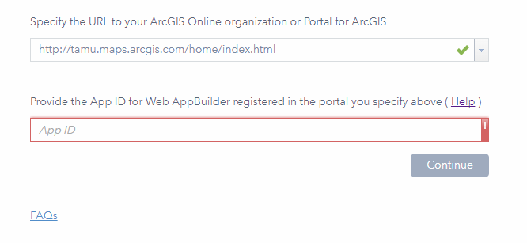
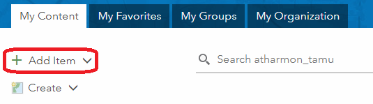
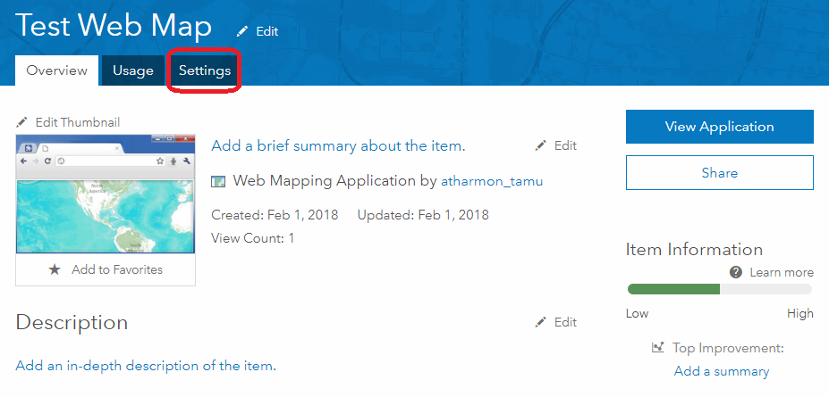
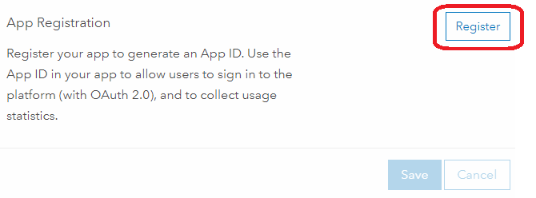
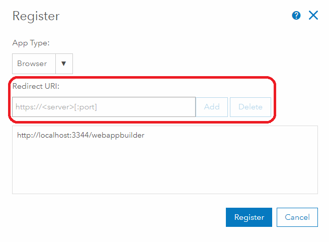
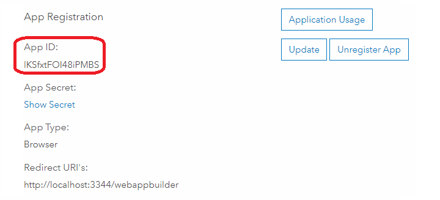
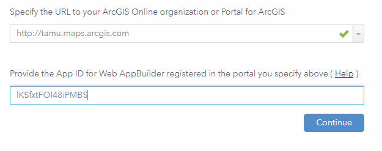

# TAMU WEBGIS
>

# Learning Objectives
>
- Describe what Web AppBuilder for ArcGIS is
- Discover the various features Web AppBuilder for ArcGIS has
- Detail how to install Web AppBuidler for ArcGIS
- Describe the purpose, types, limitations, and constraints of interactive elements

# ArcGIS Collector
If you are happy with the basic stuff that you can do with ArcGIS Collector/Survey123, etc.
 - [New](https://www.esri.com/en-us/arcgis/products/collector-for-arcgis/resources)
 - [Old](https://www.esri.com/about/newsroom/arcuser/create-your-own-collector-map/)

# Web AppBuidler for ArcGIS
If you need additional functionality that is not included in existing off the shelf Esri "apps".

Web AppBuilder for ArcGIS is an intuitive what-you-see-is-what-you-get (WYSIWYG) application that allows you to easily build web apps. It includes powerful tools to configure fully featured HTML apps using an extensible framework for developers.

# Features
- Create HTML/Javascript apps that work on desktop browsers, tablets, and smartphones
- Integrated with the ArcGIS Online and ArcGIS Enterprise platforms
- Build the apps you need using ready-to-use widgets, such as Query, Geoprocessing, and Print
- Create custom app templates
- Extensible framework for developers to create widgets and themes
- Create apps by accessing workflow tabs including Theme, Map, Widget, and Attribute
- Build 3D apps

# Installation
Installing Web AppBuilder can be a hassle and surprisingly annoying. Outlined below are steps needed to get Web AppBuilder for ArcGIS installed and running on your computer.
>
The first step is to download Web AppBuilder [here](https://developers.arcgis.com/web-appbuilder/). The download should include NodeJS so you shouldn't have to worry about installing that separately. Extract the downloaded **.zip** and you'll end up with a Web AppBuilder directory, enter this directory. You should see a file inside the root directory called **startup.bat**. Double click this **batch** file to run Web AppBuilder for ArcGIS. This will launch a a screen NodeJS prompt. It will flash a few lines then stop. Once you're good, open up your favorite browser and head to http://[computername]:3344/webappbuilder/. You could use localhost as your computer name just to make sure it works but you'll run into issues later trying to add create an app. You should see what's below:
>

>
Put the Texas A&M University ArcGIS Online organization account URL into the first field. You'll then be required to provide an **App ID**, we'll create one in the following steps. At this time head to the TAMU ArcGIS Online main page. Once there click the button near the top called **Content**. 
>

>

>

>
Within the **Content** page, you should click the button **Add Item**. This will show a drop down, from here select **An Application**. In the resulting popup, make sure to choose the following:
- **Type** whatever the application type is
- **Purpose** select Ready to Use
- **API** select Javascript
- **URL** enter in URL you used earlier (http://[computername]:3344/webappbuilder or if on a domain: http://[computername].[yourdomain]:3344/webappbuilder)
- **Title** enter in a name that makes sense
- **Tags** enter in tags that describe your application
- Click **Add Item**
>

>
On your application page head to the settings tab near the top. Here you will select **Register**.
>

>
Within the **Register** page make sure to choose the appropriate **App Type** then add your machine URL from earlier (http://[computername]:3344/webappbuilder) yet again to the section labeled **Redirect URI**.
>

>
Click **Add** then **Register**. You'll be shown a page that shows application details, you should make note of your **App ID**, you'll need that for the next step.
>

>
Open up your machine URL (http://[computername]:3344/webappbuilder) and input your **App ID** into the second field. If everything works you should be able to start creating Web AppBuilder applications.
>

>
Here are examples of apps you can create using of Web AppBuilder. 

>
Tons of examples [here](http://esridevbeijing.maps.arcgis.com/apps/MapAndAppGallery/index.html?appid=1e3085af6e1a48c8908fa624bdfef768)

# Parts of a Web AppBuilder application
## Widget
Widgets are little chunks of functionality that are tied into an interactive view; an example of a widget would be a zoom widget that has a button for zooming in and a button for zooming out. You can create these with Javascript. These are the basis of your Web AppBuilder application.

## Panel
Panels are tasked with showing widgets for you; they allow you to scale widgets independently of the widget itself. Multiple widgets can be inside of a single panel.

## Theme
Themes define how the UI of the application look; these include:
- How the widget displays via theme panels
- The color scheme, fonts, and so on
- Where widgets are located on the viewers UI

# Advantages
- Ease of use; Web AppBuilder is simple to get setup and use
- Quality looking product created in no time at all
- Product easily works across different platforms such as desktops and smart devices
- Vast array of different plug-able widgets
# Disadvantages
- Limited to ESRI products and ecosystem
- Limited visualization (no D3.js)
- You don't learn anything. This could be either an advantage or disadvantage depending on who you ask.
##### Credits to [ESRI](https://developers.arcgis.com/web-appbuilder/guide/xt-welcome.htm)

<!--## Questions-->

<!--[Set 1](../reviewquestions/08.md)-->
