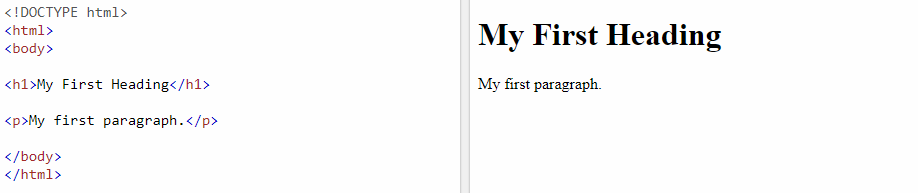
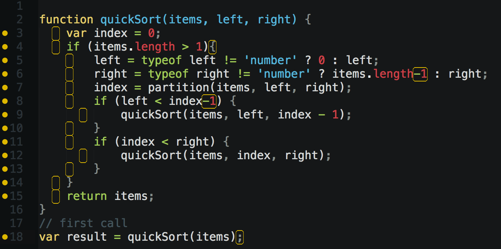

# TAMU WEBGIS
>

# Learning Objectives
>
- Describe what is HTML
- Detail the finer points of HTML
- Describe what is CSS
- Learn how to use and / or import Javascript in a site

# Intro to Coding
Below will be a crash course into the various languages that comprise websites, known as a front-end; this is in no way exhausted and it is up to you to learn more from websites such as w3schools, Codeacademy, or Stackoverflow.
## HTML
>

>##### Simple website
>
Have you ever wondered how the websites you see everday such as Instagram and Reddit are created? They're created with HTML! Of course these websites are insanely complex and are comprised of some serious stuff ranging from AngularJS, ReactJS, ReduxJS, crazy CSS, and some impressive asset work by talented designers just to name a few things. But at their core all websites are based off Hyper Text Markup Language or HTML. This markup language is a powerful and simple way to create the different portions of a site using HTML **elements**. An **element** is a simple HTML object that is comprised of three parts: start tag, end tag, and content.
```html
<!-- EXAMPLE OF HTML ELEMENT -->
<p>Howdy y'all!</p>
```
Notice how an **element** starts with a **start tag**, then the element content, then is closed with an **end tag**. The **end tag** is similar to the **start tag** but has a forward slash before the tag keyword; in this case **p**. Some elements can work without having a corresponding **end tag** but it is good practice to always close an with an end tag. In time you'll learn the various elements and their corresponding tags and how to create different designs utilizing them. 
```html
<!-- EXAMPLE OF BASIC HTML SITE -->
<html>
    <head>
        <title>Title of window or tab</title>
    </head>
    <body>
        The content of the site goes here
    </body>
</html>
```
You may have noticed that the **html**, **head**, and **body** elements. These are the main elements found in all websites. The **html** tag lets us know that this is an HTML file. The **head** tag usually contains search engine info, CSS and Javascript files to use, and window title. Finally **body** contains the main content of the site, usually the main visible portions. 
>
```html
<!-- EXAMPLE OF HTML ATTRIBUTES -->
<p class="mainText">Howdy y'all!</p>
<p id="detailText">Welcome to Texas A&M!</p>
```
HTML attributes are key - value pairs that reside in the **start tag** of an element. There are many HTML attributes but the two main attributes one will use are **class** and **id**. **Class** is used to group several HTML elements that are alike to a single identifiable name, the **class** name. With the **class** attribute you an easily style several elements that form a particular class such as those elements that comprise a site's header or a side pane. **Id** is used to distinguish a particular element from others; think of it as a unique name given to that particular element. Using an **id** allows you to setup event listeners to specific HTML elements that enable different functionality using Javascript. You will see why these are useful further down in the Javascript and especially in the CSS sections. 
>
A great way to think of HTML is image to a website as a house. Think of HTML as the house's foundation and frame. At this point sure it's a house but you wouldn't want to live in it. Much like a simple HTML site, a frame on a foundation is not much to look at. What about the rest of it?
## CSS
Sites employ a style sheet language called **Cascading Style Sheets** or **CSS** to jazz things up. CSS is the drywall, paint, and interior furnishings of the house. CSS makes sites look fantastic by controlling how HTML elements are displayed, how they're colored, how they're placed and aligned, and many, many more. What does CSS look like?
```css
<!-- EXAMPLE OF CSS -->
body {
    background-color: lightblue;
}

h1 {
    color: white;
    text-align: center;
}

p {
    font-family: verdana;
    font-size: 20px;
}

```
As shown above, CSS is applied at the most basic level to an HTML element; this is known as the **selector**. **Selectors** can be applied to HTML elements as shown above, classes, and even ids. You'll notice that when CSS is applied to an HTML element there are no prefixes such as **.** or **#**. Inside of the curly braces are the various CSS properties and values to be applied to the **selector**. The **property** is the text to the left of the colon while the **value** is the text to the right. A CSS **property** describes a different way the **selector** will be displayed. The **background-color** property will change the background color of a webpage such as from the default white to lightblue in this example. CSS has so many different properties that it would be a waste to list them here but you can find them [online](https://www.w3schools.com/cssref/default.asp). You should give that a look sometime to see what is possible with CSS. Each CSS **declaration** is comprised of both the **property** and **value** and is separated by a semi-colon. Many websites have such vast styling that their CSS files can be thousands of lines long. In the example above the CSS is only applied to HTML elements, but CSS can also be applied to element **classes** and **ids**. You do this by having a **selector** of **.** or **#**.
```css
<!-- EXAMPLE OF CSS -->

<!-- CSS style that applies to class mainText -->
.mainText { 
    color: red;
    text-align: left;
}
<!-- CSS style that applies to id detailText -->
#detailText {
    color: black;
    text-align: left;
}
```
```html
<!-- IMPORTING CSS INTO HTML -->
<link rel="stylesheet" type="text/css" href="mystyle.css">

```
The beauty of CSS is that you can apply the same styles to multiple HTML pages instead of having to style each page independently. This lets companies and organizations apply their brand to all pages within their site quickly and effiecently. 
<!-- Another key feature of CSS is the cascading of styles. You can add styles to styles to quickly style elements with properties found in other styles. -->
>

>##### Example of **good** CSS
>
## Javascript
Not to be confused with the other Java that constantly bugs you about updating, Javascript is a powerful yet simple, dynamically typed language that bears little resemblence to Java. Think of Javascript as the electrical and plumbing of our house. Javascript is a front-end scripting language that allows us to manipulate different elements depending on different outcomes such as uploading a file or even start a download after a user hits a button. Javascript doesn't outright change how elements are displayed or styled, but works by applying logic and then maybe changing a style; it all depends on what the coder wants. In a way Javascript is the brains behind a website.
>

> ##### Example of Javascript
In a website, we can define our Javascript inside a **script** tag placed inside the **head** or **body** elements. These scripts are not visualized but used for various functionality. We can also use a Javascript file and import that file into our HTML with a **src**. Both of these methods will allow you to use a Javascript file or Javascript functions inside your HTML page. 
```html
<script>
function myFunction() {
    console.log("Hello");
}
</script>
<script src="myscripts.js"></script>
```
>
# Good learning resources
Great tutorials and examples of how to use HTML and CSS can be found below.
- https://www.w3schools.com/html/
- https://www.w3schools.com/css/
- https://www.w3schools.com/js/
- https://www.codecademy.com
- HTML and CSS: Design and Build Websites by Jon Duckett

<!--## Questions-->

<!--[Set 1](../reviewquestions/09.md)-->
 
## Videos
[Video 09.1 - 2018-02-05](https://youtu.be/BlI4MfShgJc)
[Video 09.2 - 2018-02-07](https://youtu.be/VaLmWy2eLmk)
