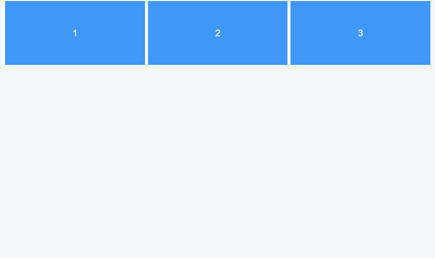

# TAMU WEBGIS
>

# Learning Objectives
>
- Describe CSS Inheritance
- Describe CSS syntax
- Import an external CSS file
- Obtain basic knowledge of important CSS properties

# CSS Continued

## A Quick CSS Rundown
Web layouts are entirely dependent on CSS and new layout modes like Flexbox make developing simple and complex layouts a breeze.  In order to better understand Flexbox, we must cover some basic CSS core principles which are assumed when working with flexbox. Three of the core principles of CSS are: parent-child inheritance, positioning, and the box model.

### Inheritance
Once HTML is parsed by the browser, it is referenced as the DOM (Document Object Model) which simplified, is an component skeleton which functions like a family relationship tree where each element in a tree functions as a node and each node has relationships with surrounding nodes.

An example family tree:


An example DOM:


While extended relationships between elements exist, CSS can only reference and target from the parent to its direct siblings, or any of its resulting children relationships. Another way of looking it is: CSS can only work horizontally and downwards, but not back up the tree. More technically, a child element cannot reference its parent but the parent can reference its children.

Suppose we have an image gallery component:

```html
<div id="gallery-container">
    <div class="gallery-item"></div>
    <div class="gallery-item"></div>
    <div class="gallery-item"></div>
</div id="gallery-container">
```

In the example above `#gallery-container` is the parent element and the `.gallery-item`'s are the children of the gallery container. Element inheritance implies that `.gallery-item`s are able to and will inherit the properties of the parent `#gallery-container` if no other rules that override them exist. But how do we decide which rules take precedence over others?

All browsers come with basic CSS styles but they're not particularly exciting on their own. It's very common to have to "normalize" or "reset" these default values to near-zero values so that they don't interfere with your intended styles. These browser default styles are given the lowest priority.

If you import serveral stylesheets into your document, import ordering is important where the last imports take priority over any imported before.

After this, [selector specificity takes over](https://www.smashingmagazine.com/2007/07/css-specificity-things-you-should-know/). This topic is long and can take up several lectures on its own but for the purpose of this course the basics will suffice. All you need to know is how to target basic elements, id's, and classes and how to do so in complex DOM tree layouts.

In our gallery example, if we wanted to target the `#gallery-container`, the CSS would look like:

```css
    #gallery-container{
        // Styles go here
    }
```

If instead we want to target all of the `.gallery-item`s, the CSS would look like:

```css
    .gallery-item{
        // Styles go here
    }
```

If we wanted to increase the weight of our selector, we could start our selector from the parent:

```css
    #gallery-container .gallery-item{
        // This targets all .gallery-items in #gallery-container
    }
```

### Box Model

Each element in the DOM has its own box model. The box model consists of the content, padding, border, and margin. Each part of the box model can be described as follows:


* **Content**: The area which contains all user-defined content such as text and images
* **Padding**: A buffer around the main content that is used to add heigh or width to elements. This space is visible and counts against the total height and width of the element.
* **Border**: The boundary region that binds the content and the padding.
* **Margin**: A buffer around the entire element (content + padding + border) which is used to create separation between or around other elements. This does not count towards the total height and width of the element and can overlap with other margins. Positive or negative values are valid.

### Positioning

Element positioning relies on the past two principles, inheritance and the box model. Given that each element has its own box model, how elements inside are displayed depends entirely on the positioning property:


 
* **Static**: Default position property value. It has no special positioning and relies on the margin, padding, and border properties to add top, right, bottom, and left offsets with respect to the normal flow of the document.
* **Relative**: Element is positioned relative to the parent obeying any internal paddings and borders it may have. Can be displaced with the top, right, bottom, and left properties with respect to the normal flow of the document.
* **Absolute**: Element is positioned absolutely relative to the parent and lifted from the normal flow of the parent element. Absolutely positioned elements will hold an absolute position relative to a parent element through top, right, bottom, and margin properties.
* **Fixed**: Element is positioned relative to the viewport (what you can see in the display) and lifted from the normal flow of the document. Fixed elements will not move and will persist with document scrolling.
* **Inherit**: Element will inherit whatever positioning property is used on its direct parent.

When we say "normal flow of the document/element" we refer to the natural tendency for elements to stack vertically and the interaction with its surrounding elements. In the case of elements with `absolute` and `fixed` positioning, this natural flow is disrupted because they are withdrawn and do not interact with the surrounding elements. 

## On To Flexbox

Flexbox (flexible box layout) is a relatively new layout mode for the base box model which greatly increases the efficiency of creating application layouts. Flexbox solves a lot of the problems present in older layout modes such as block, inline, table, and positioned layout. If you recall:

* The **block layout** is designed for vertically positioned elements (e.g. A series of text blocks)
* The **inline layout** is designed for horizontally positioned elements(e.g. A series of images on the same line/row)
* **Table layout** is designed for two-dimentional layouts (x,y). This layout is particularly rigid with cell sizing, count, and positioning.
* **Positioned layout** is designed for explicit (absolute and fixed) positioning of elements with disregard of all others.

Unlike these layout modes, flexbox allows you to work with column or row layouts without having to change your markup structure. Flexbox gives you full control of the children elements by allowing you to change the space distribution, alignment, and order on the fly which makes it especially useful for dynamic and adaptive layouts. In addition, Flexbox can be used to solve the issue of vertical alignment in other layout modes which required an excess of rules or less-than-ideal work-arounds.

Flexbox provides the following common CSS properties:

* `flex-direction`
* `flex-wrap`
* `justify-content`
* `align-items`
* `align-self`
* `flex-grow`
* `flex-shrink`
* `flex-basis`

### Flex

Since flexbox properties are trickled down into the children elements, the parent element must contain the flex box display declaration. Using our image gallery example:

```html
<div id="gallery-container">
    <div class="gallery-item">1</div>
    <div class="gallery-item">2</div>
    <div class="gallery-item">3</div>
</div id="gallery-container">
```

```css
#gallery-container {
    //We'll use flex instead of block, inline, inline-block
    display: flex;
}
```

Will produce:


### Flex Direction

`flex-direction` allows us to specify whether we want to use a `row` or `column` layout where the default value is `row`.

Allowed values for `flex-direction`:

* `row`
* `row-reverse`
* `column`
* `column-reverse`


```css
#gallery-container {
    display: flex;
    flex-direction: column;
}
```

Will produce:


In addition to the `row` and `column` `flex-direction` property values, you can also use `row-reverse` and `column-reverse` to change the display order without having to manually change the markup structure.

```css
#gallery-container {
    display: flex;
    flex-direction: column-reverse;
}
```

Will produce:


### Flex Wrap

The `flex-wrap` property allows element behaviour wrapping when the vertical or horizontal space has been completely filled.

Allowed values for `flex-wrap`:

* `wrap`
* `nowrap`
* `wrap-reverse`

Wrapping allows content to flow to the next row or column OR resize to accomodate all elements on the same row or column. For example, our gallery viewport only allows gallery items:


Adding more elements will cause the rest to shrink to accomodate it. This is the default behaviour:


If we want to preserve our original element size by allowing them to wrap over to the next row or column we can add the `wrap` value to the `flex-wrap` property:

```css
#gallery-container {
    display: flex;
    flex-wrap: wrap;
}
```
Which will produce:


### Flex Axes

Flexbox elements have an additional 2 axes: the **main axis** and **cross axis**.


* **Main Axis**: Axis in which the flex elements are laid on. This axis cannot be described as permanently horizontal (x) or vertical (y) since it is influenced by the `flex-direction` property. If `flex-direction` is `row`, the **main axis** runs horizontally. If `flex-direciton` is `column`, the **main axis** runs vertically.
* **Cross Axis**: Axis runs *perpendicularly* to the main axis.

These axes are important to keep in mind when aligning and justifying flex-items within the flex containers as these properties will align on either the x or y axis depending on the `flex-direction` property value.

### Justify Content

The `justify-content` preoperty aligns along the **main axis** of the flex element.

Allowed values for `justify-content`:

* `flex-start (default)`
* `flex-end`
* `center`
* `space-between`
* `space-around`

In `row` flex layouts, `justify-content` will align horizontally.

```css
#gallery-container {
    display: flex;
    flex-direction: row;
    justify-content: center;
}
```


In `column` flex layouts, `justify-content` will align vertically.

```css
gallery-container {
    display: flex;
    flex-direction: column;
    justify-content: center;
}
```


### Align Items

Much like the `justify-content` property, `align-items` aligns flex-items but on the **cross axis** instead of the **main axis**. The `align-self` property allows individual element alignment.

Allowed values for `align-items` and `align-self`:

* `flex-start`
* `flex-end`
* `center`
* `baseline`
* `stretch (default)`

In `row` flex layouts, `align-items` will align vertically.

```css
#gallery-container {
    display: flex;
    flex-direction: row;
    align-items: center;
}
```


In `column` flex layouts, `align-items` will align horizontally.

```css
gallery-container {
    display: flex;
    flex-direction: column;
    align-items: center;
}
```


By utilizing and combining both `justify-content` and `align-items`, it is possible to easily center content both vertically and horizontally:

```css
gallery-container {
    display: flex;
    flex-direction: row;
    justify-content: center;
    align-items: center;
}
```


```css
#gallery-container {
    display: flex;
    flex-direction: column;
    justify-content: center;
    align-items: center;
}
```


### Flex Grow

The `flex-grow` property sets the grow factor of a flex item. **Positive free space** available in the flex containers **main axis** is distributed among the flex items and the `flex-grow` property directly effects the bias of space distribution. The inital `flex-grow` value is zero (0) and how much free space is allocated to each flex item is a relative to what the `flex-grow` value of all other flex item children is. Since the initial value is zero(0) in all of our flex items, free space is not distributed and as such inital height and width is preserved. However, if we set the `flex-grow value to 1, we will see free space along the **main axis** be destributed evenly.

**Positive free space** refers to the space remaining along the main-axis that is not occupied by the flex items.

```css
    gallery-item{
        flex-grow: 1;
    }
```



If, for example, we wanted to allocate more free space by a factor of 2 to the 2nd gallery item:

```css
    .gallery-item{
        flex-grow: 1;
    }

    .gallery-item:nth-child(2){
        flex-grow: 2;
    }
```
*[:nth-child(n) is an avanced CSS Selector](https://tympanus.net/codrops/css_reference/nth-child/)*


### Flex Shrink

In the case where the total width of all flex items exeeds the width of a flex container's main size along the **main axis**, the `flex-shrink` property can be used to distribute the **negative free space** as to allow flex items to fit within the bounds of the flex container. Default value for `flex-shrink` is zero (0);

**Negative free space** refers to the pixels on the **main axis** which overflow outside of the main container size. In the example below, the flex contaienr has a width of 300px and the flex items each with a width of 250px.


Since the default `flex-shrink` value is zero for all the flex items, the negative free space is not distributed and elements overflow outside of the flex container. Setting a `flex-shrink` value of 1 will allow all flex items to distribute the negative free space to fit within the flex container.

```css
    .gallery-item{
        flex-shrink: 1;
    }
```


Much like the `flex-grow` property, you can set the individual flex item `flex-shrink` proportion of distributed negative free space relative to all other flex items.

### Flex Basis

The `flex-basis` property allows you to set the initial width of a flex item before being influenced by the `flex-grow` and `flex-shrink`. The `flex-basis` property accepts all the values accepted by the regular `width` property.

>
## CSS Icons
The simplest way to add an icon to your HTML page is when an icon library, such as **Font Awesome**. Add the name of the specified icon class to any inline HTML element (like \<i> or \<span>). All the icons in icon libraries are scalable vectors that can be customised with CSS  such as size, color, shadow, etc.


---
## References and Further Reading

* https://tympanus.net/codrops/css_reference/flexbox/
* https://tympanus.net/codrops/css_reference/combinators/
* https://www.w3schools.com/css/css_boxmodel.asp
* https://developer.mozilla.org/en-US/docs/Learn/CSS/Introduction_to_CSS/Cascade_and_inheritance
* https://www.w3schools.com/css/css_positioning.asp


<!--## Questions

<!--[Set 1](../reviewquestions/11.md)-->

## Videos
Coming Soon !
[Video 11.1 - 2018-02-09](missing) - missing - too long to upload
