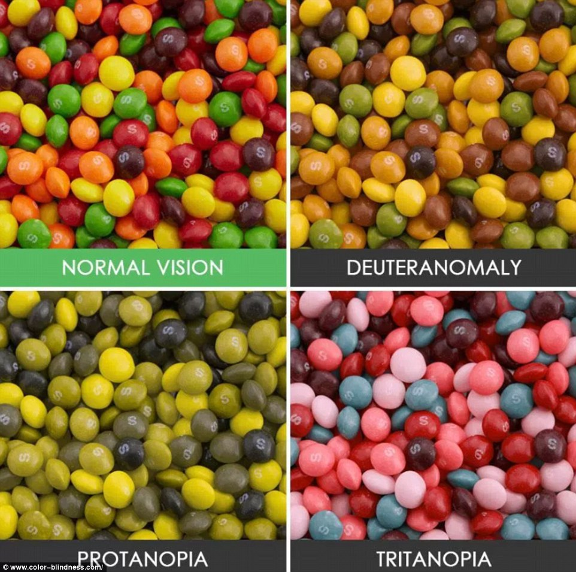

# TAMU WEBGIS
>

# Learning Objectives
>
- Describe why site acessibility matters
- Describe the types of methods employed to make sites ADA compliant
- Describe what site usability means
- Obtain basic usability techniques

# Accessibility and Usability

## Accessibility

The [Americans with Disabilities Act (ADA)](https://www.ada.gov/2010_regs.htm) is a law that prohibits discrimination against individuals based on disabilities in all areas of public life. This means that any public or private business or organization offering a "public accomodation" **must** have an ADA compliant web presence. Failure to meet ADA requirements could hold an individual, organization, business, or institution [liable to legal actions](http://www.foxrothschild.com/publications/what-businesses-should-know-about-website-accessibility-lawsuits-under-the-ada/).

The list of requirements to have a fully compliant website is fairly extensive but there are a few basic **must-haves** that cover the majority of disabilities. In the end, not only is a legal requirement but it's also a good idea to have your website/digital product accessible to as many people as possible.

### How do disabilities affect web applications?

There are a range of disabilities but the most frequent are visual impairments ranging from partial or poor sight to complete blindness and colorblindness (red-green and blue-yellow). To a much lesser extent auditory impairments from partial to complete deafness, and limited limb mobility are other disabilities affecting Americans.


*Image courtesy of [Medical News Today](https://www.medicalnewstoday.com/articles/319115.php)*



*Image courtesy of [Color-Blindness.com](https://www.color-blindness.com)*

These users rely on limited navigation hardware or specialized assistive technologies and devices such as:

* Screen readers: Utilized by people with visual impairments. Users use their fingers or cursors to hover over elements and the device/software dictates the content as they do so.
* Screen magnifiers: Utilized by people with visual impairments. These tools allow users to blow-up a specific area on the screen to allow them to more easily read small text.
* Limited navigation hardware: Users with poor or limited limb mobility prohibits wide range of movement and may need to navigate with a single navigation device (mouse or keyboard).

ADA points to keep in mind when developing a website:

Any kind of image, whether static (.jpg, .png) or animated (.gif) should have `alt` tags describing the function. These should be short but descriptive.


Use the `longdesc` attribute for long descriptions to describe the contents and value of tables and graphs.

Provide transcripts of any video or audio content

In hyperlinks or buttons, avoid generic call-to-action text such as "Click Me". Ensure that the hyperlink is descriptive to its action.

>
>***Don't***
>
>
>

>***Do***
>
>
>

Use semantic markup with proper element hierarchy (page titles, headings, tables, paragraphs, images).

```html
<!DOCTYPE html>
    <html>
        <head>
            <title>Semantic Hierarchical Markup</title>
        </head>

        <body>
            <section>
                <h1>Awesome Website</h1>
                <p>This is my awesome website. Reasons:</p>

                <ul>
                    <li>Reason 1</li>
                    <li>Reason 2</li>
                    <li>Reason 3</li>
                </ul>
            </section>
        </body>
    </html>
```

Functionality and navigation is accessible from a keyboard (tab navigation) with no "tab traps" where the focus gets trapped in any part of the content. Element focus (element outline) should be provided for these users.

Ensure your content does not cause seizures; this is particulary important for any website with animations where pattern or color transition repetion timing is too short.

Ensure the color of text and color of your background does not yield poor color contrast which makes reading difficult for certain users with visual impairments.


*Image courtesy of www.dowitcherdesigns.com*

Do not use too small of a font size and ensure that resizing the browser window does not cause your website content and element to overlap.


Forms and input elements must be properly named and contextual labels must be provided.


This list only covers some of the more imporant points in broad overview, though the specification is far more detailed. See *References and Additional Reading* for additional resources on ADA compliance.

## Usability

Usability is a quality metric that measures how effective a website can execute its designed purpose, whether it be guiding a user on an informational site or intuitively assist the user in performing  a specific task.

### Why is usability important?

The web is filled with like-resources and often times it's quite literally a competition to get the larger share of visitors than your competition. Users have high standards (including picky and impatient) and are likely to immediately leave a website if your website does not meet minimum usability practices. The ultimate goal of usability is to get the information users expect as efficiently as possible.

[Nielsen Norman Group, a UX (user experience) research-based group, greatly simplifies usability into five components](https://www.nngroup.com/articles/usability-101-introduction-to-usability/):

* **Learnability** measures how well and how fast your visitors learn to use your website the very first time they arrive. In order to achieve a high usability rating, your website must be easy and intuitive to use.
* **Efficiency** measures how quickly users are able to complete tasks after familiarizing themselves with your website.
* **Memorability** measures how well users are able to refamiliarize themselves with your website navigation and task completion after a period of time.
* **Errors** measures how many mistakes or errors users make on your website as a result of poor design and usability.
* **Satisfaction** measures the level of user satisfaction with their visit (first or recurring) as a result of design and usability. Good usability increases the probability of becoming a recurring visitor.

### Navigation

Many websites that have more than a few pages of content will have a navigation system of one form or another (menu bars, side drawers, hamburger-style menus), however not all navigation systems are the same and it's important to learn what separates a good navigation system from a poor one.


*Example of a standard menu bar*


*Example of a a side bar menu*


*Example of a a hamburger button style navigation system. Most commonly found in mobile applications and response designs*

Navigation is by far one of the most important components in a website. It is the primarly method by which users find the information they need. A poorly designed navigation system can quite *literally* make or break your website because it means users can be easily confused and frustrated if they cannot promptly access the information they seek. Your navigation system must be highly obvious and must be properly structured in order to optimize your navigation click depth.

Click depth is the metric that measures the number of clicks it takes a user to navigate your site and subsequently reach the information they expect. The golden rule for click depth is three (3) clicks. Three clicks may seem like a small number but it is entirely possible to keep even complex websites within three clicks reach to content users need. How do you create and effective navigation system?

* Have a predictable navigation system. There's no need to re-invent the wheel with funky navigation systems when battle-tested navigation systems are better at guiding users through your website.
* Keep it simple. Collect your content, determine your selling points, organize it, and use those groups to create your navigation topics. Do not overdo the number of navigation components. In many cases fewer is better.
* Use hierarchical structure. Harness the power of custom styling to bring focus to the important elements in your navigation system.
* Be consistent. Don't use different navigation systems for different pages if you can avoid it.


*Flat vs complex site structure. Image courtesy of [NNGroup](https://www.nngroup.com/articles/flat-vs-deep-hierarchy/)*

### Content

Content is the primary focus for users visiting your website and how your present your content is critical from a usabilty perspective. As a general rule of thumb, avoid presenting your content in a way that will make user's head hurt.

Type must be legible and influenced by properties such as font family, font style and weight, and font size.

Avoid decorative and funky fonts which are difficult to read. Limit font families to 1-2 (one for heading and one for body text). There are [handy online tools](https://fontpair.co/) which help you pick and pair web fonts that are both asthetically pleasing and legible.


*Example of bad fonts. Resource courtesy of [Practical Typography](https://practicaltypography.com/bad-fonts.html)*

Use **bold** and *italicized* text sparingly and avoid the use of super thin font weights which provide low contrast. Bold and italicized styles should be reserved for emphasis.


*Example of thin fonts. Resource courtesy of [UXDICT.IO](https://uxdict.io/lights-fonts-good-or-bad-for-the-user-931088d2be86)*

Do not use too small of a font size. Remember the accessibility guidelines!

Avoid large walls of text. Break it down into digestible paragraphs and provide visual aids where appropriate (remember to use `alt` tags).

Limit line length to an average of 75 characters. Shorter line lenghts are more comfortable to read as opposed to unrestricted line lengths, especially on larger displays and resolutions.


*Example of long line lengths. Resource courtesy of [MotherFuckingWebsite](http://motherfuckingwebsite.com/)*


*Example of short line lengths. Resource courtesy of [TheBestMotherFucking.Website](https://thebestmotherfucking.website/)*


Provide good contrast between your backgrounds and font colors.

Avoid information overload. Information overload is the mispractice of presenting users with too much information than they can digest during their visit. User confusion is a very common side effect of information overload. Think cramming for an exam the night before: how much information can you actually retain?


*Example of information overload. Resource courtesy of [Interaction Design Foundation](https://www.interaction-design.org/literature/article/information-overload-why-it-matters-and-how-to-combat-it)*

Be consistent with your voice and tone. Your target audience determines what tone you should use in your content (e.g Business professional vs. satirical).

The above points and more can be found and covered in greater depth over at [Butterick's Practical Typography online book](https://practicaltypography.com/). It is an **excellent** resource for typography that not only applies to the web but also research papers, résumés, and PowerPoint presentations.


### Design

The web is littered with countless examples of great and terrible site design. Good design aims to present information in a clear and concise fashion by working for users, rather than against, in order to get the information they need. While web design is an entire discipline in an of its own, a few basic principles and key points will ensure your designs do not fall under the umbrella of terrible design.

**Pattern libraries and UI Kits**

Develop or use an existing pattern library and UI kit and be consistent with your component usage. Nothing throws off a user more than unexpected behavior. Pattern libraries and UI kits are design frameworks which contain grids that help you create your content layout. In addition, UI kits consist of battle-tested common HTML styled components that can be used in place of the default browser styles. These tools can help you speed up your design development while ensuring that common patterns are established (provided they're used correctly). [Bootstrap](https://getbootstrap.com/) is a popular HTML, CSS, and JavaScript front-end design and development toolkit consisting of a huge library of prebuilt components, grids, and plugins designed for fast prototyping and development.


*Example of a few bootstrap components that are part of the pattern and UI library.*

**Color and contrast**

The importance of color and constrast cannot be stressed enough. As we covered in the accessibility section, the most common disability among Americans is colorblindness of one form or another. Therefore it is critically important that you select colors that result in good contrast between backgrounds, text, and images. This doesn't mean you have to limit your artistic ability but you should always keep contrast in mind. There are many tools available online which perform contrast analysis. Any quick Google search with the keywords "web contrast tools" will yield a plethora of results with free-to-use contrast checkers.

**Responsive Design**

Even if you've never heard of the term before, if you've browsed the web today, you have visited a responsive website. Responsive web design is one that dynamically adjusts according to the size and resolution of the display it is rendered on. For example, the Google website works on any device with a web browser and it works well. Nowadays, responsive design is an absolute **must** given that Google now assigns a lower page rank if a site is not responsive.

Responsive design took off when the web became mainstream on internet-capable handheld devices (i.e. mobile phones) and mobile website traffic increased. Additionally, fat sausage fingers are incapable of reliably clicking on small text and buttons without first having to pinch-to-zoom. From there on out, responsive design became a smart common sense decision since in some cases mobile traffic can amount to being over 50% of the total site visits and failure to provide the necessary accomodations for mobile users means they can't reliably find the information they seek, or they give up altogether and find another mobile-friendly resource.

A common difficulty in developing a responsive design is that simply shifting elements around doesn't yield the optimal layout or even preserve functionality on mobile. A true responsive design ensures that all functions available on desktop are acessible and functional on a mobile device. Ensuring that this point is met allows mobile users have an equally satisfying experience both on a desktop and mobile device.


*Responsive behavior on geoprojects.tamu.edu*

**Print Styles**

Print styles should be dead, but they're not. What's a print style you ask? Have you ever tried to print out a web page only to find that it includes headers, footers, sidebars, ads, etc? This is not ideal behaviour and given that direct printing from websites is still common in academic environments it is fairly important that you make print styles which strip out all irrelevant website components so that end result preserves accessibilty and readability. Preparing a print style can vary in difficulty depending on the complexity of your site but the general CSS recipe is as follows:

```css
@media print {
   header, footer{
       display: none;
   }
}
```

The `@media` rule will contain all CSS style overrides that are specific for printing.


*Example of good print styles on Wikipedia*

**Design Feedback**: 

Design feedback are any additional styles that provide contextual visual and auditory feedback based on user-triggered events. Such events include, but not limited to:

Hovering a button which triggers a subtle or drastic change in appearance to reinforce the hover behavior.


*Button hover feedback*

Focusing an input element will add an outline to differentiate the active input element from the rest.


*Input focus feedback*

Providing loading elements in cases where data or the application is busy or not ready.


*Aggie Map preloader while application is not ready*

These contextual feedbacks are designed to provide the user with information on the active state of their current action or pending application states, for example.

**Graceful Degradation**

One of the more difficult aspects of developing and designing for the web are the multiples devices, browsers, and screen sizes that you have to take into consideration. Not all browsers and devices behave in the same way even if developing for the latest browser versions for the most popular browsers (Chrome, Safari, Firefox, Internet Explorer/Edge, Opera). In many cases a design developed around Chrome will likely have issues on other browsers (particularly older versions) in one way or another whether it be a weird font rendering issue to complete layout disasters, and it is important to design and develop with *graceful degradation* in mind.

Graceful degradation is the practice of building with all the bells and whistles using the latest features HTML, CSS, and JS can offer on latest browser versions while providing a reduced, yet functional, experience for older browsers through legacy features.

[CanIUse](https://caniuse.com/) is an excellent tool that allows you to determine which features are supported on which browsers and major versions.

Some browsers, however, are lost causes.


[Even Microsoft has ended support for anything older than IE11](https://www.microsoft.com/en-us/windowsforbusiness/end-of-ie-support). The best that can be done for users running unsafe and older versions of Internet Explorer is suggest a browser upgrade from this decade.

**Universal Design**

In summary, keeping up to date with and using the latest accessibility and usability practices will ensure that your site:

- Is legally compliant. As a bonus perk, you avoid legal lawsuits.
- Delivers a high level of user satisfaction from an accessibility perspective
- Delivers a high level of user satisfaction from an aesthetics perspective
- Is used (hopefully)

It's a smart idea to follow accessibility and usability guidelines. Everyone benefits from it so why not?

---

# References and Additional Reading

* https://www.w3.org/WAI/eval/preliminary
* https://moz.com/learn/seo/alt-text
* https://www.w3.org/WAI/quicktips/
* https://www.w3.org/WAI/ER/tools/
* https://www.nngroup.com/articles/usability-101-introduction-to-usability/
* http://itaccessibility.tamu.edu/resources/tools.php


<!-- - Statistic of number of americans that suffer from disabilities
- Images of colorblindness test
- Effects of cataracts visual aid
- How descriptive should alt tags be -->

<!--## Questions

<!-- [Set 1](../reviewquestions/11.md) -->

## Videos
[Video 1 - 2018-02-12](https://youtu.be/o51xCD3TS9E)
