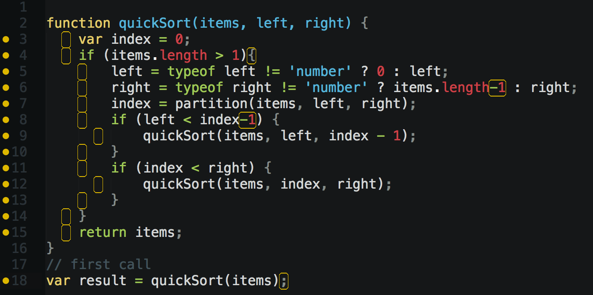

# TAMU WEBGIS
>

# Learning Objectives
>
- Recognize Javascript 
- Import Javascript into your website
- Identify and create JS variables
- Identify JS operators

# Intro to Javascript Coding 
Not to be confused with the other Java that constantly bugs you about updating, Javascript is a powerful yet simple, dynamically typed language that bears little resemblence to Java. Think of Javascript as the electrical and plumbing of our house. Javascript is a front-end scripting language that allows us to manipulate different elements depending on different outcomes such as uploading a file or even start a download after a user hits a button. Javascript doesn't directly change how elements are displayed or styled, but works by applying logic and then maybe changing a style; it all depends on what the coder wants.
>

> ##### Example of Javascript
## Adding Javascript to our page
In a website, we can define our Javascript inside a **script** tag placed inside the **head** or **body** elements. These scripts are not visualized but used for various functionality. We can also use a Javascript file and import that file into our HTML with a **src**. Both of these methods will allow you to use a Javascript file or Javascript functions inside your HTML page. 
```html
<script>
function myFunction() {
    console.log("Hello");
}
</script>
<script src="myscripts.js"></script>
```

## Variables
What is a variable? A variable is a named container used to store a value. Variables start with the keyword **var** followed by the variable name, then an equals sign, and lastly the value you want to assign to the variable. You can name your variable anything though its in good practice to have a name that describes the value; this is to aid both you and anyone else reading your code. In Javascript you do not need to worry about variable types as all variables are of type **var**. A **var** can hold a number, decimal, string, array of values, or even a function as a value. A standard variable in Javascript looks like this:
```javascript
<!-- EXAMPLE OF JAVASCRIPT VARIABLES -->
var line;
var numOfLines = 0;
var lineText = "Sup dawg";
var calcAddition = function(a, b) {
    console.log(a + b);
}
```
The semicolon found at the end is completely optional; you will see me use them as I come from a Java background that *requires* semicolons to terminate lines of code. Some people hate adding semicolons, some don't mind. People actually get heated about things like this. Back to variables. You can also choose to declare a variable by just writing **var** followed by a name; you are not required to give it a value at this time. If you do this you can then give the variable a value later on at your discretion.
>
Javascript variables can contain various values, though these values usually must be one of following:
>
Type | Explanation | Example 
--- | --- | ---
String | A sequence of characters and / or numbers; analogous to a word or sentence in English | var stringy = "Whaddup world, ima string!";
Number | This can be any integer or decimal number; signed or unsigned | var numLines = 10;
Boolean | Either true or false, either 1 or 0 | var bool = true;
Array | A structure that allows you to store multiple values into a single named variable; use **numbers** to access elements | var linesOfText = ["You do not like green eggs and ham?", "I do not like them, Sam-I-am.", "Could you, would you, with a goat?"];
Object | Anything. Everything in Javascript is an object, and can be stored in a variable. Uses **names** to access elements | var h1 = document.querySelector('h1');
>
>##### Definitions from [Mozilla](https://developer.mozilla.org/en-US/docs/Learn/Getting_started_with_the_web/JavaScript_basics)
>
We wont cover strings, ints / doubles, or bools any further as they're rather self explanatory and dull once you know what they represent; instead we'll exlain arrays and objects just a little further. An array in Javascript looks like:
```javascript
<!-- EXAMPLE OF ARRAYS -->
var arrayExample = ["Will", "Carlton", "Aunt Viv", "Uncle Phil", "Jazz"];
var oddExample = new Array(1, 'b', "joe", 38.1741, true);
```
Both lines create a new array variable with the given values. The first line is just a more concise way to create a new array variable, there is no need to write the **new Array** part unless you like extra wordage. You may also notice that the second line has more than one data typed stored inside the array. Weird huh? Yeup in Javascript **arrays** are treated just like **objects** meaning they can hold any variety of data types. How does one access these values you might ask? With indices! Say I want to *grab* the 2nd element from the variable named **arrayExample**, how would we do that?
```javascript
<!-- EXAMPLE OF INDICES -->
var arrayExample = ["Will", "Carlton", "Aunt Viv", "Uncle Phil", "Jazz"];
var mainCharacter = arrayExample[0];
```
>
We assign the variable **mainCharacter** the value from the element at index **0** of the variable named **arrayExample**; this makes the variable **mainCharacter** equal to **"Will"**. What the hell, element at index **0**?! Yeah welcome to programming. It will do you good to just remember that most programming languages are **zero-based numbered**, meaning that the first element of an array is at position **0** in the array. You may think "But that's the **FIRST** value, it should be index = 1", well you can thank the C language for starting this all. You'll learn to like **zero-based numbering** soon enough. Well what if we access the value at index (position) **5**? You'd get an error since the value at index **5** does not exist, the last value is at index **4**.
>
```javascript
<!-- EXAMPLE OF JAVASCRIPT OBJECT AKA JSON -->
var actors = {
    "Will": "Will Smith",
    "Uncle Phil": "James Avery",
    "Carlton": "Alfonso Ribeiro",
    "Aunt Viv": {
        "first": "Janet Hubert",
        "second": "Daphne Reid"
    }
}
var mainActor = actors["Will"];
var secondAuntViv = actors["Aunt Viv"]["second"];
var originalAuntViv = actors["Aunt Viv"]["first"];
```
>
In Javascript, **objects** are kind of like arrays in that they're named variables that contain several other elements with their own values. But unlike arrays, **objects** are accessed with a **name** rather than an index. A good way to remember **objects** in Javascript is that they're just giant **key-value** structures. Given a **key** you can get the **value** with a simple `value = variableName[key]`. Notice how we still use brackets to access the element, but we use a **string based key** instead of a **integer based index**.
## Operators
Operators in Javascript are rather self explanatory but we'll touch on them briefly. 
>
Operator | Explanation | Example
--- | --- | ---
\+ | Addition, adds variable's values | var one = 0 + 1; returns 1
\- | Subtraction, subtracts variable's values | var two = 3 - 1; returns 2
\* | Multiplication, multiplies variable's values | var three = 3 * 1; returns 3
/ | Division, divides variable's values | var four = 12 / 4; returns 4
% | Modulus, gives you the remainder of division | var five = 17 % 6; returns 5
++ | Increment, addes 1 to the variable value | var six = five++; returns 6
-- | Decrement, subtracts 1 from the variable value | var seven = 8--; returns 7
+= | Adds the next value to the first value | var a = 1; a += 2; returns 3
== | Equal in value, returns a boolean | 5 == 4; returns false
=== | Equal in value and type, returns a boolean | 5 === "5"; returns false
!= | Value not equal, returns a boolean | 10 != 1; returns true
!== | Value or type not equal, returns a boolean | 10 !== "10"; returns true
\> | Greater than, returns boolean | 4 > 2; returns true
\< | Less than, returns boolean | 4 < 20; returns true
\>= | Greater than or equal, returns boolean | 4 >= 3; returns true
\<= | Less than or equal, returns boolean | 20 <= 21; returns true
\&& | And, returns boolean. For true all expressions must return true | var x = 6; (x < 10 && x > 5) returns true
\|\| | Or, returns boolean. One of the expressions must return true | var x = 6; (x < 10 \|\| x < 5) returns true
\! | Not, returns boolean. Returns opposite of value given | var bill = true; !bill returns false
>

>
# Good learning resources
Great tutorials and examples of how to use HTML and CSS can be found below.
- https://www.w3schools.com/html/
- https://www.w3schools.com/css/
- https://www.w3schools.com/js/
- https://www.codecademy.com
- HTML and CSS: Design and Build Websites by Jon Duckett

<!--## Questions

<!--[Set 1](../reviewquestions/13.md)-->


## Videos
[Video 1 - 2018-02-14](https://youtu.be/kRliEl8KUt4) - starts at 48 mins
