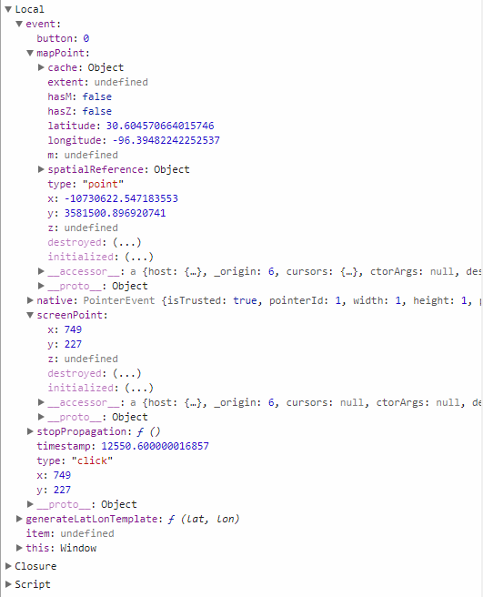

# TAMU WEBGIS
>

# Learning Objectives
>
- Detail the different Javascript conditionals 
- Explain objects
- Create and manipulate JS objects
- Listen for and do useful stuff on events

# Intro to Javascript Coding Continued
>
## Conditional statements
Conditionals are used to control the flow of a program based on some condition. 
### If / else if
Whenever you need to determine if something is valid before continuing, it may be helpful to use an if conditional. 
```javascript
var i = 0; 
var k = 8;
if (i < k) {
    console.log("i is less than k");
}
```
The code will only log to the console the string as long as i is less than k. If i is greater than or equal to k, nothing will happen. If you would like something to happen you can always use an else.
```javascript
var i = 10; 
var k = 8;
if (i < k) {
    console.log("i is less than k");
} else {
    console.log("i is NOT less than k");
}
```
Since i is 10 and k is 8, the statement held inside else's block will execute. With if statements you can chain them together indefinitely if you want to.
```javascript
var i = 37;
if (i < 10) {
    console.log("i is between 0 and 9");
} else if (i < 20) {
    console.log("i is greater than or equal to 9 and less than 20");
} else if (i < 30) {
    console.log("i is greater than or equal to 19 and less than 30");
} else if (i < 40) {
    console.log("i is greater than or equal to 29 and less than 40");
} else {
    console.log("i is greater than or equal to 40");
}
```
### Switch statement
Below you'll find a switch statement. These are useful for controlling the flow of your code amongst several known outcomes. Note the break after each case. If you do not break the code will "cascade" downwards until it finds a break; this may or may not be something you'd want.
```javascript
var one = "ONE";
switch (one) {
    case "ONE":
        console.log("ONE");
        break;
    case "TWO":
        console.log("TWO");
        break;
    default:
        break;
}
```
## try / catch
Sometimes code you write has the potential to cause an error. One way of gracefully dealing with said errors is to use a try / catch statement. Surrounding code that may throw an error with try / catch will allow you to view the error and either fix the problem or siliently ignore the problem, without your program crashing.
```javascript
try {
    throw IndexNotFoundException
} catch(err) {
    console.log(err);
}
```
## Objects
Objects in Javascript are useful types that are used to store many key-value pairs and associating a lot of data under a single variable. Objects in Javascript can be created in many different ways as seen below.
```javascript
var myCar = new Object();
myCar.make = 'Chevy';
myCar.model = 'Silverado';
myCar.year = 2002;

var myRide = new Object();
myRide["make"] = 'Chevy';
myRide["model"] = 'Cavalier';
myRide["year"] = 1996;

var myJalopy = {
    make: 'Oldsmobile',
    model: 'Delta 88',
    year: 1988
}
```
## Events
Events are one of the most useful features of Javascipt you'll be using. Most Javascript mapping libraries we will be using have a ton of different events we can listen to. LeafletJS's **Map** class alone has 33 different events you can listen to and respond. Upon an event triggering, we can then take the parameters these events pass to us and do something in response to said event. Ever wondered how map popups worked? Of course they use events! What happens is you click on some sort of feature on the map. That feature has an event listener waiting for you to click on it. The listener then forwards info regarding the click on to a function which then processes the event in some fashion. Let us take a look at a basic use-cases of events.
>
```javascript
view.on("click", function (event) {

    var generateLatLonTemplate = function (lat, lon) {
        return "<div class='point-coords copy copy-trigger' data-clipboard-target='#latlon' alt=" +
            "'Copy' title='Copy'><p>Latitude: " + lat + "</p><p>Longitude: " + lon + "</p><span id='latlon' class='copy-val'>" + lat + ", " + lon + "</span></div>"; 
    }

    if (isLatLonTooltipVisible) {
        $('.esri-ui-corner .point-coords').replaceWith(generateLatLonTemplate(event.mapPoint.latitude.toFixed(5), event.mapPoint.longitude.toFixed(5)));
    } else {
        isLatLonTooltipVisible = true;
        var item = $('.esri-view:not(.satellite-tool) .esri-ui-bottom-left.esri-ui-corner')[0];
        $(item).append(generateLatLonTemplate(event.mapPoint.latitude.toFixed(5), event.mapPoint.longitude.toFixed(5)));

    }

});
```
The above snippet of Javascript code is taken directly from Aggiemap.tamu.edu. We've previously initialized a MapView object named **view** which handles interactions with the base map and any additional layers we want to add. The first line of code in the snippet is telling the **view** object to listen for any event's of type **click** on itself. What does this mean? Well it means whenever we click on the **view** it will trigger the function defined as the second parameter of the `on()` function of **view**. Whenever the click occurs, **view** will send any information it can to our local function under the variable **event**. Let's set a breakpoint and take a look at **event**.
>

>
You can get a lot of information passed from events. Take a look at event.mapPoint. This is a great way of getting where on the map the user has clicked and returning the corresponding latitude and longitude of the click. You can use any of the information returned by the event to either process or return to the user in a user friendly way. Below is a list of possible events you can listen for in a LeafletJS MapView:
- baselayerchange
- overlayadd
- overlayremove
- layeradd
- layerremove
- zoomlevelschange
- resize
- unload
- viewreset
- load
- zoomstart
- movestart
- zoom
- move
- zoomend
- moveend
- popupopen
- popupclose
- autopanstart
- tooltipopen
- tooltipclose
- locationerror
- locationfound
- click
- dblclick
- mousedown
- mouseup
- mouseover
- mouseout
- mousemove
- contextmenu
- keypress
- preclick
- zoomanim
>
...That's a lot of different events.

>


>
# Good learning resources
Great tutorials and examples of how to use HTML and CSS can be found below.
- https://developer.mozilla.org/en-US/docs/Web/Events
- https://www.w3schools.com/js/
- https://www.codecademy.com

<!--# Questions
<!--[Set 1](../reviewquestions/15.md)

## Videos
[Video 1 - 2018-02-21](https://youtu.be/xCwXGOgSAPA)
