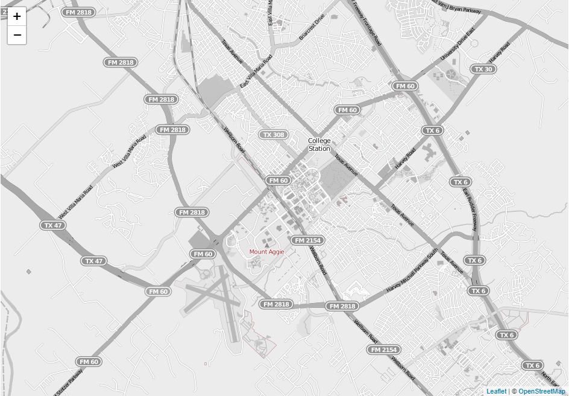
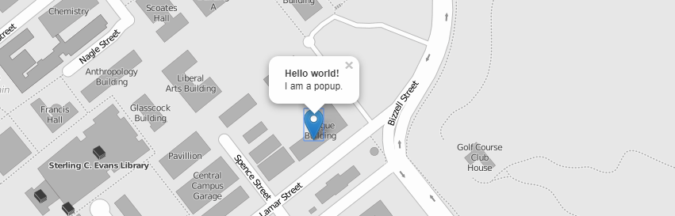

# TAMU WEBGIS
>

# Learning Objectives
>
- Utilize LeafletJS
- Create a simple web map
- Add data to web map

# Simple Mapping - Leaflet
LeafletJS is one of the better web mapping libraries you can use. The best part of Leaflet is that it is simple, open-source (meaning FREE), and has great documentation. Enough gibber-jabber, lets get to it.
## Getting started
Using a good text editor (Notepad++, VSCode), create a new Javascript file called **map.js**. I'm assuming at this point that you know how to create a basic HTML site and know how to import a separate Javascript file. You'll need a similar setup for seeing your map. 
```html
<html>
    <head>
        <link rel="stylesheet" href="https://unpkg.com/leaflet@1.3.1/dist/leaflet.css"
            integrity="sha512-Rksm5RenBEKSKFjgI3a41vrjkw4EVPlJ3+OiI65vTjIdo9brlAacEuKOiQ5OFh7cOI1bkDwLqdLw3Zg0cRJAAQ=="
            crossorigin=""/>
        <script src="https://unpkg.com/leaflet@1.3.1/dist/leaflet.js"
            integrity="sha512-/Nsx9X4HebavoBvEBuyp3I7od5tA0UzAxs+j83KgC8PU0kgB4XiK4Lfe4y4cgBtaRJQEIFCW+oC506aPT2L1zw=="
            crossorigin=""></script>
        <script src="./map.js"></script>
        <style>
            #mapid { height: 41rem; }
        </style>
    </head>
    <body>
        <div id="mapid"></div>
        <script>main();</script>
    </body>

</html>
``` 
You'll see that we are using a cloud hosted version of the Leaflet CSS and Javascript. This means we can use LeafletJS without having to download a local copy. We're also creating a link to our Javascript file we'll be creating shortly. Inside the **body** we're defining a **div** with an id **mapid**. This will be the container that has our map. We define the height of the map inside the **head** of our HTML page. Without defining a height we won't be able to see the map. We now add an embedded script at the bottom to call the start of our Javascript code inside our **map.js**.
>
Back to **map.js** we'll add the following to create a new Leaflet map. This map will only create a map *view* inside our HTML; there are no layers added at the moment. If you were to check the site you'll see nothing is shown. 
```javascript
function main() {
    var mymap = L.map('mapid').setView([30.61313, -96.34467], 13);
}
```
We now need to add a background layer to our map. We can do this by using what LeafletJS calls a **tileLayer**. This layer takes a raster tile source like OpenStreetMap, ESRI, or Mapbox and adds those tiles to a layer Leaflet knows. With this layer added we should be able to see an actual map. Make sure when you create this layer that you add it to your map.
```javascript
function main() {
    var mymap = L.map('mapid').setView([30.61313, -96.34467], 13);
    L.tileLayer('http://{s}.tiles.wmflabs.org/bw-mapnik/{z}/{x}/{y}.png', {
        maxZoom: 18,
        attribution: '&copy; <a href="http://www.openstreetmap.org/copyright">OpenStreetMap</a>'
    }).addTo(mymap);
    
}
```
>

>
With a map now showing, we will add a marker to the map to show the location of the coolest building on campus: CSA. We'll need to create a marker variable, give it the map coordinates of the location we want it to appear at, and then add said marker to the map.
>
```javascript
var marker = L.marker([30.61699, -96.33629]).addTo(mymap);
```
>
Markers are fine and dandy but let's give it some text. To do this we'll then use our **marker** variable to **bindPopup**. This will generate a popup and bind it to our **marker**, showing the popup whenever the **marker** is pressed. My entire **map.js** can be found below.
>
```javascript
function main() {
    var mymap = L.map('mapid').setView([30.61313, -96.34467], 13);
    L.tileLayer('http://{s}.tiles.wmflabs.org/bw-mapnik/{z}/{x}/{y}.png', {
        maxZoom: 18,
        attribution: '&copy; <a href="http://www.openstreetmap.org/copyright">OpenStreetMap</a>'
    }).addTo(mymap);
    var marker = L.marker([30.61699, -96.33629]).addTo(mymap);
    marker.bindPopup("<b>Hello world!</b><br>I am a popup.");
}
```
>

>

>
# Additional resources
- http://leafletjs.com/

<!--# Questions
[Set 1](../reviewquestions/16.md)-->

## Videos
[Video 1 - 2018-02-23](https://youtu.be/M9UpjYPlvHM) up to 25 mins
[Video 2 - 2018-02-23](https://youtu.be/N0splCS518g) up to 25 mins
