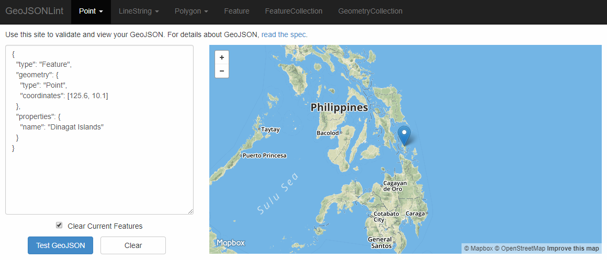

# TAMU WEBGIS
>

# Learning Objectives
>
- Create JSON objects
- Manipulate JSON objects with Javascript
- Create GeoJSON objects
<!-- - Add GeoJSON objects to web maps -->
# JSON
Javascript Object Notation, or JSON, is an expressive, human-readable, data type. Think of JSON as a giant key-value structure. As you start your journey into web mapping you'll see just how frequently used JSON is both in creating objects and in sending / receiving data. JSON started out in Javascript but has since spread to many different programming languages due to JSON's easy to read and interpret structure. 
>
Below is an example of a JSON object. You can see there are three different key-value pairs inside our JSON object **me**. 
>
```javascript
<!-- EXAMPLE OF JSON WRITTEN IN TWO DIFFERENT WAYS -->
var me = { "name": "Aaron", "age": 26, "city": "Lavras" };

var me = { "name": "Aaron",
            "age": 26,
            "city": "Lavras"}
```
>
JSON key-value pairs can contain any of the following data types:
- string
- number
- object
- array
- boolean
- null
- function
- date
- undefined
>
You can access any of the values associated with the JSON object by using two different JSON notations: dot or bracket.
>
```javascript
var me = { "name": "Aaron", "age": 26, "city": "Lavras" };

<!-- EXAMPLE OF DOT NOTATION -->
var city = me.city;

<!-- EXAMPLE OF BRACKET NOTATION -->
var age = me["age"];
```
>
Both notations are perfectly acceptable methods for accessing data inside of a JSON object. You can also chain your notations if you need to access deeply nested values inside a JSON object. Below you can find an example of this.
>
```javascript
<!-- EXAMPLE OF JAVASCRIPT OBJECT AKA JSON -->
var actors = {
    "Will": "Will Smith",
    "UnclePhil": "James Avery",
    "Carlton": "Alfonso Ribeiro",
    "AuntViv": {
        "first": "Janet Hubert",
        "second": "Daphne Reid"
    }
}
<!-- BRACKET NOTATION -->
var mainActor = actors["Will"];
var secondAuntViv = actors["AuntViv"]["second"];
var originalAuntViv = actors["AuntViv"]["first"];

<!-- DOT NOTATION -->
var mainActor = actors.Will
var secondAuntViv = actors.AuntViv.second
var originalAuntViv = actors.AuntViv.first
```
>

# GeoJSON
GeoJSON is a subset of JSON used for encoding geographic data. GeoJSON is often used by web mapping APIs like LeafletJS or ESRI JS for displaying human-readable data from either an ArcServer or user generated data. Below you can see just how similar GeoJSON is to JSON. You'll actually see that GeoJSON is just a type of JSON with a set of specific keys and values. Lets take a look.
```javascript
{
  "type": "Feature",
  "geometry": {
    "type": "Point",
    "coordinates": [125.6, 10.1]
  },
  "properties": {
    "name": "Dinagat Islands"
  }
}
```
GeoJSON supports many feature geometries such as:
- points
- lines
- multilines
- polygons
- multipolygons
>
Each feature in GeoJSON can have a JSON object property called **properties** where feature specific data is held. In the example above you can see there is a point **feature** with a **properties** property. Inside you can see the name of the point feature in question, "Dinagat Islands". Using a website like [geojsonlint](http://geojsonlint.com/) we can paste in a GeoJSON object to make sure it's valid.
>

>
To see a huge example of GeoJSON in action look [here](http://gisday.tamu.edu/Rest/Buildings/Map/Get/).

# Additional resources
- https://www.w3schools.com/js/js_json_intro.asp
- http://geojson.org/

<!--# Questions
[Set 1](../reviewquestions/16.md)-->


## Videos
[Video 1 - 2018-02-23](https://youtu.be/M9UpjYPlvHM) starts at 25 mins
[Video 2 - 2018-02-23](https://youtu.be/N0splCS518g) starts at 25 mins
