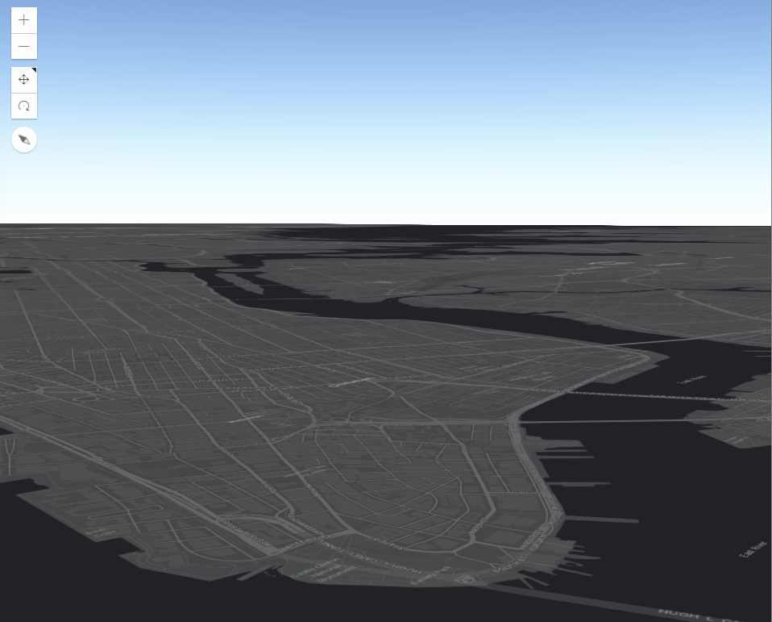
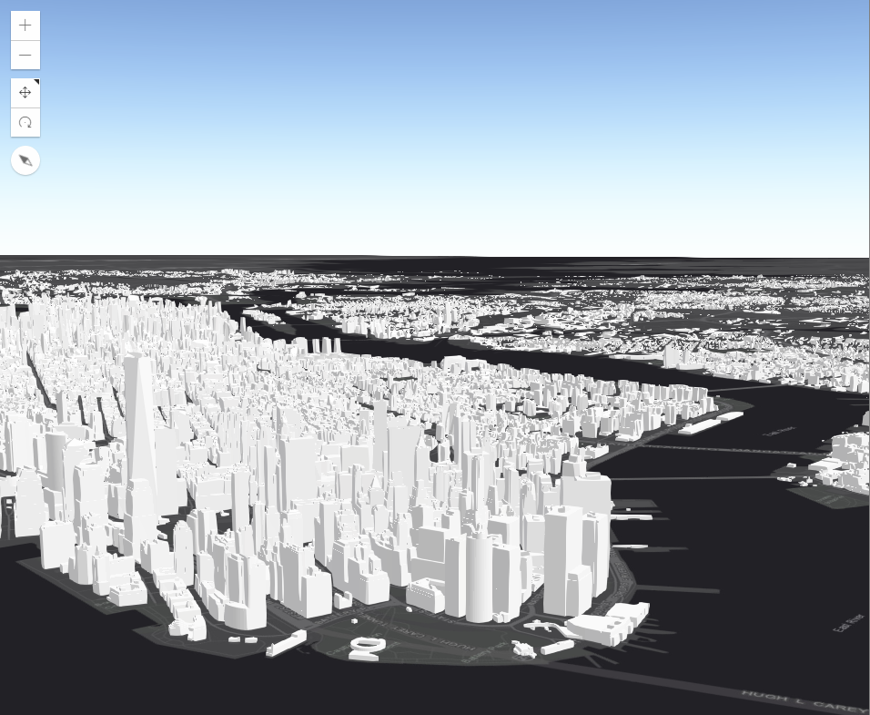
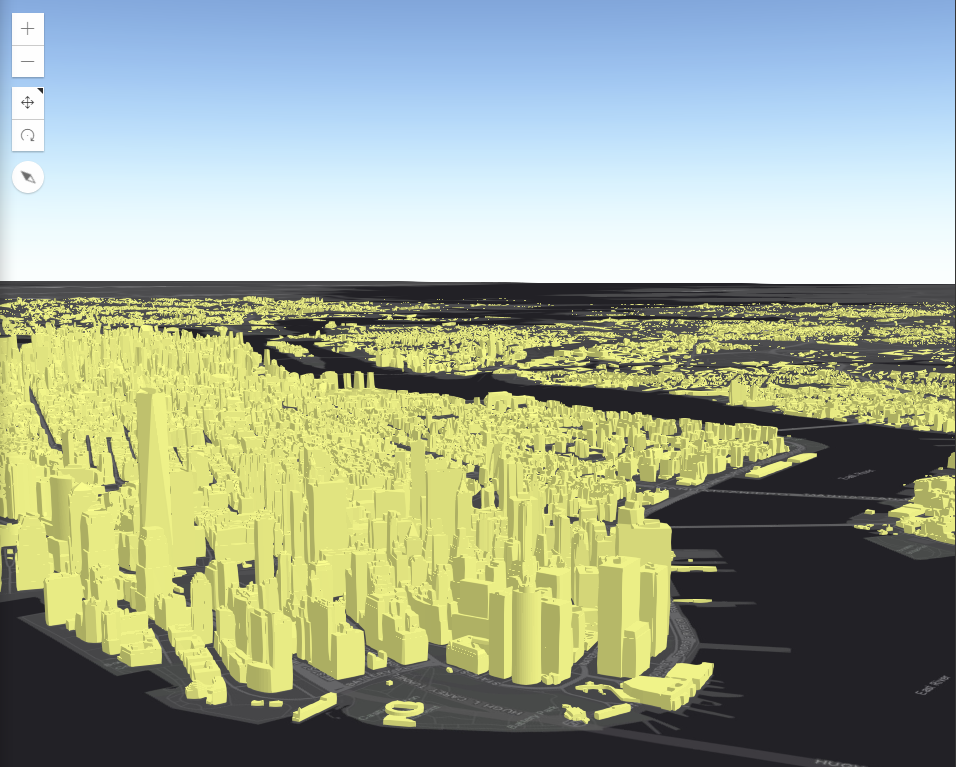

# TAMU WEBGIS
>

# Learning Objectives
>
- Create 3D web mapping applications

# 3D Web Mapping with ArcGIS JS
We can use many of the same ideas used in 2D web mapping and apply them to 3D web mapping. ESRI's JS is more than capable of handling 3D data layers. How do we show these data layers you might ask. I'll show you! We'll start with our HTML shell in a file called **index.html** and a Javascript file to hold all our logic called **map.js**. Inside our **index.html**, we import the ArcGIS for Javascript (ESRI JS) functionality into our site then define where our Javascript **map.js** is. We also do some styling and create a container **div** which is where our 3D map will live. Lastly we call the **main()** function inside of **map.js**.
```html
<html>
    <head>
        <link rel="stylesheet" href="https://js.arcgis.com/4.6/esri/css/main.css">
        <script src="https://js.arcgis.com/4.6/"></script>
        <script src="./map.js"></script>
        <style>
            html, body, #mapid {
            padding: 0;
            margin: 0;
            height: 100%;
            width: 100%;
            }
        </style>
    </head>
    <body>
        <div id="mapid"></div>
        <script>main();</script>
    </body>

</html>
```
>
```javascript
function main() {
    require([
        "esri/Map",
        "esri/views/SceneView",
        "esri/layers/SceneLayer",
        "dojo/domReady!"
      ], function(Map, SceneView, SceneLayer) {

      });
}
```
>
## SceneView
ESRI separates out its 2D from its 3D functionality in a rather clever way. If you're using a 2D map then you'll be using the MapView module along with the FeatureLayer module to display data. When dealing with 3D maps, you'll instead use the **SceneView** module. The two different view modules do roughly the same thing, just know that one is used for 2D and the other for 3D. 
>
Make sure your **map.js** has an imported **SceneView** and **Map** modules and you've added both to your list of parameters. With that added we can go ahead and define a **Map** in the function. Remember that the **Map** is used to define the basemap and any initial layers we want to add to our **SceneView**. **Map**s are used in both MapViews and **SceneView**s since both define a "maps" start.
```javascript
var map = new Map({
    basemap: "dark-gray",
    ground: "world-elevation"
});
```
>
With the **Map** added we then go and define our **SceneView**. We give it the name of the HTML container, the map variable we defined above, and any start parameters we wish to include. It's important to note in that in 3D space you have many more camera options to specify, whereas in 2D space you only have zoom and heading. 
```javascript
var view = new SceneView({
    container: "mapid",
    map: map,
    camera: {
        position: [-74.0338, 40.6913, 707],
        tilt: 81,
        heading: 50
    }
});
```
If you manage to not get any errors you should end up with something like this.
>

>
## SceneLayer
Remember how you display layer info on a 2D map with FeatureLayers? In 3D space we use **SceneLayer**s to display data. The two layers are roughly the same, just one is for 2D and, again, one is for 3D. Make sure you don't confuse the two. Let's add in a **SceneLayer** from somewhere on Portal. Again we start by adding **SceneLayer** to the Dojo's **require** and to the parameter list. We then create a new **SceneLayer** using a portal item ID. This will grab the portal item and put that data inside our **SceneLayer**. Lastly, we add our **SceneLayer** to our **Map**, NOT to our **SceneView**.
>
```javascript
    // "esri/layers/SceneLayer",

    var sceneLayer = new SceneLayer({
        portalItem: {
        id: "2e0761b9a4274b8db52c4bf34356911e"
        }
    });
    map.add(sceneLayer);
```
>
If we were to check out our map we'd see this:
>

>
## Changing SceneLayer rendering
We can use a property of our **SceneLayer** to change how we see our 3D buildings. Every **SceneLayer** has a property called **renderer** which we can alter to change how our buildings look. The **renderer** is a plain JSON object with some special properties we must define to get the desired affect. Defining your own **renderer** is very important for achieving professional level visualizations in your web map.
>
We start by telling the **SceneLayer** renderer what type of 3D data we will use. In this case we use **mesh-3d**. We then tell it how we'll fill in our 3D mesh using the **symbolLayers** property. Here we describe the type of symbolization we'll use as well as the color we want.
>
```javascript
    var symbol = {
        type: "mesh-3d", 
        symbolLayers: [{
            type: "fill", 
            material: {
                color: [244, 247, 134]
            }
        }]
    };
```
>
With our **renderer** specified, we then add our newly created **symbol** variable to our **SceneLayer** by using the **symbol** variable below.
>
```javascript
    sceneLayer.renderer = {
        type: "simple", 
        symbol: symbol
    };
```
>
You then end up with some brightly colored buildings in NYC.
>

>

>
# Additional resources
- https://developers.arcgis.com/javascript/latest/api-reference/esri-layers-SceneLayer.html
- https://www.w3schools.com/js/


# Questions
[Set 1](../reviewquestions/21.md)

## Videos
[Video 1 - 2018-03-02](https://youtu.be/ObDEF9lENdA) starts at 29 mins, no audio
[Video 1 - 2018-03-02](https://youtu.be/J6NkMPgl1bI) starts at 29 mins, no audio