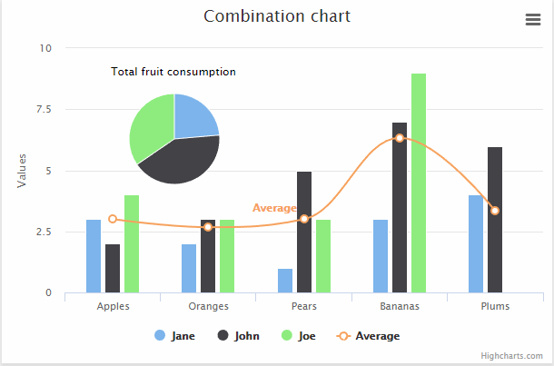

# TAMU WEBGIS
>

# Learning Objectives
>
- Explain the components of HighCharts.js
- Implement simple HighCharts.js visualization
<!-- - Pull REST data to create HighCharts.js visualization -->

# Intro to HighCharts
Highcharts is a Javascript, visualization library used by many different groups and companies. We can use Highcharts for a variety of fancy visualizations that are generated easily and effortlessly with little input from us. 
>
 
>
# Working with HighCharts
Lets create a line graph using Highcharts shall we? To start our work with HighCharts, create a basic HTML page **index.html** with a **head** and **body**. Inside of **head** add the following lines to import the HighCharts library into our page. 
```html
    <script src="https://code.highcharts.com/highcharts.js"></script>
    <script src="https://code.highcharts.com/modules/series-label.js"></script>
    <script src="https://code.highcharts.com/modules/exporting.js"></script>
```
We then add the following style; without it we would not be able to see our graph.
```html
    <style>
        #container {
            min-width: 310px;
            max-width: 800px;
            height: 400px;
            margin: 0 auto
        }
    </style>
```
Inside of **body**, add a div with an id of **container**. This div will be the container for our graph. Below the **container** div, we'll add the meat and potatoes of our HighChart visualization.
>
We start by calling the **chart()** method of the **Highcharts** object. We provide the id of our **container** div and set a bunch of different options and define the data we'll be plotting.
```javascript
 Highcharts.chart('container', {

    title: { text: 'Solar Employment Growth by Sector, 2010-2016' },
    subtitle: { text: 'Source: thesolarfoundation.com' },
    yAxis: { title: { text: 'Number of Employees' } },
    legend: { layout: 'vertical', align: 'right', verticalAlign: 'middle' },
    plotOptions: { series: { label: { connectorAllowed: false }, pointStart: 2010 } },

    series: [{
        name: 'Installation',
        data: [43934, 52503, 57177, 69658, 97031, 119931, 137133, 154175]
    }, {
        name: 'Manufacturing',
        data: [24916, 24064, 29742, 29851, 32490, 30282, 38121, 40434]
    }, {
        name: 'Sales & Distribution',
        data: [11744, 17722, 16005, 19771, 20185, 24377, 32147, 39387]
    }, {
        name: 'Project Development',
        data: [null, null, 7988, 12169, 15112, 22452, 34400, 34227]
    }, {
        name: 'Other',
        data: [12908, 5948, 8105, 11248, 8989, 11816, 18274, 18111]
    }],

    responsive: {
        rules: [{
            condition: {
                maxWidth: 500
            },
            chartOptions: {
                legend: {
                    layout: 'horizontal',
                    align: 'center',
                    verticalAlign: 'bottom'
                }
            }
        }]
    }

}); 
```
You can see above a lot of the different options, especially the options regarding labels, are self explanatory. 
>
The data we will show is comprised of a property called **series**. This property is an array of plain Javascript objects (JSON). Each value inside of **series** has two properties: name and data. Name will describe to Highcharts the name of our line, both on the chart and in the legend. The 
data array is the values that will be plotted that comprise our line.
# Additional resources
- https://www.highcharts.com/demo
- https://github.com/d3/d3/wiki/Gallery
- https://bost.ocks.org/mike/bar/

<!--# Questions
[Set 1](../reviewquestions/23.md)-->

## Videos
[Video 1 - 2018-03-07](https://youtu.be/E88FI6lIph4) - starts at 28 mins
[Video 2 - 2018-03-07](https://youtu.be/CgnPezwrBKk) - starts at 28 mins
