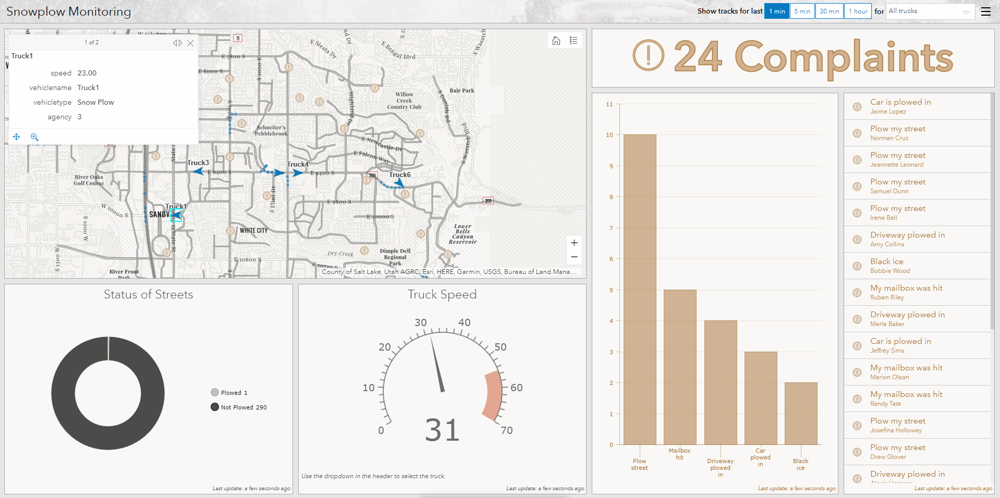
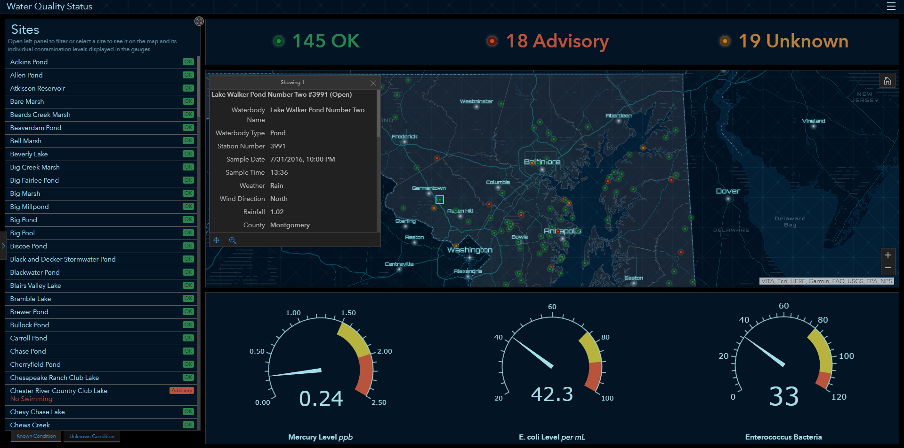

# TAMU WEBGIS
>

# Learning Objectives
>
- Learn what Operations Dashboard for ArcGIS 
>
# What is Operations Dashboard for ArcGIS?
> ### Text and examples from https://www.esri.com/en-us/arcgis/products/operations-dashboard/overview
Operations Dashboard for ArcGIS is a configurable web app that provides location-aware data visualization and analytics for a real-time operational view of people, services, assets, and events. From a dynamic dashboard, view the activities and key performance indicators most vital to meeting your organization's objectives.
>
What can Operations Dashboard do for you?
## Common view
Support collaboration by providing a common operating view of key performance i ndicators to help everyone understand what is working well and what needs attention.
## Ready to use
Enrich your data with a diverse set of visualization tools to enable actionable decision-making. Give stakeholders at-a-glance insights into key performance indicators.
## Flexible
Adapt to any situation or event, whether it's simple or complex, indoor or outdoor. Monitor the people, services, assets, and actions that are most relevant to your event or activites.
## Real-time
Monitor, track, and assess the critical factors for successful operations, even as a situation develops. Use data analytics to support strategic and tactical decisions across your organization.
## Configurable
Create and configure dashboards to be independent or interactive. Provide a common view on the wall of your operations center, or get a drill-down view that can be filtered at your desk.
# How it works
1. Create a dashboard
2. Add elements
3. Set layout
4. Build interactivity
5. Save, test, and share
>

> ##### [Snowplow Monitoring](https://www.arcgis.com/apps/opsdashboard/index.html#/1ecce900ca404673abd678df592b4d3a)

> ##### [Water Quality Status demo](https://www.arcgis.com/apps/opsdashboard/index.html#/37d0e7637f98479e83f5cdcf51038c3e)
>
# Campus Viewer
- https://www.youtube.com/playlist?list=PLGZUzt4E4O2KR-vbDxxv4pSmQHS0mfe8A

# Additional resources
- https://www.esri.com/en-us/arcgis/products/operations-dashboard/overview
- https://blogs.esri.com/esri/arcgis/2017/10/16/88428/
- http://www.esri.com/library/fliers/pdfs/boston-marathon.pdf
- https://community.esri.com/community/gis/applications/operations-dashboard-for-arcgis/blog/2017/12/07/try-some-dashboards
- https://doc.arcgis.com/en/operations-dashboard/help/create-web-maps-for-dashboards.htm
- https://www.arcgis.com/apps/opsdashboard/index.html#/1ecce900ca404673abd678df592b4d3a

<!--# Questions
[Set 1](../reviewquestions/22.md)-->
