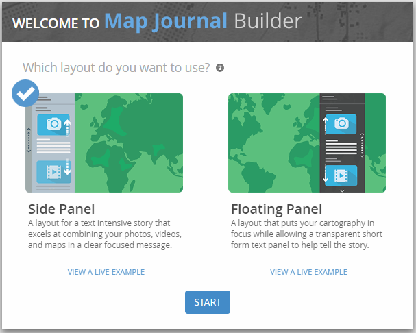

# TAMU WEBGIS
>

# Learning Objectives
>
- Create Story Maps
- Add Interactive Visualizations to Story Maps

# Creating Story Map Journal
We start by going to the [Story Maps](https://storymaps.arcgis.com/) website. Click on the **Apps** button on the top or expand the hamburger menu to see the **Apps** button. 
>

>
A little down the page you should see a option to build **A Rich Multimedia Narrative**. Make sure to click the button labeled **BUILD**.
>

>
You may be asked to login with your ArcGIS account. If so go ahead and log in now. 
>
After logging in, you will be presented with the Welcome screen. Click the left hand option **Side Panel** then press the **START** button.
>

>
## Journals
We now must give our journal a name. This name is what is presented to the user whenever the open your story map journal. Let's call ours **Aggieland** then hit the **>** key to continue.
>
## Setting the main stage
Now we must provide the main section content that will be seen whenever you log on. We can choose between four different content types: a map, an image, a video, or a web page. Let's choose an image. You can use any image you want, in this case I'll be using a random photo of the water tower. After that you will be asked to provide some text to accompany the image in a header, sub-text type flow.
>

>
After you hit save you should be presented with your first section inside your journal. 
>

>
## New section
Now let's add a new section that shows a map of everyone's favorite building: O&M. Go ahead and click the **ADD SECTION** button near the bottom of the side pane. Let's name our section **Eller Oceanography and Meteorology Building**. Make sure your content type is a map. Under that select the **Create a map** option. You'll be asked to name your map, I named mine **Eller Oceanography and Meteorology Building**. Hit **CREATE**. You'll now be presented with a map window.
>

>
Use this window to style your map to however you want, just make sure you zoom into the O&M building or your section will make no sense.
>
Let's add a marker to our map. To do this choose the **Add** button at the top. Here you can choose from many different ways to add a layer. I'm going to use a .csv so I'll select **Add Layer from File**.
>

>
Once you add the layer you will be presented with many different styling options to choose from. I'm going to leave mine on the default **Types (Unique symboles)** option. Press **SAVE**..
>

>
You can now double check the settings before you add the section in.
>

>
Press **NEXT** and you'll be given the opportunity to add header and detailed text to your section.
>

>
We can now view our journal. If you scroll down the page you'll see how it goes from the home section to our O&M section and seemlessly changes the main content along the way.
>

>
You can keep adding sections that utilize the various different 
# Additional resources
- https://storymaps.arcgis.com/en/
- https://learn.arcgis.com/en/projects/get-started-with-story-maps/lessons/create-a-story-map-journal.htm

<!--# Questions
[Set 1](../reviewquestions/23.md)-->

## Videos
[Video 1 - 2018-03-19](https://youtu.be/SCsnn0zhPEQ) - goes through first 10 mins
[Video 2 - 2018-03-19](https://youtu.be/F6uGEwqh_AE) - goes through first 10 mins
