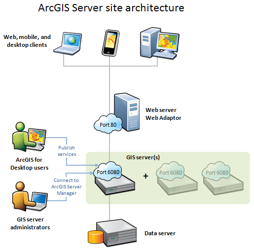

# TAMU WEBGIS
>

# Learning Objectives
>
- Learn about web servers
# Server - site architecture
>

>
It's important to know how the devices and websites you visit interact with servers. The diagram above outlines the basic client-server flow. 
## Client
Like your mobile device or a web broswer, the client is the link between the user and the site or service. Clients are the end means by which most people will interact with data in a database like seeing your Facebook feed; you're using a client to view data from a database. 
>
## Web server
A web server can host web applications and provide optional security and load balancing benefits to your ArcGIS Server site. If you just need basic hosting of GIS services, you can use the site that you create after installing ArcGIS Server.
>
If you need to go beyond simple hosting of services, or if you want to use your organization's existing web server, you can install the Web Adaptor. The Web Adaptor allows you to integrate your ArcGIS Server site with IIS, WebSphere, WebLogic, and other web servers.
>
## GIS server 
The ArcGIS Server machine fulfills requests to your web services. It draws maps, runs tools, queries data, and performs any other action you can do with a service. The ArcGIS Server can consist of one machine or many machines working together. The machines all have access to the same data and configuration information, so you can grow or shrink the number of participating machines in response to demand.
>
The ArcGIS Server machine exposes your services through the common web protocol HTTP. When you install ArcGIS Server, you immediately have a set of web services you can use in your apps. You can supplement the ArcGIS Server machine with an enterprise web server for more functionality, such as the ability to host web apps.
>
ArcGIS Servers can be organized in groups, called clusters. Each cluster runs a dedicated subset of services, as configured by the server administrator. For example, you could create one cluster to run all your map services and another cluster of servers (perhaps with higher processing power) to run your geoprocessing services.
>
## Data server
You can place your data directly on each GIS server, or access it from a central data repository, such as a shared network folder or an enterprise geodatabase. Whichever option you choose, the data includes all the GIS resources that have been published as services on the ArcGIS Servers. These resources can be maps, locators, geodatabases, and so on.
>
# Additional resources
- http://enterprise.arcgis.com/en/server/latest/get-started/windows/components-of-arcgis-for-server.htm

<!--# Questions
[Set 1](../reviewquestions/26.md)-->

## Videos
[Video 1 - 2018-03-19](https://youtu.be/SCsnn0zhPEQ) - starts at 10 mins
[Video 2 - 2018-03-19](https://youtu.be/F6uGEwqh_AE) - starts at 10 mins
