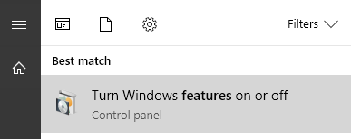
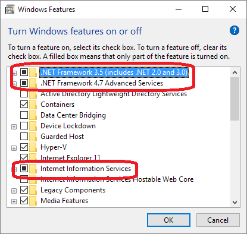
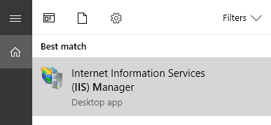
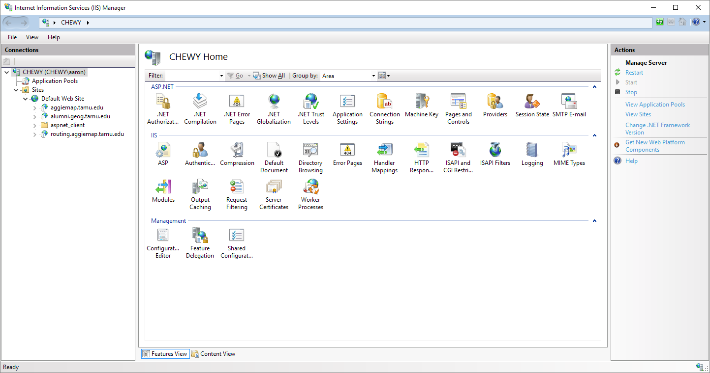
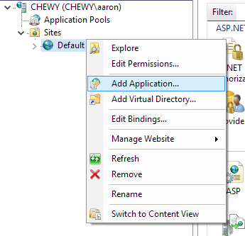
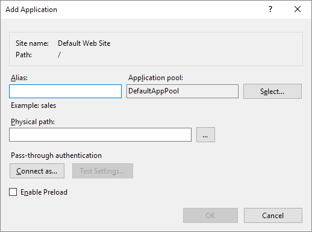
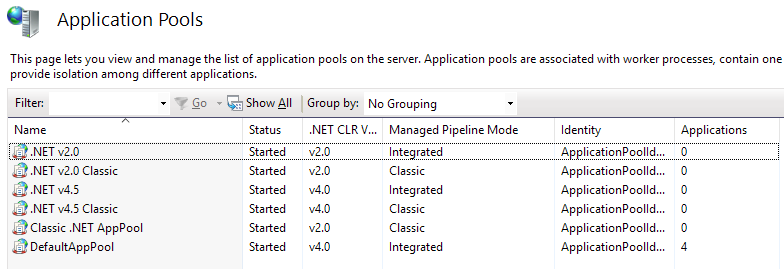
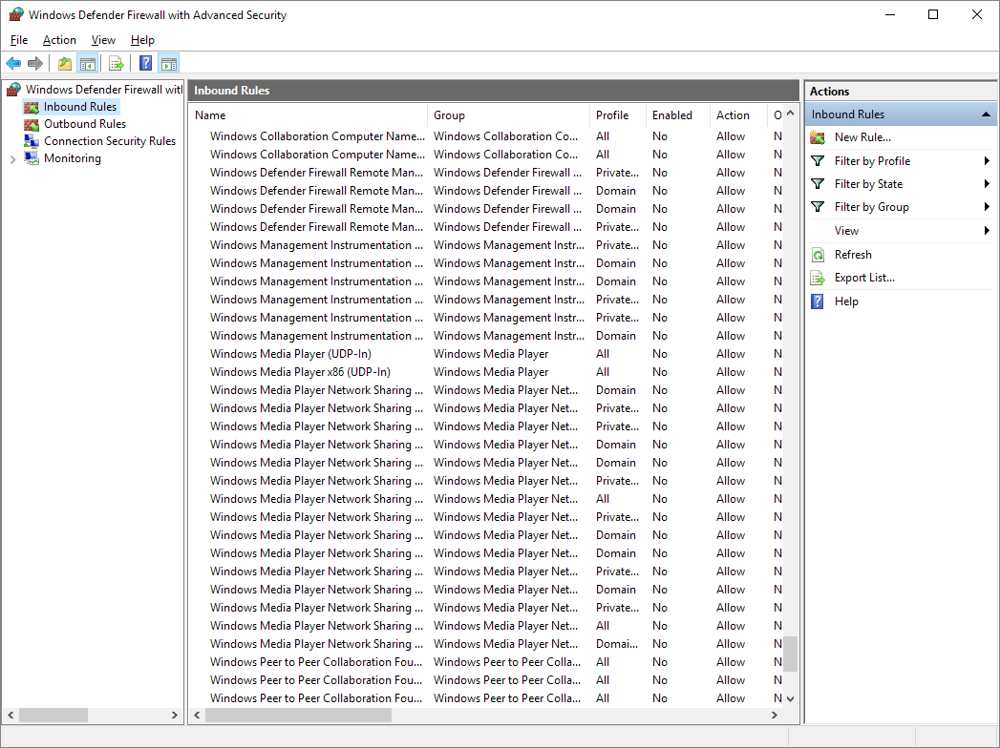

# TAMU WEBGIS
>

# Learning Objectives
>
- Describe IIS installation process
- Learn how to setup a site in IIS
# Internet Information Services
IIS, or Internet Information Services, is the web server baked into Windows of all varieties. There are many different web servers out there you can use such as Apache, nginx, Tomcat, etc, but for this class we'll be using IIS because it's relatively pain free to get working. 
>
# Installing IIS
It's important to know that generally you do not download and install IIS. If you're running a modern version of Windows, chances are you have IIS already; you just need to enable it. Press your windows key or the windows button at the bottom to start up your start menu. Now start typing in the following:
>
`add features`
>
You should be presented with the following option:
>

>
Click on this option. You will now be presented with a window that contains a large scrollable list of items. Scroll until you see the option called **Internet Information Services**. You'll also probably need to select the **.NET Framework** options (3.5, 4.7).
>

>
Windows will then go and download any required files it didn't already have and then enable IIS. It will probably prompt you to restart, go ahead and do so.
>
# Using IIS Manager
Whenever your computer comes back to, open up the start menu and type in 
>
`iis m`
>
You should see the following option for **Internet Information Services (IIS) Manager**. Select it.
>

>
IIS Manager is the program we'll be using to manage our IIS web server. 
>

>
We can add new websites to our web server by right clicking the **Default Web Site** in the left-hand pane.
>

>
You'll see the **Add Application** window.
>

>
Here you'll see many different options. The **Alias** is the name that will appear below your **Default Web Site** structure. We usually set the alias to the URL we'll be using, for instance **aggiemap.tamu.edu**. 
>
We can leave our **Application pool** set to the **DefaultAppPool** option. We'll be touching up on **Application pool** later on in the lecture. 
>
The **Physical path** is the actual path to our website; the directory which contains your **index.html** usually. Click **OK**. 
>
At this point you should be able to browse to http://localhost/NAMEOFAPPLICATIONALIAS and see your website. Pretty neato!
>
# Application pool
What exactly was that application pool setting within the **Add Application** window? The **application pool** defines a group of one or more worker processes, configured with common settings that serve requests to one or more applications that are assigned to that application pool. Since application pools allow a set of Web applications to share one or more similarly configured worker processes, they provide a convenient way to isolate a set of Web applications from other Web applications on the server computer.
>

>
# Firewall
>

>
# ASPX / C#
In this class we've only seen websites that use HTML, CSS, and Javascript. There hasn't been any server-side coding. Here we'll dive a little into how C# server-side websites function and how they generally look. All pages within this type of site have two components: the frontend **ASP(X)** and backend **C#** pages. 
>
The **ASP(X)** page is what the user sees. If you use your imagination hard enough you can see that it vaguely resembles HTML in that you have elements and tags. You can place any HTML element inside an ASP(X) page and it'll work exactly as you'd imagine.

```asp
<%@ Page Language="C#" MasterPageFile="~/MasterPages/NormalHeader.master" AutoEventWireup="true" CodeFile="Default.aspx.cs" Inherits="Logout_Default" Title="System Logout" %>


    <asp:Content ID="Content3" ContentPlaceHolderID="ContentPlaceHolderHead" Runat="Server">
        <meta name="keywords" content="UCIGS, University Consortium for Geographic Information Science, Texas A&M University, TAMU, GeoProjects Initiative, Logout" />
        <meta name="description" content="<%=this.Title %>" />
        <meta name="title" content="<%=this.Title %>" />

        <meta property="og:title" content="<%=this.Title %>" />
        <meta property="og:type" content="article" />
        <meta property="og:url" content="<%=HttpContext.Current.Request.Url.AbsoluteUri %>" />

        <meta property="og:description" content="<%=this.Title %>" />
    </asp:Content>

    <asp:Content ID="Content1" ContentPlaceHolderID="ContentPlaceHolderBody" Runat="Server">
            <div class="small-partition">
                <div class="container12">
                    <h1>Log off</h1>
                    <h3>Click the logout button to securely sign out of your account.</h3>

                    <asp:Button runat="server" ID="btnSubmit" Text="Logout" OnClick="ButtonSubmit_Click" class="primary" />

                </div>
            </div>
    </asp:Content>
```
>
To complement the ASP(X) page, you have the **C#**, pronouned C sharp, page. This is your backend. Here we can do different functions on the server side such as loging a user in or writing a value to a database table. Whenever you use a REST API you're calling a backend much like this. 
```csharp
public partial class Logout_Default : AbstractUserManagableBatchServiceManagableStatefulPage
{
    protected void Page_Load(object sender, EventArgs e)
    {
       

    }

    protected void ButtonSubmit_Click(object sender, EventArgs e)
    {
        if (ApplicationState.ShouldLogSessions)
        {
            ((ApplicationState)ApplicationState).SessionManager.LogOutSession(Session.SessionID, UserId, "Logout from logout.aspx Page_Load", Request);
        }
        SessionUtils.LogoutSession(this);
        Response.Redirect(ResolveUrl("~/"), false);
    }
}

```

# Additional resources
- https://msdn.microsoft.com/en-us/Library/ms181052(v=vs.80).aspx
- https://docs.microsoft.com/en-us/iis/configuration/system.applicationhost/applicationpools/


<!--# Questions
[Set 1](../reviewquestions/27.md)-->

## Videos
[Video 1 - 2018-03-21](https://youtu.be/5ICbIVkBUes) - starts at 10 mins
[Video 2 - 2018-03-21](https://youtu.be/34gbQeBKuWg) - starts at 3 mins, ends at 47 way long - needs trim
