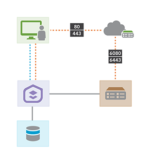

# TAMU WEBGIS
>

# Learning Objectives
>
- Describe the components of the new ArcGIS Enterprise Platform
- [Describe the differences between deployment patterns for ArcGIS Enterprise](https://enterprise.arcgis.com/en/get-started/latest/windows/additional-server-deployment.htm)
- [Describe the security considerations of ArcGIS Enterprise](https://enterprise.arcgis.com/en/get-started/latest/windows/the-arcgis-enterprise-security-model.htm)
- Describe the connection between desktop, server, and mobile ArcGIS Enterprise ecosystem
> #### Info thanks to ESRI
# ArcGIS Enterprise components
ArcGIS Enterprise puts collaboration and flexibility at the center of your organization's GIS. It pairs industry-leading mapping and analytics capabilities with a dedicated Web GIS infrastructure to organize and share your work on any device, anywhere, at any time.
>
What are the components that make up ArcGIS Enterprise?
## ArcGIS Server
ArcGIS Server is software that makes your geographic information available to others in your organization and optionally anyone with an Internet connection. This is accomplished through web services, which allow a powerful server computer to receive and process requests for information sent by other devices. ArcGIS Server opens your GIS to tablets, smartphones, laptops, desktop workstations, and any other devices that can connect to web services.
## Portal for ArcGIS
Portal for ArcGIS is a component of ArcGIS Enterprise that allows you to share maps, scenes, apps, and other geographic information with other people in your organization. The front-end ArcGIS Enterprise portal is powered by the back-end infrastructure of Portal for ArcGIS. You can customize the ArcGIS Enterprise portal to fit your organization's look and feel.
>
The ArcGIS Enterprise portal brings together all the geographic information in your ArcGIS platform and shares it throughout your organization. With it, you can:
- Create, save, and share web maps and scenes.
- Create and host web mapping apps.
- Search for GIS content within your organization.
- Create groups to share GIS information with colleagues.
- Share links to GIS apps.
- Share map and layer packages to use in ArcGIS Desktop.
The ArcGIS Enterprise portal makes GIS accessible for users of all experience levels. Geographic viewers are designed for those who are just beginning with GIS, while experienced GIS users can connect to the portal from ArcGIS Desktop, developer APIs, and other applications.
## ArcGIS Data Store
ArcGIS Data Store is an application that lets you easily configure data storage for the hosting server used with your portal. If you are not a database expert, ArcGIS Data Store provides you with a convenient setup and configuration experience that creates the following different types of data stores.
- Relational data store—Stores your portal's hosted feature layer data, including hosted feature layers created as output from spatial analysis tools run in the portal
- Tile cache data store—Stores caches for your portal's hosted scene layers
- Spatiotemporal big data store—Archives real-time observational data that you can use with an ArcGIS Server running ArcGIS GeoEvent Server that is federated with your portal; also stores the results generated using ArcGIS GeoAnalytics Server tools.
>
With ArcGIS Data Store, you can do the following:
- Publish large numbers of hosted feature layers. Hosted feature layers that rely on the relational data store require a smaller memory footprint to run, making it possible for you to publish many services with less hardware resources.
- Publish hosted scene layers to your portal. If your portal's hosting server is registered with a tile cache data store, you can publish hosted scene layers from ArcGIS Pro to your portal or publish from scene layer packages directly in the portal web site. For more information on publishing hosted scene layers, see Publish scenes in the Portal for ArcGIS user help.
- Archive high volume, real-time observation data. If you use ArcGIS GeoEvent Server to stream high volumes of real-time data, you can create a spatiotemporal big data store and archive the GeoEvent observation data.
- Create backups of data stores automatically. Backups ensure you can recover your feature and scene data in the event of a disaster such as data corruption or hardware failure. You can control when and where automatic backups of each data store are created.
- Configure a failover data store for your feature layer data and scene caches. ArcGIS Data Store allows you to set up primary and standby relational data store machines, and primary and standby tile cache machines. Your hosted feature layer and hosted scene layer tile cache data is replicated from the primary machines to the standby machines, so if a primary machine crashes, the standby machine can take its place with minimum downtime.
- Configure a highly available spatiotemporal big data store. You can configure multiple spatiotemporal big data stores to balance data loads over multiple machines and ensure availability of spatiotemporal data in the event of a machine failure.
- Perform analysis in Map Viewer. Your portal's hosting server must use an ArcGIS Data Store relational data store to enable standard feature analysis functionality in your portal. To use GeoAnalytics Tools, configure the hosting server with a spatiotemporal big data store.
## ArcGIS Web Adaptor
ArcGIS Web Adaptor allows ArcGIS Server to integrate with your existing web server. It is compatible with IIS and Java EE servers such as WebSphere and WebLogic.
>
The Web Adaptor is an application that runs in your existing website and forwards requests to your ArcGIS Server machines. It polls your site at a regular interval to learn which machines have been added or removed. It then forwards traffic to only the currently participating machines.
>
When you prepare to expose your ArcGIS Server site to an external audience, you should install the Web Adaptor or implement comparable request forwarding and security technology
>
The Web Adaptor provides the following benefits:
- Allows you to integrate ArcGIS Server with your organization's existing web server. By including a web server in your site, you gain the ability to host web applications that use your GIS services.
- Allows you to provide a single endpoint that distributes incoming requests to the ArcGIS Server machines in your site.
- Allows you to expose your ArcGIS Server through your organization's standard website and port. Use the Web Adaptor if you don't want users to see the default port 6080 or the default site name arcgis.
- Allows you to block the ArcGIS Server Administrator Directory and ArcGIS Server Manager from the view of external users.
- Allows you to block ArcGIS Desktop users from establishing administrative or publisher connections to ArcGIS Server.
- Allows you to use your organization's identity store and security policies at the web-tier level. For example, if you're using IIS, you can use Integrated Windows Authentication to restrict who enters the portal. You can also use Public Key Infrastructure (PKI) or any other identity store for which the web server has built-in or extensible support. This allows you to provide a single sign-on or other custom authentication experience when logging in to use services, web applications, and ArcGIS Server. For more information, see Configuring ArcGIS Server's authentication tier.
# Deployment patterns
You can extend the functionality and capacity of the base ArcGIS Enterprise deployment with additional servers. Adding more server machines, be they on-premises or in the cloud, to your ArcGIS Enterprise deployment will help you make the most of the ArcGIS Server licensing roles.
>
Icon | Description
--- | ---
 | The ArcGIS Enterprise user
 | Base ArcGIS Enterprise deployment
 | Additional ArcGIS Server site
 | ArcGIS Data Store instance
 | ArcGIS Web Adaptor instance
## ArcGIS GIS Server
In the base ArcGIS Enterprise deployment, ArcGIS GIS Server acts in two distinct capacities:
- The hosting server that supports the overall Web GIS infrastructure.
- A general purpose GIS Server, where services can be published from ArcGIS Desktop that reference your own data sources, such as geodatabases.
In this configuration, an additional ArcGIS GIS Server site is federated with your ArcGIS Enterprise portal. This additional site provides dedicated mapping and visualization capabilities to your users. The number of machines in each site will be dictated by your specific needs for capacity and high availability.
>

>
## ArcGIS Image Server
Image Server provides two primary capabilities: dynamic image services from mosaic datasets and raster analysis using distributed processing.

If you will only be using dynamic image services, the recommended deployment pattern is to add a dedicated ArcGIS Image Server site to the base ArcGIS Enterprise deployment.
>

>
## ArcGIS GeoAnalytics Server
To federate an ArcGIS GeoAnalytics Server site to your base ArcGIS Enterprise deployment, you must first add an ArcGIS Data Store configured as a spatiotemporal big data store on its own machine:
>

>
You may need to add additional machines to your spatiotemporal big data store may be required for large volumes of data, and additional ArcGIS GeoAnalytics Server machines may be required for faster processing of large amounts of data.
## ArcGIS GeoEvent Server
ArcGIS GeoEvent Server enables real-time event-based data streams, such as from an Internet of Things (IoT), to be integrated as data sources. A minimal setup adds a single-machine site with the ArcGIS GeoEvent Server licensing role to the existing base ArcGIS Enterprise deployment.
>

>
# Security considerations
ArcGIS Enterprise uses an identity-based security model. Any content such as layers, services, maps, and apps are secured through groups within the ArcGIS Enterprise portal. These groups are created in the portal; you can add users manually to these groups, or you can link them to enterprise groups from your organization’s identity store, such as Active Directory-based, LDAP-based, or (new at 10.6) SAML-based identity provider.
>
For an individual to access content secured in a group, they must be a member of your organization and have an identity within your ArcGIS Enterprise portal. When you create an identity for a user within your portal, you assign them a role. This role defines a specific set of privileges for the user. For example, you can define the type of information a user can search, edit, or create. To learn more about the type of privileges you can grant members of your organization, see Levels, roles, and privileges. You can also allow anonymous access to public content in your ArcGIS Enterprise portal.
>
Keep in mind that when you federate an ArcGIS Server site with your portal, the ArcGIS Enterprise security model takes over. Any content that already resides on your ArcGIS Server site will automatically be owned by the portal’s initial administrator account. To enable access, you need to share the items to the appropriate group or groups in your portal. This step only applies if you are federating an ArcGIS Server site that already contains some content, and would not apply to new server deployments.
# ArcGIS Enterprise ecosystem

>
# Additional resources
- https://enterprise.arcgis.com/en/get-started/latest/windows/additional-server-deployment.htm
- https://enterprise.arcgis.com/en/get-started/latest/windows/the-arcgis-enterprise-security-model.htm

<!--# Questions
[Set 1](../reviewquestions/28.md)-->

## Videos
[Video 1 - 2018-04-02](https://youtu.be/SaJg2MllbF0) - Starts at 4 mins, through 33 mins
[Video 2 - 2018-04-02](https://youtu.be/b7ZI2pSlHR8) - Starts at 4 mins, through 33 mins
[Video 3 - 2018-01-29](https://youtu.be/Jx6D7XwOZUQ) - TAMU Geocoding servers & Why not to keep your servers in the basement

