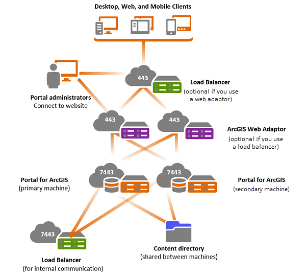

# TAMU WEBGIS
>

# Learning Objectives
>
<!-- - [ArcGIS Portal User Administration](https://enterprise.arcgis.com/en/portal/latest/install/windows/configuring-a-highly-available-portal.htm)
- [ArcGIS Portal Data Administration](https://enterprise.arcgis.com/en/portal/latest/install/windows/configuring-a-highly-available-portal.htm)
- [ArcGIS Portal Service/Servers Administration](https://enterprise.arcgis.com/en/portal/latest/install/windows/configuring-a-highly-available-portal.htm) 
- Federating data sources and servers -->

- Learn about ArcGIS Portal User / Data Administration
- Discuss data and server federation
- Discuss highly available portals

# Portal User / Data Administration
>#### From [enterprise.arcgis.com](http://enterprise.arcgis.com/en/portal/latest/administer/linux/managing-access-to-your-portal.htm)
## Identity Stores
The identity store for your portal defines where the credentials of your portal accounts are stored, how authentication occurs, and how group membership is managed. Portal for ArcGIS supports two types of identity stores: built-in and enterprise.
### Built-in identity store
Portal for ArcGIS is preconfigured so you can easily create accounts and groups in your portal. You can use the Create an account link on the portal website home page to add a built-in account to your portal and start contributing content to the organization or access resources created by other members. You can also click the Groups tab on the portal website home page and create a group to manage items. When you create accounts and groups in your portal this way, you are leveraging the built-in identity store, which performs authentication and stores portal account user names, passwords, roles, and group membership.
>
You must use the built-in identity store to create the initial administrator account for your portal, but you can later switch to an enterprise identity store. The built-in identity store is useful to get your portal up and running, and also for development and testing. However, production environments typically leverage an enterprise identity store.
### Enterprise identity store
Portal for ArcGIS is designed so you can use enterprise accounts and groups to control access to your ArcGIS organization. For example, you can control access to the portal by using credentials from your Lightweight Directory Access Protocol (LDAP) server and identity providers that support Security Assertion Markup Language (SAML) 2.0 Web Single Sign On. This process is described throughout the documentation as setting up enterprise logins.
>
The advantage of this approach is that you do not need to create additional accounts within the portal. Members use the login that is already set up within the enterprise identity store. The management of account credentials is completely external to Portal for ArcGIS. This enables a single sign-on experience so users will not need to reenter their credentials.
>
Similarly, you can also create groups in the portal that leverage the existing enterprise groups in your identity store. Also, enterprise accounts can be added in bulk from the enterprise groups in your organization. When members log in to the portal, access to content, items, and data are controlled by the membership rules defined in the enterprise group. The management of group membership is completely external to Portal for ArcGIS.
## User access privileges
Once you've decided how accounts will be managed in Portal for ArcGIS, you need to decide what privileges you want users that access your ArcGIS organization to have. Privileges are defined by whether or not the user accessing your portal is part of the ArcGIS organization.
>
Users that access the portal without an ArcGIS organizational account can only search for and use public items. For example, if a public web map is embedded into a website, users looking at the map will be accessing an item of your portal, even though they do not have an account. It is up to you to enable this type of access. You can always disable access to persons that do not already belong to the ArcGIS organization. To learn how to do this, see Disabling anonymous access.
>
Users can access your portal with elevated privileges if they are members of your ArcGIS organization. Members of your ArcGIS organization are listed on the Organization page of the portal website. Members of an organization are organized by membership levels which correspond to various roles with different privileges. To learn more about the different levels of privileges, see organization roles.
>
When a new ArcGIS organizational account is added to your portal, it will be granted the user role by default. However, the portal administrator can change the role at any time.
## Managing organizational accounts
An ArcGIS organizational account is a user account that has been added to the organization panel of your portal website. Throughout the documentation and user experience in the portal website, these users are typically referred to as members of the organization.
>
As an administrator, it is important that you fully control not only the privileges granted to each member of your ArcGIS organization but also who is allowed to be a member of it.
>
The maximum number of ArcGIS organizational accounts in your portal is defined by the authorization file you used to activate the software. At any point in time, you can compare the total number of members in your organization and the maximum allowed from the Organization page in the portal website. Under Total Membership, Current Count lists the current number of portal members and Maximum Allowed shows the total number of members for which the portal is authorized.
# Federating servers
>#### From [enterprise.arcgis.com](https://enterprise.arcgis.com/en/portal/latest/administer/windows/federate-an-arcgis-server-site-with-your-portal.htm)
Federating an ArcGIS Server site with your portal integrates the security and sharing models of your portal with one or more ArcGIS Server sites. Federation is optional unless you want to do the following:
- Configure your site with a Security Assertion Markup Language (SAML) identity provider.
- Host tile layers, feature layers, and scene layers published by members of the portal.
- Allow members of the portal to perform spatial analysis in Map Viewer.
When you add a server to your portal as described in this topic, you are federating the server with the portal. A server that has been added to your portal is called a federated server.
>
When you federate a server with your portal, the portal's security store controls all access to the server. This provides a convenient sign-on experience but also impacts how you access and administer the federated server. For example, when you federate, any users, roles, and permissions that you previously configured on ArcGIS Server services are no longer valid. Access to services is instead determined by portal members, roles, and sharing permissions. Before federating, review the information in Administer a federated server to learn more about how federating will impact your existing site.
>
Services that exist on the ArcGIS Server site at the time of federation are automatically added to the portal as items. These items are owned by the portal administrator who performs federation. After federation, the portal administrator can reassign ownership of these items to existing portal members as desired. Any subsequent items you publish to the federated server are automatically added as items on the portal and are owned by the user who publishes them.
>
After federating, you can optionally designate a single server site to be the portal's hosting server. See the table in About using your portal with ArcGIS Server for a list of functionality available when your portal has a hosting server. See Configure a hosting server for instructions on designating one of your federated servers as the portal's hosting server.
>
If the server you want to federate uses web-tier authentication, you'll need to disable web-tier authentication (basic or digest) and enable anonymous access on the ArcGIS Web Adaptor configured with your site before federating it with the portal. Although it may sound counterintuitive, this is necessary so your site is free to federate with the portal and read the portal's users and roles. If your ArcGIS Server site is not already using web-tier authentication, no action is required. You can continue with the steps below.
# Highly available portals
>#### From [enterprise.arcgis.com](https://enterprise.arcgis.com/en/portal/latest/install/windows/configuring-a-highly-available-portal.htm)
In an organization where downtime must be minimized, configure your ArcGIS Enterprise deployment to be highly available. For the deployment to be highly available, all components of the deployment, including the portal, must be highly available. This topic covers configuring the portal component of the deployment. To configure a highly available portal, install the Portal for ArcGIS software on two machines. Create the portal on the first machine, and join the second machine to that portal.

Configuring high availability is an advanced task that requires an extensive understanding of portal administration, scripting, and networking. Before you install and configure Portal for ArcGIS, you must configure your organization's load balancer to forward requests to the portal software. Additionally, you need to set up a file server to contain the portal's content directory, and decide how ArcGIS Server will communicate with Portal for ArcGIS. Esri recommends that you coordinate with your organization's information technology staff so they understand the requirements for configuring a highly available portal.
>

> #### In this architecture, each portal is installed on its own machine and references a shared content directory. Administrators connect to the site through the load balancer or ArcGIS Web Adaptor. The content directory is shared to both portal machines through a file server.
>
In this architecture, a load balancer or reverse proxy server is configured and acts as a gateway to the organization. If you intend to use web-tier authentication, ArcGIS Web Adaptor is required. The web adaptor can also be the gateway if your web server is highly available. Otherwise, you can configure a second web adaptor. In this case, the load balancer must be configured with the portal before you configure the web adaptor. If you're not using web-tier authentication, ArcGIS Web Adaptor is not required.
>
Both portal machines include system databases that store information about content. The portal system database on the first machine replicates changes to the database on the second machine. An index service keeps users and item searches in sync between both machines.
>
In most cases, you'll use at least one GIS Server site, configured as the portal's hosting server. Esri recommends that you use the load balancer to distribute requests between the portal and the hosting server. This ensures that requests from the GIS Server site are sent to the portal in a highly available fashion. If you are using the load balancer as the gateway and you don't want to use it for internal communication with the hosting server as well, you can add a second load balancer that is only available internally. If you are using ArcGIS Web Adaptor as the gateway, all public traffic is handled by the web adaptor, and all internal traffic is handled by the added load balancer that's directly in front of the two portal machines balancing to port 7443.
>
Note that this topic primarily covers configuration and upgrading the Portal for ArcGIS component of a highly available ArcGIS Enterprise deployment, but the ArcGIS Server sites you configure with your highly available portal should also be configured to be highly available as should the data stores. Configure highly available ArcGIS Enterprise provides an overview and links to documentation for configuring the other components.

<!--# Questions
[Set 1](../reviewquestions/31.md)-->

# Videos
[Video 1 - 2018-04-11](https://youtu.be/cfjRUkLl19w)
[Video 2 - 2018-04-11](65zsO0b6w74) - Blackboard - No video - Starts 3 mins
