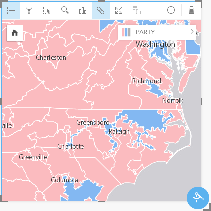
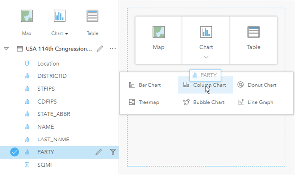
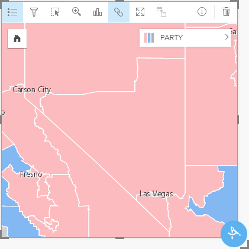

# TAMU WEBGIS
>

# Learning Objectives
>
<!-- - Describe ArcGIS Insights role
- [Complete the configuration process for ArcGIS Insights](https://enterprise.arcgis.com/en/portal/latest/administer/linux/configure-insights-licensing.htm)
- Complete the creation of a WebGIS with insights -->
- Describe ArcGIS Insights role
- Detail the configuration process for ArcGIS Insights
- Complete the creation of a WebGIS with Insights

# ArcGIS Insights
>##### [esri.com](https://www.esri.com/en-us/arcgis/products/insights-for-arcgis/overview)
Insights for ArcGIS is a web-based, data analytics workbench where you can explore spatial and nonspatial data, answer questions you didn't know to ask, and quickly deliver powerful results. Insights is all about data analytics powered by location.
## How Insights for ArcGIS works
1. **Bring in your data.** Connect to enterprise databases. Drag and drop your data onto a page. Visualize data on cards as maps, charts, and tables to unlock endless possibilities for analysis and data exploration.
2. **Apply spatial thinking.** Leverage familiar GIS tools for summarization, aggregation, statistics, analysis, and more, via the action button. Or perform a simple drag and drop to bring in your data onto another map card.
3. **Show your work.** Clearly communicate how you arrived at your conclusion. Share a step-by-step model of your analysis or detail the final results of a workbook internally or externally.
>
>[Insights for ArcGIS playlist](https://youtu.be/UnQNpThIqSA)
>
## Summary of Insights features
- **Drag and drop interface**
- **Interactive cards**
- **Enable Location**
- **Spatial and Non-spatial visualizations**
- **Analysis view**
# Configuration of ArcGIS Insights
>##### [esri.com](https://enterprise.arcgis.com/en/portal/latest/administer/windows/configure-portal.htm)
Insights for ArcGIS is an app you access through your portal that allows you to perform iterative and exploratory data analysis on ArcGIS web services, Excel spreadsheets, and data stored in databases.
>
Purchase and download an Insights for ArcGIS license file through My Esri, and import the file into the portal website. You can then provision Insights licenses to members of your ArcGIS Enterprise portal through the portal website.
>
After you install and configure Insights for ArcGIS, configure Insights licenses using the following steps. The portal you specify to manage licenses is known as the licensing portal. Insights connects to this portal to obtain licensing information for members of your organization. If your organization has multiple portals, ensure the portal you specify is the one you want to use to manage Insights licenses.
>
1. Log in to My Esri and click **My Organizations > Licensing > Create New Provisioning File**.
2. Choose **Additional Portal Products** from the **Product Type** list. The **Version, License Type, Provision,** and **File Type** options populate automatically.
3. Click **Apply.**
4. Choose the number of named users you need in the **Allocate** column of the products list. Click **Next**.
5. Provide the contact and address information for your organization. Click **Populate user fields from my profile** and **Populate organization fields from my organization** to automatically enter the information associated with your account.
6. Specify the delivery option for your license file. Optionally add a description or note to your request.
7. Click **Review File** and verify the provisioning information.
8. Click **Create File.** Depending on the delivery option you specified, the file is available for download immediately or attached to an email sent to the address you specified.
9. Save the file in a directory that is accessible to the portal machine.
10. Open a web browser and sign in to your ArcGIS Enterprise portal as the default administrator in your portal organization. The portal you sign in to becomes the licensing portal for your organization.
11. Click **Organization > Manage Licenses > Import.**
12. Browse to and select the Insights for ArcGIS entitlements file you generated from My Esri.
13. Choose **Insights from the **Application** drop-down list.
14. Click **Import** to configure your portal for Insights for ArcGIS licenses.
>
Once you've configured Insights licenses for your organization, assign licenses to yourself and your portal members. 
# WebGIS with Insights
>##### [From arcgis.com](https://doc.arcgis.com/en/insights/online/get-started/quick-exercise-workbooks.htm)
In this exercise, you are a political reporter studying the results of the 2017 United States federal election. Specifically, you are looking for differences between the 114th and 115th Congress. Despite the fact that the Republicans won all branches of government, the Democrats picked up five seats in the 115th Congress. You will use layers from Living Atlas of the World to determine areas of interest and analyze changes to the representatives in Congress. In less than 10 minutes you will do the following:
- Sign in to your Insights for ArcGIS account.
- Create a new workbook and add layers from Living Atlas of the World.
- Learn about some of the important buttons in your workbook.
- Interact with cards, including zooming and panning, making selections, and resizing.
- Create charts to pair with your maps.
Note: To complete this exercise, you must have an Insights for ArcGIS license and access to layers from Living Atlas of the World through your ArcGIS Online organization.
## Create a new workbook
In Insights, your analysis is done in a workbook. A workbook stores all of the pages, data, and processes from your analysis. Follow these steps to create a new workbook.
>
1. Open Insights and sign in to your account. You can access Insights through the gallery of apps in your ArcGIS Online organization.
2. On the **Workbooks** page, click **New workbook**.
3. In the **Add To Page** window, click **Living Atlas**.
4. In the **Search** box, search for *Congress*. Select **USA 115th Congressional Districts** and **USA 114th Congressional Districts**. Click **Add**.
>
The workbook opens with two layers in the data pane and two map cards created.
>
5. Change the title of the workbook to Congressional Districts. Click the **Save** button.
>
## Explore your workbook
Using a new software product for the first time can be intimidating. This section walks you through some of the key aspects of the user interface so that you are more comfortable with it when you start to perform your analysis. If you are already familiar with buttons and controls in Insights, you can skip this section.
>
Take a look at the workbook and notice some of the key features:
>
- The Undo Undo and Redo Redo buttons in the upper left can be used to undo and redo processes such as running analysis tools or creating a new card.

- Add Data can be used to add a new dataset to your page.

- The Map, Chart, and Table buttons can be used to create cards without dragging fields or datasets. The three buttons are dimmed because no data has been selected.

- The Create Relationships button can be used to join datasets using common fields.

- The Analysis view button view can be used to view a model of your analysis. The model is created automatically as you work in your workbook.

- The Basemaps button can be used to change the basemap for your maps cards.
>
Look at the data in the data pane and notice the two buttons available for each dataset:
>
- The **Rename dataset** button is used to edit the name of the dataset.
- The **Dataset options** button is used to open a menu containing more actions available for the dataset.
- Click the **Dataset options** button for one of the datasets. The menu opens to show the following options: **Enable Location, View Data Table, Remove Dataset, Refresh Dataset, Hide Selected Fields, Show Hidden Fields, and Share Data**.
- Expand the dataset in the data pane. The fields in the dataset are displayed, along with symbols indicating whether the field is a location, string, number, or rate/ratio field. You can select fields and drag them to the page to create maps, charts, or tables. You can also use the buttons above the data pane to create maps, charts, and tables.
>
Now that you are familiar with some of the basic controls in Insights, it's time to start exploring your data.
>
## Explore your maps
One of the benefits of Insights is that it is easy to interact with multiple maps. This section will walk you through some of the basic interactions you can make with map cards.
>
1. Drag the corners of the maps to make them alrger. You can also drag the cards to different positions on the page.
2. Press Shift while dragging to zoom in on the Virginia-North Carolina border on one of your maps.
>

>
3. Click the **Sync extents** button on the card that is zoomed in.
>
The second map zooms to match the extent of the first map.
>
4. Examine the two maps at the current extent. Notice that there are several districts that have different boundaries, indicating that they were redrawn between the 114th and 115th Congress.
>
## Create charts to supplement your maps
Insights makes it easy to create charts and tables, as well as maps. The following steps walk you through creating charts to pair with your maps.
>
1. Expand the layer for the 114th Congressional districts.
2. Select the *PARTY* field and drag it to the **Chart** drop zone to create a column chart.
>

>
3. Click the **Card Filter** button and apply a filter to the STATE_ABBR field. Unselect all of the values and then select NC (North Carolina). Click **Apply**.
4. Repeat steps 1 to 3 using the 115th Congress.
>
The same number of Democrats and Republicans were elected in North Carolina in each election, despite the redistricting. You will continue your search in different areas.
>
5. Delete your chart cards by clicking the **Delete** button.
6. Navigate to Nevada, in the southwestern United States.
>

>

<!--# Questions
[Set 1](../reviewquestions/35.md)-->

# Videos
[Video 1 - 2018-04-20](https://youtu.be/4TcHWvCMAu4) - Starts at 4:40 mins
[Video 2 - 2018-04-20](https://youtu.be/pSe3G4mbqfw) - Starts at 4:40 mins
