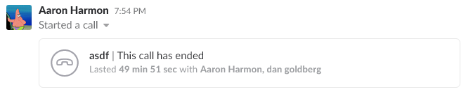
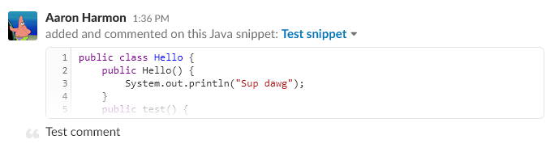

# Why use Slack?
 <!--  -->
#### [Get TAMU Slack](http://tamu.slack.com)
Slack is a tool used by organizations and professionals around the world; from developers to artists to middle-management, Slack is an insanely useful tool. Think of Slack as a chatroom for work. You may not have experienced it just yet but have you ever been CC'd in a big ol'email chain with several other people? And people start replying to various portions of said email all at the same time? Then you get that one person who decides to reply to a portion that's several email's back then all that gets appended and it creates one hell of a mess. Good luck trying to make sense of that mayham. Emails are great for talking to one person or sending notices or announcments, but not for collaboration with a couple people. Enter Slack.
>
## Channels
Within Slack you'll notice something called channels, think of these as conversations with several people (or one person, but why even use a channel at this point?) like a group chat in Facebook or Whatsapp or whatever. You can make them open to the public (all of TAMU) to join, or you can make them private (the smart move). Private channels are only visible to members and members can only join by invitation. Within a channel you can discuss, share, call, screenshare, and video call everyone making collaboration pretty easy. Within these channels you have access to a powerful search function that can help you find something mentioned by a channel member way back when or help you find an important date hidden somewhere.
>

>
## Direct Messages
 This is exactly what it seems like; send a message to a single person for their eyes only. Useful when trying to ask someone a simple question without cluttering up a channel.
>

## Sharing code and other files
Slack makes sharing files insanely easy be it a file from your local computer or from your Google Drive. You can also share code snippets from various programming languages. These snippets have line numbers and syntax highlighting (those fancy colored key words) making reading code much easier than sharing a text file or screencap or just flat out copying and pasting into a channel. Don't be that person, use the code snippets. 
>

>

## Collaboration
It is by no means required for this course to use Slack, but it is `HIGHLY` recommended. Using Slack will enable you to discuss, help, share, and more with your classmates more efficiently. It is also the best way to contact Aaron. He just might choose to ignore your email and only read check / respond to Slack. 

